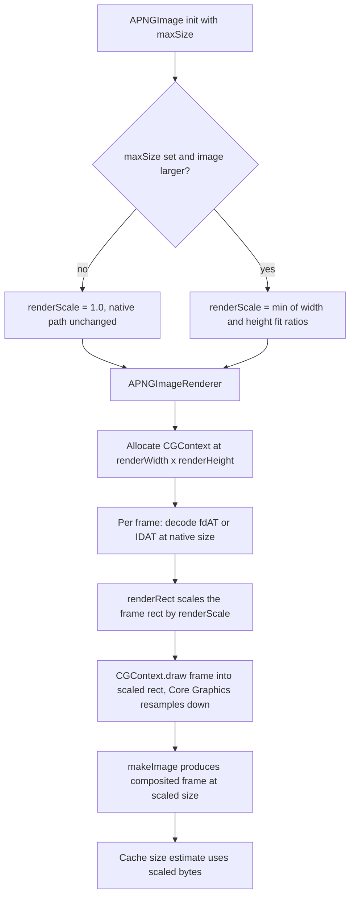

2026-06-22

# APNGKit: `maxSize` downsampling for large animated PNGs

## What it does and why

APNGKit renders every animated PNG at its full native pixel resolution. There is no downsampling and no maximum-dimension guard anywhere in the decoder — `IHDR` reads the width/height straight from the file with no bounds check. That is fine for typical sprites, but it makes very large images dangerous.

The question that started this: *what happens with a list of several images at 10240×7680 (1024·10 × 768·10) on an iPhone?* The answer is that it crashes — not from a logic bug, but from an out-of-memory (jetsam) kill. For a trueColor-with-alpha image, the canvas alone is `10240 × 7680 × 4 ≈ 300 MB`, and each displayed image holds **several** such buffers alive at once:

| Allocation | Cost at 10240×7680 |
|---|---|
| `outputBuffer` `CGContext` | ~300 MB |
| current output `CGImage` (`makeImage()`) | ~300 MB |
| previous output `CGImage` (dispose `.none`/`.previous`) | up to ~300 MB |

So ~600 MB+ **per displayed image**, allocated eagerly the moment `.image` is assigned to an `APNGImageView`. A handful in a scrolling list blows past the per-app memory limit on every iPhone, and the OS terminates the process.

We confirmed that *reactively* catching the OOM is not reliable on iOS: a 300 MB `CGContext` allocation usually succeeds (virtual-memory overcommit) and the jetsam kill fires later when the pages are faulted in, so there is nothing catchable. The reliable fix is *proactive*: render the image smaller. This change adds that capability.

## The feature

Every `APNGImage` initializer gains an optional `maxSize: CGSize?` (default `nil`):

```swift
// Caps a huge image to ~screen size: renders at 1024×768 instead of 10240×7680
let image = try APNGImage(named: "huge", maxSize: CGSize(width: 1024, height: 768))
imageView.image = image
```

When `maxSize` is set, the decoder derives a single `renderScale = min(1, fit)` and the **entire compositing pipeline runs in that scaled space**. This is the important design point: it is not "composite at full size then shrink the result" (that would still allocate the 300 MB buffer). The persistent buffers themselves are small, because the canvas — and therefore every cached frame and every drawn region — is allocated at the reduced size.

For the 10240×7680 case with `maxSize` 1024×768 (scale 0.1), the canvas drops from ~300 MB to ~3 MB. A list of several such images goes from multiple gigabytes (guaranteed kill) to tens of megabytes.

## How it was built

The change threads one scalar — `renderScale` — through the geometry and lets Core Graphics do the resampling for free:



Concretely:

- **`APNGDecoder`** computes `renderScale` right after reading `IHDR`, exposes `renderWidth` / `renderHeight` / `renderBytesPerRow`, and offers a `renderRect(_:)` helper that scales a native rectangle by a single `CGAffineTransform(scaleX:y:)`. Both origin and size scale by the same factor, so neighbouring frame regions keep sharing their boundaries.
- **`APNGImageRenderer`** allocates its `CGContext` at `renderWidth × renderHeight`, and the dispose region, the `.previous` crop, and the blend draw rects all pass through `renderRect(_:)`. Frames are still decoded at native size via `CGImageSourceCreateImageAtIndex`; drawing each one into a smaller destination rect is what triggers the downsampling.
- **Cache policy** estimates bytes from the scaled dimensions, so a downsampled forever-loop that now fits under `maximumCacheSize` can regain frame caching that it would have been denied at native size.

The default path is untouched by construction: `maxSize: nil` yields `renderScale == 1.0`, every scaling guard short-circuits, and the produced geometry is byte-identical to before. That is what let the existing 85 tests pass unchanged.

## A constraint worth recording: downsampled compositing is not bit-exact

APNG is a compositing format — each frame is a sub-rectangle drawn at integer offsets with dispose/blend ops — not a single bitmap. Scaling the canvas means multiplying those integer offsets by a fractional factor, so frame regions can land on non-integer pixel boundaries. For **full-frame** APNGs (every frame covers the whole canvas, the common case) this is clean. For APNGs that do pixel-exact **partial** updates with `.over` blending, downsampling can introduce minor edge-resampling artifacts at frame seams. Keeping every rect derived from the *same* native coordinate times the *same* scale keeps boundaries coincident and the artifacts minor — but the result is not pixel-identical to a native render, and that is an accepted trade for not crashing.

## Scope decision: image-level only, not per-view

We initially extended this further with a per-view `APNGImageView.maxSize`, so a single already-built `APNGImage` (whose decoder can be shared across several views) could be rendered at a different size per view without rebuilding it. That required moving `renderScale` ownership from the decoder onto the renderer, and — because the decoder's decoded-frame cache is shared across renderers — gating cache reads/writes on the renderer's scale matching the decoder's, plus a renderer rebuild path in the view's `maxSize` setter.

It worked and tests passed, but it roughly doubled the size and surface area of the change. We rolled it back to keep the contribution focused on the one thing the problem needs: an image-level `maxSize`. The per-view variant remains a clean follow-up if shared-image-at-multiple-sizes ever becomes a real requirement.

## Outcome

- Four files changed: `APNGDecoder.swift`, `APNGImage.swift`, `APNGImageRenderer.swift`, and two new tests in `APNGImageRendererTests.swift` (`testRenderDownsamplesToMaxSize` covering multi-frame composited output plus a native-path regression guard, and `testMaxSizeLargerThanNativeDoesNotUpscale`).
- `swift build` clean; all 87 tests pass (85 existing + 2 new).
- Contributed upstream from a fork: `plateaukao/APNGKit` → PR [onevcat/APNGKit#151](https://github.com/onevcat/APNGKit/pull/151).
