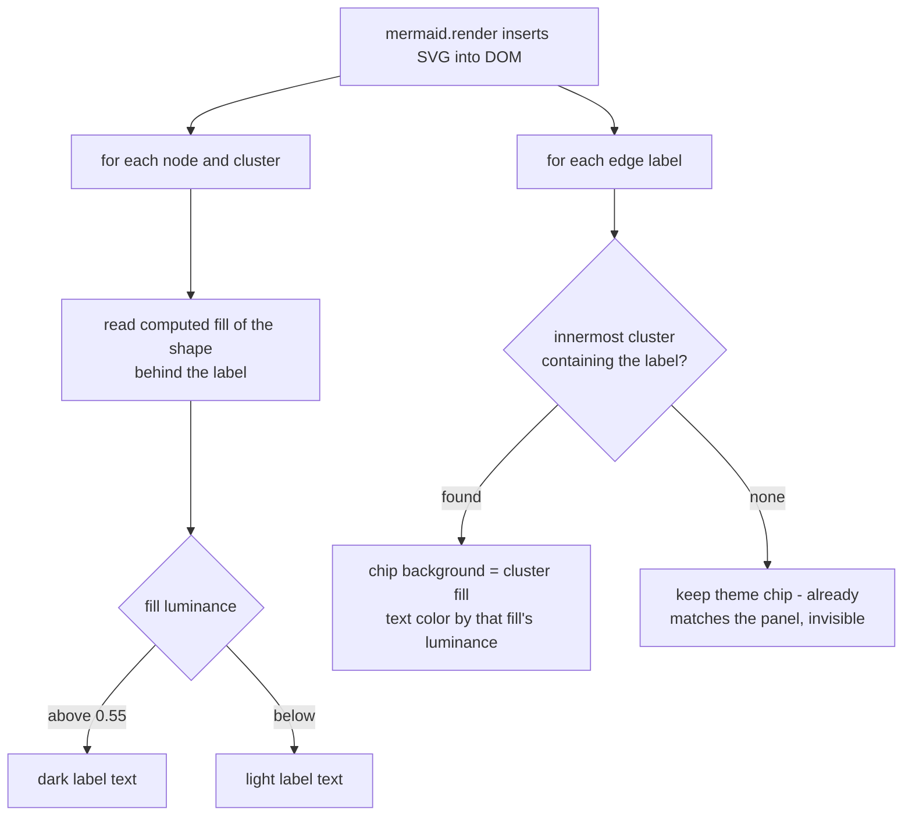

2026-08-18

# ADR site: custom mermaid theme with rounded nodes and contrast-aware labels

The ADR viewer rendered mermaid diagrams with the stock `default`/`dark`
themes: square corners, trebuchet ms, and colors that had nothing to do with
the site's palette. This change gives every diagram the site's own look —
rounded rectangles throughout, the system font stack, accent-soft blue node
fills, dashed subgraph borders, soft drop shadows, and smooth `basis` curves
on flowchart edges — and makes labels survive diagrams whose authors
hard-coded their own fills.

## Theming

`mermaid.initialize` now uses `theme: "base"` with `themeVariables` duplicated
from `style.css` for both color schemes. Duplication is unavoidable: mermaid
bakes colors into the SVG at render time and cannot resolve CSS custom
properties.

The rounded corners come from a `themeCSS` trick: `rx`/`ry` are SVG2 geometry
properties, so a CSS rule like `.node rect { rx: 8px; }` wins over the
`rx="0"` presentation attributes mermaid emits — one rule rounds flowchart
nodes, sequence actors, state boxes, clusters, notes, and even the little
activation bars, with no per-shape work.

## Contrast-aware labels

Some ADRs carry their own `style`/`classDef` fills (light green "good path",
light red "bad path"). Those fills are baked into the SVG, so in dark mode the
theme's light label text landed on a light fill and vanished. Rather than
guessing, a post-render pass (`fixLabelContrast`) measures what is actually
behind each label:



Edge labels needed the second branch because "just remove the background" is a
trap: mermaid draws edge labels on top of the edge path, and the chip behind
the text is what masks the line. Deleting it would strike the arrow line
through the text. Blending the chip into the containing cluster's computed
fill keeps the mask but makes it invisible, and the luminance rule then puts
dark text on the hard-coded light fills in dark mode. The same pass runs in
the zoom lightbox, and it is symmetric — an author who hard-codes a dark fill
in light mode gets light text.

## Verification

The checked-in `docs/adrs/` snapshot was stale and had no multi-diagram ADRs,
and CLAUDE.md forbids regenerating it locally. The preview instead drove the
real site with Playwright and intercepted the network: `page.route` served
`manifest.json` with two extra entries and the diagram-rich ADR files straight
from the repo root, so the working tree stayed clean while all 16
diagram/scheme combinations were screenshotted and reviewed.

That review also caught a latent markdown bug in
`ask_web-mermaid-stream-blink-fix.md`: a prose line began with a literal
triple-backtick `` ```mermaid `` mention, which markdown parsed as a real
fence opening — it swallowed the following paragraphs into a bogus diagram
block that rendered as an error box. Reflowing the sentence so the backticks
sit mid-line inside an inline code span fixed the article.
