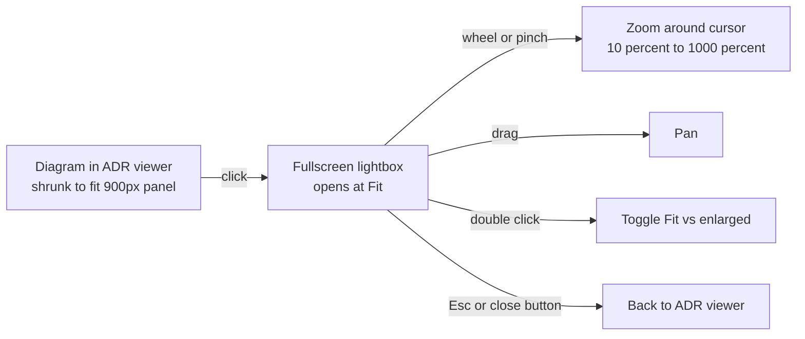

2026-07-18

# ADR Site: Click-to-Zoom Lightbox for Mermaid Diagrams

## Problem

Mermaid diagrams rendered in the ADR viewer were often too small to read. Mermaid emits its SVG with `width: 100%; max-width: <natural>px`, so any diagram wider than the ~900px viewer panel gets scaled down to fit — a 1600px-wide flowchart shrinks to roughly half size and its node text becomes unreadable. There was no way to see a diagram at its natural size, let alone magnify it.

## Solution

Clicking a rendered diagram now opens it in a fullscreen lightbox with free pan and zoom. The inline rendering is unchanged (diagrams still fit the panel for skimming); the lightbox is the escape hatch when you actually need to read one.

Interaction details:

- **Open**: click any successfully rendered mermaid block (it gets a `zoom-in` cursor and a "Click to zoom" tooltip). The lightbox starts at **Fit** — whole diagram visible, centered.
- **Zoom**: mouse wheel zooms around the cursor position (macOS trackpad pinch arrives as ctrl+wheel, so it works too); two-finger pinch on touch devices zooms around the pinch midpoint; `+` / `−` / `1:1` / `Fit` buttons in a top-right control bar with a live percentage readout. Scale is clamped to 10–1000 percent.
- **Pan**: drag with mouse or one finger (pointer events with capture, `touch-action: none` on the stage so the browser doesn't hijack the gesture).
- **Double-click**: toggles between Fit and an enlarged view (at least 100 percent) centered on the click point.
- **Close**: Esc, or the ✕ button. Esc closes the lightbox *first* and leaves the ADR viewer open; arrow-key prev/next ADR navigation is suppressed while the lightbox is up so a stray keypress can't swap the document underneath the diagram.

### Implementation notes

- The lightbox **re-renders the diagram from its mermaid source** rather than cloning the inline SVG. Mermaid SVGs are full of `id` references (arrowhead markers, gradients); cloning one into the same document duplicates ids. A fresh `mermaid.render()` with a new id is clean, and automatically picks up the same light/dark theme the page was initialized with.
- The natural size comes from the SVG `viewBox`, then mermaid's responsive styling (`width: 100%; max-width`) is stripped and explicit pixel dimensions set, so a single CSS `transform: translate(tx, ty) scale(s)` on a wrapper div is the only thing controlling geometry. Zoom-around-a-point is the standard `tx = cx - k * (cx - tx)` adjustment where `k` is the scale ratio.
- CI's `build.sh` re-stamps the `?v=` cache-busters in `index.html` on every push, so no manual version bump was needed — the change is only `docs/app.js` and `docs/style.css`.

## Key Files

- `docs/app.js` — lightbox creation, open/close, wheel/pinch/drag handlers, keydown precedence; `renderMermaidIn()` marks blocks zoomable
- `docs/style.css` — `.mmd-lightbox`, `.mmd-stage`, `.mmd-controls` styles, `zoom-in` cursor on rendered blocks

## Verification

Driven headless with Python Playwright against a local `http.server` (the Chrome extension wasn't connected): 13 checks covering open-at-fit, wheel zoom, drag pan, all four buttons, double-click toggle, zoom clamp at 1000 percent, arrow-key suppression, Esc precedence (lightbox closes, viewer stays), state reset on reopen, dark mode, and a clean console. All passed.
