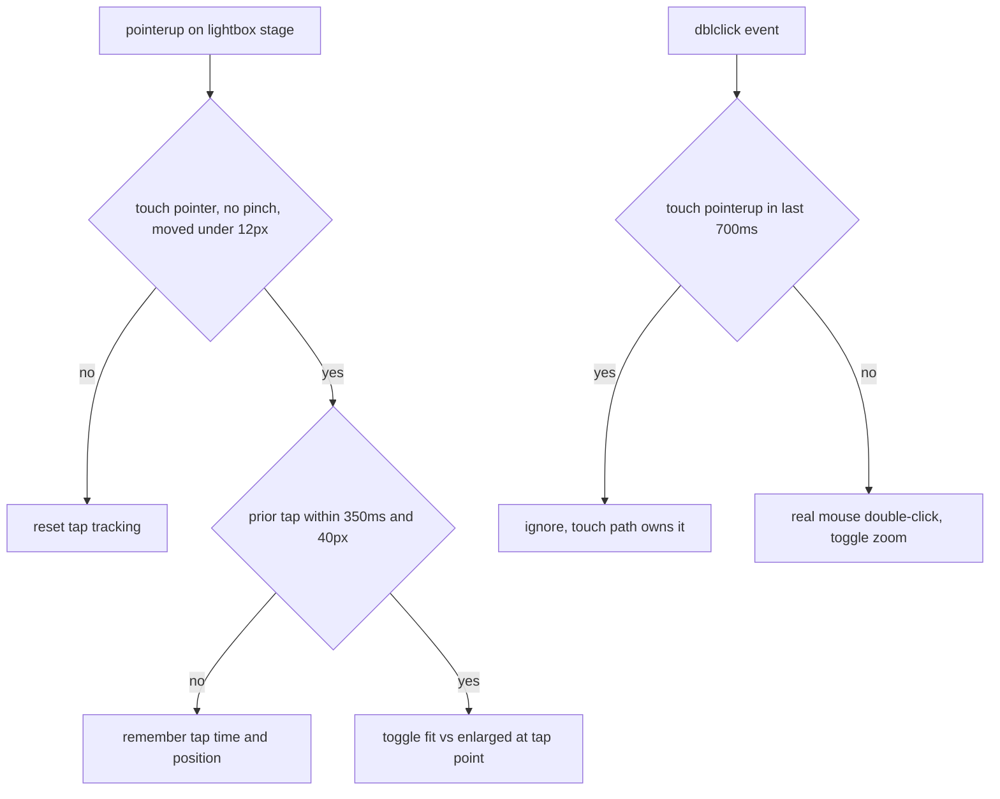

2026-07-18

# ADR site: mobile-friendly layout for Android and iOS phones

The ADR calendar site was designed desktop-first. On a phone it technically rendered (the viewport meta was already correct) but was hostile to use: the month grid squeezed text pills into ~50px-wide cells where labels were unreadable smears, the week view burned a fixed 140px column on the date label and forced every day row to 200px tall even when empty, the toolbar buttons were ~30px tall (well under the 44-48px touch-target guidelines), tapping the project filter made iOS Safari zoom the whole page in, and long inline code in ADR bodies pushed the viewer into horizontal scroll. This change makes the site genuinely usable on Android and iOS phones without altering the desktop look at all — everything is gated behind media queries or touch-capability checks.

## What changed, per area

**Month view (≤600px).** Text pills become calendar-app-style color bars: pure CSS turns each `.pill` into a 6px rounded bar in the project color (`font-size: 0`, `pointer-events: none`). Because the bars no longer take taps, a tap anywhere in the cell hits the existing day-cell click handler and opens the Day view, where full-size pills are shown. No JS changes were needed — the interaction was already wired; the CSS just reroutes taps to it.

**Week view (≤720px).** The `140px + 1fr` grid collapses to a single column: the date header (weekday, day number, month) lays out inline above the pills, and the 200px min-height is dropped so empty days shrink to a compact row. Pills in week/day views switch from `nowrap`+ellipsis to wrapping, with bigger padding — full titles are readable and each pill is a comfortable tap target.

**Toolbar.** On phones the controls span the full width: view switcher and prev/today/next share the first row, period label and project filter the second. Buttons get taller (~40px) tap targets, and the project `<select>` gets `font-size: 16px` — anything smaller makes iOS Safari auto-zoom the page when the select is focused, which was the single most annoying mobile behavior.

**Safe areas / notches.** The viewport meta now uses `viewport-fit=cover`, and the topbar, calendar, viewer header/body/footer, and lightbox controls all pad with `env(safe-area-inset-*)` (written as extra `padding-left/right` lines after the shorthand so browsers without `env()` keep the base padding). This matters mostly in landscape on notched iPhones and for the home-indicator strip at the bottom of the viewer. `theme-color` metas (light + dark) tint the mobile browser chrome to match the site.

**Viewer (markdown reader).** Wide tables become internally scrollable (`display: block; overflow-x: auto` — the GitHub approach), long identifiers wrap (`overflow-wrap: break-word` on the body, `anywhere` on inline code), and `overscroll-behavior: contain` stops the page behind the viewer from scroll-chaining. The header wraps instead of overflowing when a long project tag meets the action buttons.

**Touch behavior.** Hover tooltips are skipped entirely when `(hover: none)` — on touch they could only flash uselessly before the tap's click event hid them. Buttons and pills get `:active` pressed-state feedback in place of hover, and `touch-action: manipulation` on controls kills double-tap-to-zoom so rapid prev/next tapping doesn't zoom the page.

## Lightbox double-tap: the one non-obvious bit

The mermaid lightbox already had pinch-zoom and drag-pan via pointer events, but its double-click-to-zoom relied on `dblclick`, which browsers do not deliver reliably for touch when the element has `touch-action: none`. So double-tap detection was added by hand in the `pointerup` path. Playwright verification then caught a subtle double-fire: Chromium *does* sometimes synthesize `dblclick` from touch taps, so both paths ran and the two toggles canceled each other out — the zoom appeared to do nothing. The fix is an ownership rule: any `dblclick` arriving within 700ms of a touch `pointerup` is ignored, because the pointerup path owns touch input.

## Verification

Playwright (headless Chromium, per the repo's verify recipe) drove the site with iPhone 13 (light) and Pixel 5 (dark) device emulation: all four views screenshotted, month-cell tap navigates to Day view, the select computes to 16px, page and viewer have zero horizontal overflow, and double-tap in the lightbox toggles 34% (fit) to 100%. The emulation run caught two real bugs before commit — the viewer overflow from unwrappable inline code, and the dblclick/double-tap double-fire. A desktop (1280px) pass confirmed the existing layout is pixel-identical.

## Key Files

- `docs/style.css` — safe-area padding, touch/`hover: none` rules, rewritten ≤720px block, new ≤600px month-bar block
- `docs/app.js` — tooltip skip on touch, lightbox double-tap detection and dblclick suppression
- `docs/index.html` — `viewport-fit=cover`, `theme-color` metas
