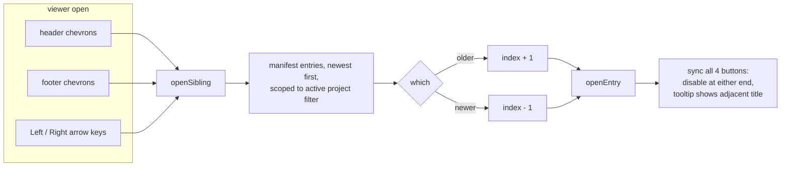

2026-07-08

# ADR site: prev/next navigation in the markdown viewer

## What and why

Reading through several ADRs used to be a round trip per document: open a pill, read, close the viewer, find the next pill, open it. This change adds previous/next navigation directly to the viewer so adjacent ADRs are one click (or one keystroke) away.

Two chevron buttons now live in the viewer header next to the existing Raw link and close button, and a matching pair sits in a new footer bar — so after scrolling to the end of a long ADR, the reader can move on without scrolling back up. Left/Right arrow keys do the same thing while the viewer is open.

## How it works

Navigation walks the same list the calendar shows: the manifest's entries (already sorted newest-first by `build.sh`), narrowed by the active project filter. So with the einkbro filter on, the chevrons step through einkbro ADRs only. The chevron semantics match the topbar's calendar arrows — left goes back in time (older), right goes forward (newer).

Details that came out of implementation:

- **State**: the app now tracks `state.currentEntry` (the entry open in the viewer, cleared on close). `viewerSiblings(entry)` recomputes older/newer on every open rather than caching indices, so the buttons stay correct if the filter changed.
- **Button sync**: all four buttons (two header, two footer) share `.viewer-prev` / `.viewer-next` classes and are synced together — disabled at either end of the list, and each carries a `data-tip` with the adjacent entry's project and title, reusing the site's existing tooltip system. The tip strips the project prefix from the title (like the calendar pills do), otherwise it read "einkbro — einkbro: …".
- **Stale-fetch guard**: `openEntry` fetches the markdown asynchronously; rapid chevron clicks or held-down arrow keys could let an older fetch resolve after a newer one and overwrite the body. After the `await`, the handler bails if `state.currentEntry` no longer points at the entry it fetched. Verified by firing 60 rapid ArrowRight presses — the rendered body matched the final hash.
- **Layout**: `#viewer-body` gained `flex: 1` so the footer bar pins to the bottom of the panel even for short documents; the body also resets `scrollTop` on each open so the next ADR starts at the top.
- **Hash**: unchanged behavior — `openEntry` already `replaceState`s the slug into the hash, so stepping through entries keeps the URL shareable at every stop.

## Key files

- `docs/index.html` — chevron buttons in `.viewer-actions`, new `.viewer-foot` bar, cache-bust bump
- `docs/app.js` — `viewerSiblings` / `syncViewerNav` / `openSibling`, stale-fetch guard, arrow-key binding
- `docs/style.css` — `.viewer-nav` button and `.viewer-foot` bar styles
