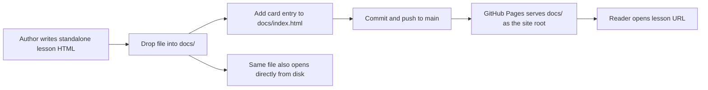

2026-07-23

# Arabic Lessons: publish standalone HTML teaching materials as a GitHub Pages site

## What this is

`~/src/arabic_lessons` is a new repository whose entire purpose is to host self-contained
HTML lesson pages for basic Arabic conversation (Traditional Chinese translation,
romanization, word breakdowns, derived forms, example sentences, grammar notes). The first
page — lessons 40–50, greetings and question words — previously lived in `~/Downloads` and
had to be opened from disk to be read or shared.

The goal was simply to give these pages a URL, so they can be linked to a student rather
than emailed around as an attachment.

## Why `docs/` rather than a `gh-pages` branch

GitHub Pages offers three publishing sources: the root of a branch, the `docs/` folder of a
branch, or a GitHub Actions workflow. `docs/` on `main` was chosen because it needs no
second branch to keep in sync and no build step — the lesson files are already the finished
artifact. A `gh-pages` branch would mean either manual merges or an Action, both of which
buy nothing here since nothing is compiled.

The right-hand branch of that diagram matters: because each lesson page inlines all of its
CSS and JavaScript and pulls in no external assets, the exact file that Pages serves also
works when double-clicked locally. Publishing did not require changing the lesson content
at all.

## What was added around the lesson file

Three things beyond the copied HTML:

**`docs/index.html`** — a landing page, because Pages serving a directory with no
`index.html` shows a 404 rather than a file listing. It lists lessons as linked cards and
reuses the lesson page's own palette and typography (the `--accent` teal, the gold rule, the
Amiri Arabic face, the bismillah in the hero) so the site reads as one document rather than
an index bolted onto a page.

**`docs/.nojekyll`** — Pages runs content through Jekyll by default, which silently drops
files and directories whose names begin with an underscore. Nothing here starts with an
underscore today, but a future lesson asset could, and the failure mode is a missing file
with no error. The empty marker file removes that class of surprise permanently.

**`README.md`** — records the Pages source setting to select in the repo settings, and the
three-step procedure for adding the next lesson. The repository will be touched
infrequently and by then the `docs/`-versus-`gh-pages` reasoning above will not be obvious
from the file tree alone.

## Current state

The repository is initialized on `main` with one commit containing all of the above. It has
no remote yet — creating the GitHub repository, pushing, and enabling Pages in Settings
remain to be done, and the URL will be `https://<user>.github.io/arabic_lessons/` once they
are.
