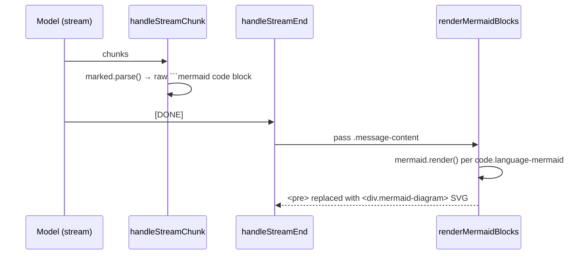

# Ask Web — Mermaid diagrams in chat replies

## Summary

Chat mode now renders ` ```mermaid ` fenced code blocks in assistant
replies as inline SVG diagrams, and the system prompt nudges the model to
add a diagram whenever one explains something more clearly than prose
(architecture, flow, sequence, timeline, decision tree, etc.).

## Approach

`chat.html` is a full **extension page**, not a content script injected
into arbitrary host pages. That made this far simpler than rendering in the
floating window: the page has its own `'self'` CSP and no Shadow DOM /
host-style collisions to fight.

Rendering already flowed through `marked.parse()`, which emits
`<pre><code class="language-mermaid">…</code></pre>` for a mermaid fence. The
only missing piece was a post-render pass that swaps those blocks for SVG.

Decisions made during implementation:

- **UMD build, not ESM.** Mermaid v10+ ESM lazy-loads diagram modules via
  dynamic `import()`, which is awkward to vendor and risks CSP friction. The
  pinned **v11.4.1 UMD** bundle (`vendor/mermaid.min.js`) is fully
  self-contained (zero `import()`), exposes `globalThis.mermaid`, and runs
  under the page's default `script-src 'self'` — no `'unsafe-eval'`. Its only
  `Function()` usages are the lodash-style `Function("return this")()` global
  fallback, which short-circuits on `self` (always truthy here) and never
  executes.
- **Render on stream end, not mid-stream.** A half-streamed diagram fails to
  parse, so `handleStreamChunk` only renders markdown (mermaid shown as a raw
  code block); `renderMermaidBlocks()` runs once in `handleStreamEnd` (and in
  `addMessage` for non-streamed replies). On parse failure the raw code block
  is left in place.
- **Theme-matched.** `mermaid.initialize` picks `dark`/`default` from the
  extension's `data-theme` attribute, with `securityLevel: 'strict'`.



## Trade-offs

- **+2.5 MB bundle.** The vendored UMD build is large, but in line with the
  existing d3 + markmap vendoring. Relevant only if Web Store listing size
  becomes a concern.
- **Diagrams appear only after streaming completes** — you can't reliably
  render a partial diagram, so there's a brief moment where the raw mermaid
  source is visible before it resolves to SVG.

## Key Files

- `vendor/mermaid.min.js` — pinned v11.4.1 UMD build (new).
- `chat.html` — loads the vendored script.
- `chat.js` — `initMermaid()`, `renderMermaidBlocks()`, calls in
  `handleStreamEnd` / `addMessage`, and the expanded system prompt in
  `buildSystemMessage()`.
- `chat.css` — `.mermaid-diagram` container styling.
- `CLAUDE.md` — documented the new vendored dependency.
