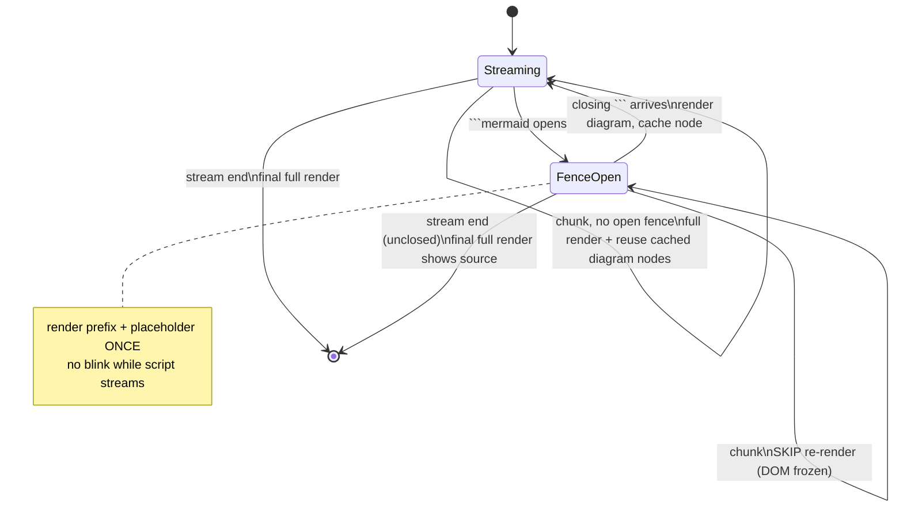

# Ask Web — Chat screen blinks while Mermaid diagrams stream

## Problem

After adding incremental Mermaid rendering, the chat screen flickered
constantly while a diagram was being generated — and worse with several
diagrams in one reply. The diagram could take tens of seconds to stream, and
the whole message strobed the entire time.

## Root Cause

`handleStreamChunk` rebuilt the whole message on every streamed token:

```js
contentDiv.innerHTML = renderMarkdown(currentStreamContent);
// …then re-render mermaid from cached SVG string
```

Two compounding costs:

1. **The diagram's source is long.** A 10–50 line diagram streams as many
   tokens, and each token triggered a full `innerHTML` rebuild — so the
   raw `` ```mermaid `` source grew in a code block while everything around
   it churned.
2. **Diagrams were rebuilt from an SVG string each chunk.** The cache stored
   the SVG as text and did `wrap.innerHTML = svg` on every re-render, so the
   browser re-parsed and re-laid-out each finished diagram (fonts,
   `foreignObject`) on every token — a visible flash. With multiple diagrams,
   every earlier diagram re-parsed on every token of later content.

## Solution

Two changes in `chat.js`:

1. **Freeze the DOM while a fence is open.** `inOpenMermaidFence()` detects
   that the text ends inside an unclosed ```mermaid fence (strip all complete
   blocks; any ```mermaid left over is open). While open, render the stable
   prefix plus a pulsing "Generating diagram…" placeholder **once**, then skip
   all re-renders until the fence closes. Nothing above the open fence changes,
   so the screen stays still — and the user sees a placeholder instead of raw
   script scrolling by.
2. **Reuse the rendered node instead of an SVG string.** The per-stream cache
   now stores the live `<div.mermaid-diagram>` element. After each `innerHTML`
   reset, `applyCachedMermaid()` moves that *same* node back into place
   (`pre.replaceWith(node)`) within the same synchronous tick — one paint, no
   SVG re-parse — so finished diagrams stay rock-stable while later text or
   diagrams stream.

The cache is reset per stream (`resetStreamMermaid`) so nodes never jump
between messages; non-streamed messages use a separate one-shot
`renderMermaidStatic()`. `handleStreamEnd` does a final full render to finalize
a fence that closed on the last chunk (or surface an unclosed one).



## Key Files

- `chat.js` — `inOpenMermaidFence()`, `renderStreamPrefixWithPlaceholder()`,
  node-based `mermaidNodeCache` + `applyCachedMermaid()`/`ensureMermaidRendered()`,
  `resetStreamMermaid()`, reworked `handleStreamChunk`/`handleStreamEnd`, and
  `renderMermaidStatic()` for non-streamed messages.
- `chat.css` — `.mermaid-pending` placeholder with a pulse animation.

## Lessons Learned

- **Per-token `innerHTML` rebuilds are fine for text but brutal for embedded
  rendered content.** Re-parsing an SVG (or any heavy node) every token reads
  as a strobe. Reuse the node; don't rebuild it from a string.
- **You don't have to render what's still streaming.** When the source of a
  block is incomplete and unparseable anyway, freezing the DOM behind a
  placeholder is both cheaper and a better UX than streaming raw syntax.
- **A single synchronous tick = a single paint.** Detaching and re-inserting
  the same node inside one handler never shows the intermediate state, which is
  what makes node-reuse flicker-free.
