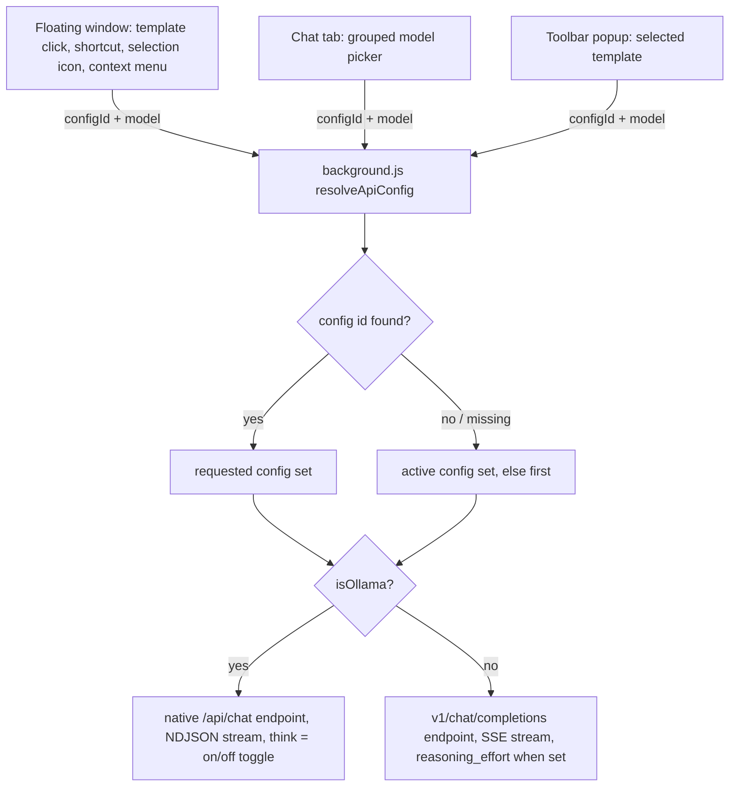

2026-08-12

# Ask Web: Multiple API Configuration Sets

Ask Web previously had exactly one API endpoint: a single key, base URL, and model in Settings. Anyone switching between OpenAI and a local Ollama (or any other OpenAI-compatible server) had to re-type settings each time, and every template shared the same endpoint. This change turns that single endpoint into named **API configuration sets** and lets prompt templates pick which set they run against.

## What a configuration set is

Each set is stored in `chrome.storage.local` under `api_configs` (with `active_api_config_id` marking the default):

```js
{
  id: 'cfg_xxx',
  name: 'Local Ollama',
  apiBaseUrl: 'http://localhost:11434/v1',
  apiKey: '',                  // optional for non-OpenAI endpoints
  models: ['qwen3:8b', ...],   // the set's own model list
  model: 'qwen3:8b',           // default model
  isOllama: true,              // auto-detected from URL, user-overridable
  reasoningEffort: 'none',     // none|minimal|low|medium|high (non-Ollama)
  thinking: false              // Ollama only: think on/off
}
```

The Ollama flag drives two behavioral splits, which is why it's an explicit stored flag rather than a URL sniff at request time:

- **Protocol** — Ollama configs call the native `/api/chat` endpoint and parse NDJSON streams; everything else uses `/v1/chat/completions` with SSE.
- **Reasoning control** — the requirement was that Ollama configs expose only a thinking on/off switch, while OpenAI-style endpoints get a reasoning-effort level. The settings modal swaps between the two controls when the flag toggles (the flag itself auto-checks when the URL looks like Ollama — port 11434 or an "ollama" host).

Detection had previously been `localhost + 11434` hard-coded in `background.js`, which broke for remote Ollama hosts; the user-overridable checkbox removes that ceiling.

## Request resolution

Every request path now carries an optional `configId` (from the template, or from the chat tab's picker). The background worker resolves it with fallbacks so deleted or unset configs degrade gracefully:



Two request-shaping rules worth remembering:

- `reasoning_effort` is only sent to the **official OpenAI host when the model looks like a reasoning model** (o1/o3/"5"), because OpenAI rejects the parameter on other models. Self-hosted servers get it whenever the set specifies one — they ignore unknown fields.
- An API key is now **only required for `api.openai.com`**. Local servers commonly run keyless (users previously had to enter a dummy key for Ollama); the `Authorization` header is simply omitted when the key is empty.

## Migration

`getApiConfigs()` migrates lazily on first read: if `api_configs` is absent, the legacy `openai_api_key` / `openai_api_base_url` / `openai_model` keys are wrapped into one config (`id: 'cfg_default'`) and persisted. The migrated set preserves prior behavior exactly — official OpenAI gets `reasoningEffort: 'none'`, other self-hosted endpoints keep the old hard-coded `'low'` cap, Ollama gets `thinking: false`. The migration is deterministic, so the racy case (options page and service worker both migrating) converges on the same value.

Because `background.js` is a service worker that cannot load `utils.js`, the config helpers exist twice — canonical pure parts in `shared.js` (ES module, imported by the worker) and mirrored in `utils.js` for the classic-script contexts — following the project's existing keep-in-sync convention. A Node harness (stubbed `chrome.storage`) verified the two migrations produce byte-identical configs and exercised the fallback chain.

## UI changes

- **Settings** — the API card is a set manager: list with Active/Ollama badges, set-active / edit / delete actions, and an editor modal (name, URL, key, models one-per-line, default model, Ollama checkbox, reasoning or thinking control). The last remaining set can't be deleted; deleting the active one promotes the first and clears references from templates.
- **Template editor** — new "API Configuration" dropdown (default = active set); the model-overlay suggestions repopulate from the chosen set's models.
- **Chat tab** — the free-text model input became a `<select>` with one optgroup per set, encoding `configId||model` in the option value; the last choice persists in storage.

A follow-up fix in the same change: both settings modals previously had no height cap, so short browser windows cropped the Save button off-screen. `.modal-content` is now a column flexbox capped at `max-height: 100%`, with the body scrolling (`overflow-y: auto`) between a pinned header and footer — verified with headless-Chrome screenshots at a 520px window.
