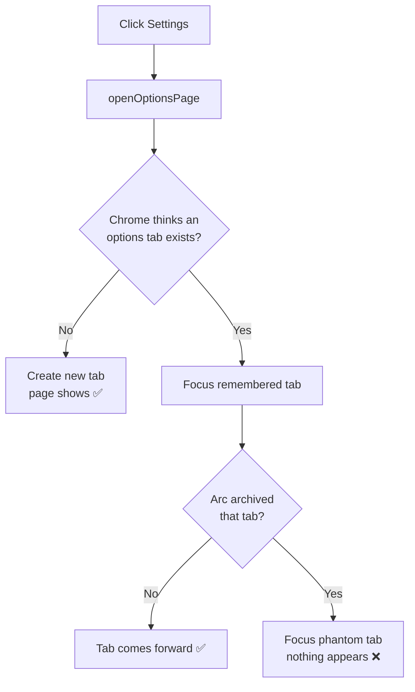

# ask_web — Settings page sometimes won't display on Arc

## Problem

In Arc browser, clicking the extension's settings button (from the toolbar
popup, the chat tab, or the floating window) sometimes did nothing — the
options page failed to appear. The failure was intermittent: the first open
after loading the extension usually worked, but later attempts often did not.

## Root Cause

Every settings entry point called `chrome.runtime.openOptionsPage()`, and the
manifest declares the legacy full-page form `"options_page": "options.html"`.

`openOptionsPage()` does not unconditionally open a tab. If it believes an
options tab is already open, it focuses that existing tab instead of creating a
new one. Arc auto-archives idle tabs and tabs in non-active Spaces. After the
options tab is archived, `openOptionsPage()` still thinks it exists and tries to
focus the now-hidden/phantom tab — the call "succeeds" but nothing visible
happens. Whether the page appears therefore depends on whether Arc has archived
the earlier options tab, which is why it was intermittent.

## Solution

Route all settings opens through the background worker's existing `openOptions`
message, and have that handler call `chrome.tabs.create({ url:
getURL('options.html') })` instead of `openOptionsPage()`. `tabs.create` always
produces a fresh, visible, foregrounded tab in the current Space and never
attempts to focus a phantom archived tab.

`popup.js` and `chat.js` were changed from calling `openOptionsPage()` directly
to sending `{ action: 'openOptions' }`; the content script already used that
message. No new permission is required (a `tabs.query({url})`-based
focus-or-create approach was rejected because it needs the `"tabs"` permission,
which this extension does not request, and would still be subject to Arc's
invisible-focus behavior).

The only trade-off is that rapid repeat clicks can open duplicate settings tabs
— harmless compared to the page not appearing at all.

## Key Files

- `background.js` — `openOptions` handler now uses `chrome.tabs.create`.
- `popup.js` — settings button sends `openOptions` message.
- `chat.js` — settings button sends `openOptions` message.
- `content.js` — already sent `openOptions` (unchanged).

## Lessons Learned

- `chrome.runtime.openOptionsPage()` is "focus-existing-or-create," not "always
  open." On browsers that archive or hide tabs (Arc, and similar tab-suspending
  setups) the focus path can target a tab the user can no longer see.
- When an extension UI action must always be visible, prefer an explicit
  `tabs.create` over APIs that try to reuse prior state.
