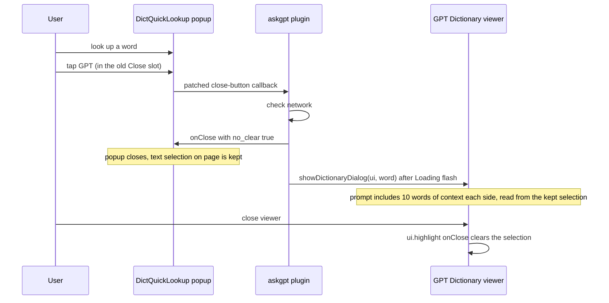

2026-08-08

# askgpt.koplugin: Replace the dictionary popup's Close button with a GPT button

When a word looked up in KOReader's built-in dictionary popup (`DictQuickLookup`) doesn't have a clear enough definition, the reader now has a one-tap escalation path: the popup's **Close** button is replaced by a **GPT** button. Tapping it closes the dictionary popup and asks the GPT dictionary (the plugin's existing `dictdialog.lua` flow) to generate a definition for the same word, with surrounding sentence context included in the prompt.

Nothing is lost by sacrificing Close: the popup can still be dismissed by tapping outside it or via the title-bar close icon, and **holding** the GPT button keeps the original hold-Close behavior (close the whole stack of chained dictionary windows).

## Flow

## How it's built

KOReader v2026.07 builds the popup's buttons from a pool keyed by id (`DictQuickLookup:_getButtonPool()`) plus a layout of id rows. The plugin wraps `_getButtonPool` once (guarded by a flag on the class) and replaces the pool entry for id `"close"` with the GPT button.

Replacing the *pool entry* rather than editing a layout was deliberate:

- KOReader's official `ReaderDictionary:addToDictButtons(spec)` API can only *append* plugin buttons as new rows — it can't take over an existing slot.
- The user may have a custom button arrangement saved in `dict_button_config`; that saved layout references buttons by id, so whatever layout is active, the slot that says `"close"` now yields the GPT button. No layout surgery needed.

Guards around the swap:

- Wikipedia windows and doc-less lookups (dictionary from the file manager) keep their normal Close button — the GPT dictionary needs `ui.document` for the book's title/author and `ui.highlight` for context.
- The patch only applies if `_getButtonPool` exists, so on an older KOReader without that method the plugin degrades to unchanged behavior instead of crashing.

## Keeping the word context alive across the hand-off

`showDictionaryDialog` builds its prompt with `ui.highlight:getSelectedWordContext(10)`, which reads the live text selection. A normal `onClose()` schedules the selection to be cleared — so the popup is closed with `onClose(true)` (`no_clear`), keeping the selection alive for the prompt build. This doesn't leak a lingering highlight: when the GPT viewer (`ChatGPTViewer`) closes, it calls `ui.highlight:onClose()`, which clears the selection as usual.

One robustness fix rode along in `dictdialog.lua`: the dictionary popup can be opened *without* a live selection (e.g. from lookup history, or a chained lookup inside the popup), in which case `getSelectedWordContext` returns nil and the old code would have crashed concatenating nil into the prompt. `prev_context`/`next_context` now default to empty strings (and are properly `local` instead of leaking globals).
