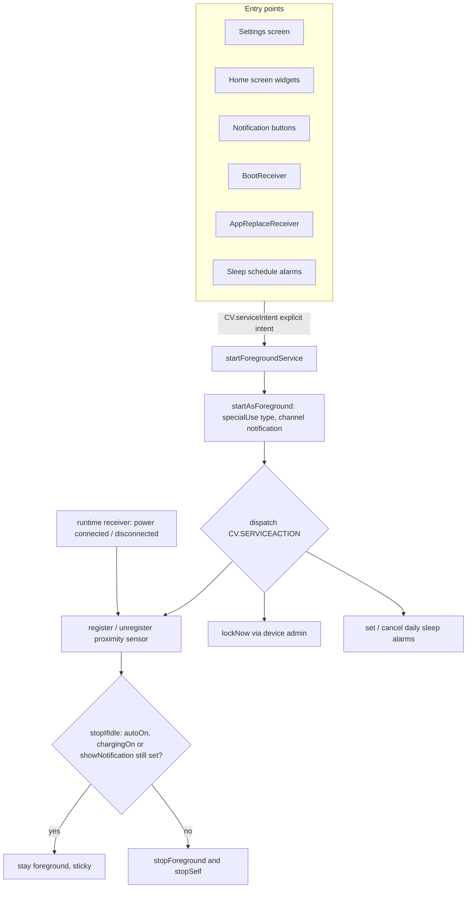

2026-08-02

# AutoScreenOnOff: modernize for a Play Store re-release (target API 36)

AutoScreenOnOff — the proximity-sensor screen on/off app — had been frozen since 2015: Eclipse/ADT project layout, Gradle 2.2.1, AGP 1.0.1, targetSdk 20. Google Play now requires targeting recent API levels, so re-releasing meant a full modernization pass. The project was rebuilt on the same toolchain as `calliplus_android`, which served as the reference throughout: Gradle 9.3.1, AGP 9.1.1, Java 17, a standard `app/` module, `keystore.properties` signing with a checked-in sample, and the Gradle Play Publisher plugin (app bundles, internal track by default). New version: **2.8.0, versionCode 40, compileSdk/targetSdk 36, minSdk 21**.

## The real work: a decade of Android platform changes

Bumping targetSdk from 20 to 36 crosses most of Android's behavioral watersheds at once. Several of the app's core mechanisms were not just deprecated but silently or loudly broken:

- **Implicit service intents** (`new Intent("com.danielkao.autoscreenonoff.serviceaction")`) are rejected since API 21 — every widget tap, preference change, and boot-time start would have failed. All callers now go through `CV.serviceIntent()`, which builds explicit intents.
- **Background services** are killed on API 26+ and cannot be started from receivers at all. The service is now a **foreground service** (type `specialUse`, with the mandatory `PROPERTY_SPECIAL_USE_FGS_SUBTYPE` explanation): `onStartCommand` unconditionally promotes itself first, then dispatches the command, then a central `stopIfIdle()` decides whether the service keeps living.
- **Manifest receivers stopped receiving `ACTION_POWER_CONNECTED`/`DISCONNECTED` in Android 8**, which means the "only when charging" mode had been dead for years. The charging receiver moved inside the service (runtime registration), and the service now idles in the foreground while charging mode is armed but the device is unplugged — that is the only way left to hear the plug-in event.
- **PendingIntents** must declare mutability on API 31+ (`FLAG_IMMUTABLE` everywhere now). This also surfaced a latent bug: the toggle widget and the screen-off widget built PendingIntents that differed only in *extras* — which PendingIntent matching ignores — with the same request code, so one widget could hijack the other's action. All service PendingIntents now use distinct request codes via `CV.servicePendingIntent()`.
- **Notifications** need a channel since API 26 (they simply don't render otherwise) and the `POST_NOTIFICATIONS` runtime permission since API 33 (requested in the settings activity). The `Notification` constructor + `setLatestEventInfo` code was replaced with `NotificationCompat`.
- **In-call detection** used `PhoneStateListener`, which requires the runtime `READ_PHONE_STATE` permission since Android 12. Replaced with an `AudioManager.getMode()` check — permission-free, and it covers VoIP calls too, so the READ_PHONE_STATE permission is gone from the manifest entirely.
- **Background activity starts** are blocked since Android 10, so the service can no longer just launch the device-admin grant screen when it needs the privilege. `promptDeviceAdmin()` still tries (works when the app is visible) but also posts a tappable notification as the reliable path.
- **Edge-to-edge**: the legacy Holo `PreferenceActivity` is kept (as in calliplus), with the same two-layer fix — `values-v35/styles.xml` sets `windowOptOutEdgeToEdgeEnforcement` (honored on Android 15 only) and `util/EdgeToEdge.padSystemBars()` pads the nav/cutout sides on Android 16+, where the opt-out is ignored.

## What was removed rather than migrated

- **The exclude-apps feature.** It relied on `getRunningAppProcesses()` (returns only your own process since API 22) and `GET_TASKS` — non-functional for a decade. A real replacement needs `QUERY_ALL_PACKAGES` plus usage-stats access, both Play-restricted; not worth it for a resurrection release. Preference UI, custom preference class, and permission all deleted.
- **The `strategy/` package** (`BaseStrategy`/`BaseTurnOnStrategy`/`BaseTurnOffStrategy`) — never instantiated anywhere; the real logic always lived inline in the service.
- **The status-bar collapse reflection hack** (`StatusBarManager.collapsePanels` via reflection) — blocked by non-SDK interface restrictions.
- **PowerOffTest/** — placeholder `android.test` instrumentation tests (`assertTrue(true)`); the framework itself is gone from modern SDKs.
- **Travis CI**, Eclipse project files, and the dead `bindService` plumbing in `MainActivity` (a `ServiceConnection` that nothing ever connected).

## Verification

`assembleDebug`, `assembleRelease` (R8 + resource shrink, whole-namespace keep rule because the legacy preference framework inflates `TimePreference`/`MyPreferenceCategory` reflectively), and `bundleRelease` all pass. The merged manifest was inspected with `aapt2` (versionCode 40, target 36, correct `exported` flags, FGS type, no `debuggable`). Installed on an API 34 emulator: the 2.8 changelog dialog and POST_NOTIFICATIONS prompt fire on first launch, and the full settings list renders end to end. The v35/v36 edge-to-edge layers still need a look on an Android 15/16 image, and sensor/wake-lock behavior needs a physical device.

Play Console still needs manual declarations: the *special use* foreground-service type justification and the device-admin usage declaration.
