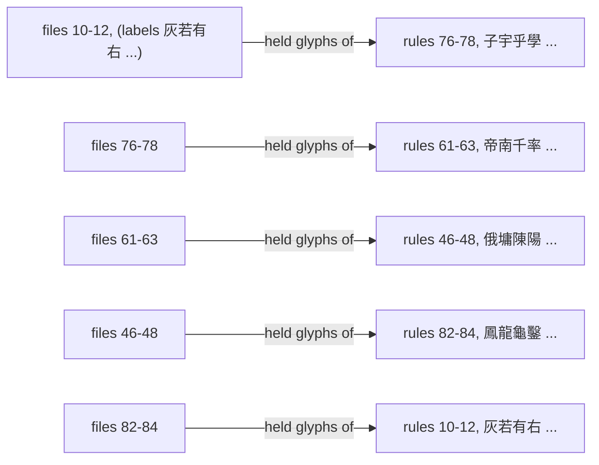

2026-08-30

# CalliPlus: five rule-blocks of the 歐陽詢 92 rules charbook showed the wrong glyphs

## What was broken

In 間架九十二法 (歐陽詢), rules 10–12, 46–48, 61–63, 76–78 and 82–84 displayed
characters that belonged to a different rule: rule 46 (右占者，右不妨獨豐), labelled
俄墟陳陽, showed the glyphs 鳳龍龜鑿; rule 83 (從「卩」之字準此) showed 來東本米; and
so on — 60 of the 368 glyphs, in five blocks of three consecutive rules. The bug
dates from the original import of the book (commit `05dd1ef`) and shipped in every
release since, including 4.11.0 earlier today.

It surfaced while recording stroke order on the Boox: the trace preview showed the
JSON's character (陳) next to the glyph that had actually been traced (龜).

## Root cause

The charbook text (`92_ou.txt`) — rule headers and character labels — is in the
canonical order, and the SVG files are *named* after those labels. But the SVG
*contents* (traced from the scanned book) were assigned to file names in a
different order: the blocks form one 5-cycle.

Every other rule matched. The rule headers settle which side is right: the glyphs
under 從「卩」之字準此 must be 卻卿仰仰, and those were sitting in the files named
`47_*`.

## Fix

- The 60 SVG files are rewritten in place with the contents that belong to their
  names (target block ← source block: 10–12 ← 82–84, 46–48 ← 61–63, 61–63 ← 76–78,
  76–78 ← 10–12, 82–84 ← 46–48). `92_ou.txt` needed no reordering.
- Two labels that never matched their glyph are corrected: `46_2` 墟 → 墉 and
  `62_2` 平 → 卒 (file rename + text line).
- The hand-traced stroke recordings follow the glyph they were traced over: the
  24 recordings named for rules 10–12 and 46–48 become 76–78 and 82–84 (with their
  `char` / `image` / `index` fields updated, on the Mac and on the Boox), and
  `assets/92_ou_strokes` is regenerated from the corrected set. Rules 10–12 and
  46–48 therefore have no stroke animation until they are recorded again.

Verification: every affected glyph was re-rendered into a labelled contact sheet
and checked by eye against its label and rule header; the full book (all 92 rules)
was reviewed the same way to confirm nothing else is displaced.

The fix is on `master` (commit `3e5ca7b`) and is not yet released; 4.11.0 on Play
still carries the bug.
