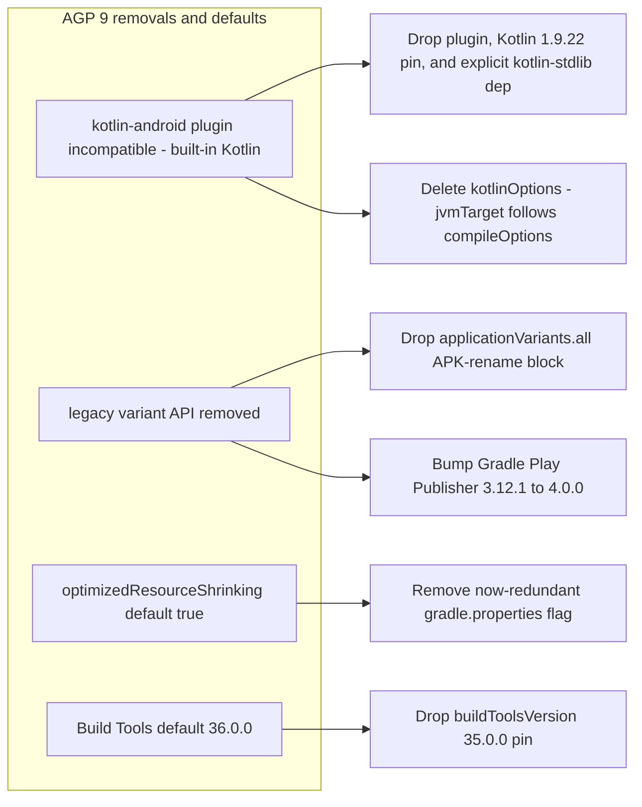

2026-08-02

# CalliPlus: Upgrade to AGP 9.1.1 / Gradle 9.3.1 with built-in Kotlin

Third and last of the Play Console optimization recommendations (after
[enabling R8 optimization](calliplus-r8-optimization.md)): move off AGP 8.
Done directly by editing the build files — no Android Studio Upgrade
Assistant involved. Chose AGP 9.1.1 (latest 9.1.x patch), which requires
Gradle 9.3.1 and SDK Build Tools 36.0.0 (both already satisfiable locally;
the build runs fine on the machine's JDK 19).

AGP 9 is a breaking release, and each removal mapped to a concrete change in
this project:

Notes on the two judgment calls:

- **APK naming.** The old `applicationVariants.all { outputFileName = ... }`
  block produced `calliplus-<variant>-<versionCode>.apk`. The AGP 9
  replacement (the `listenToArtifacts` gradle-recipe) needs a custom
  build-logic plugin with a `BuiltArtifactsLoader` copy task — real machinery
  for a cosmetic local filename. Play uploads go through Gradle Play
  Publisher app bundles, so nothing depends on the APK name; the block was
  dropped and outputs are the default `app-<variant>.apk`. README and
  CLAUDE.md updated to match.
- **Play Publisher.** GPP 3.x uses the removed legacy variant API; GPP 4.0.0
  is the AGP 9 line (and drops AGP 8 support, so the two bumps must land
  together). All `publish*` tasks verified present after the upgrade.

The prerequisite that made this smooth had already landed in the previous
commit: AGP 9 deletes the `android.nonFinalResIds` flag, and the Java
`switch (R.id.…)` statements that flag protected were already migrated to
`if/else`.

Built-in Kotlin means the Kotlin compiler now ships with AGP (2.2.x embedded)
instead of a project-pinned 1.9.22 — the existing Kotlin sources compiled
under 2.x without changes. Verified `./gradlew help`, `build --dry-run`, and
a full `assembleRelease`, then smoke-tested the release APK on the emulator:
SVG charbook rendering, DB search, character pager — all working, clean
logcat.
