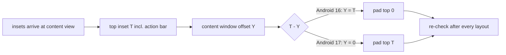

2026-08-29

# CalliPlus: window content hidden under the action bar on Android 17

## What was broken

On a Pixel 9 running Android 17 (API 37) the first rows of every screen sat under the
Holo action bar: the search field on the main screen, the first rule's header in a
charbook. The ad banner was drawn at the very top of the window, behind the status bar.
The Play Store build showed the same; it surfaced while installing the stroke-animation
build on that phone.

## Root cause

The app's legacy Holo theme has been fighting forced edge-to-edge since Android 15:

* Android 15 honours `windowOptOutEdgeToEdgeEnforcement` (`res/values-v35/styles.xml`).
* Android 16 ignores the opt-out, but its decor still lays the window content out below
  the status bar and action bar; only the navigation side was uninset, which
  `utils/EdgeToEdge.padSystemBars` handled by padding the content's left/right/bottom.
* Android 17 lays the content out from the top edge of the window and simply draws the
  action bar over it. Nothing offset the content any more, and `padSystemBars` set the top
  padding to 0.

## Fix

Measured on the device, the `statusBars` inset the decor hands to `android.R.id.content`
already includes the action bar (257 px = 149 status + 108 bar on the Pixel 9), and it is
the same on Android 16. So the top padding is that inset minus the content view's actual
window offset:

A first attempt added the action bar height on top of the inset, which double-padded
(content 514 px down) — `ActionBar.getHeight()` also reports 257 once laid out. Verified
on the Pixel 9 (Android 17) and a Pixel 7 API 36 emulator (Android 16, unchanged).
CLAUDE.md's edge-to-edge note was updated accordingly.
