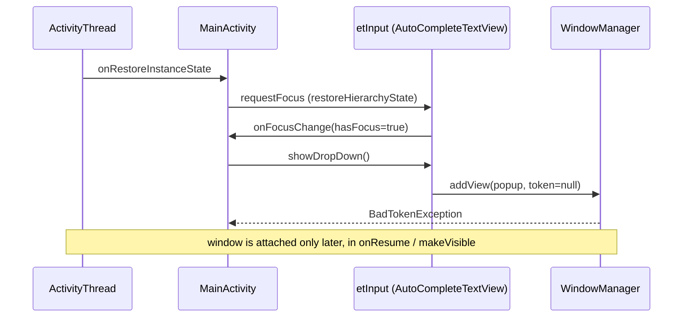

2026-08-26

# CalliPlus Android: fix the four 4.8.1 crashes from Play Console

Play Console reported four distinct crashes against 4.8.1 (the first R8 /
AGP 9 release). None are new to that release — each is an old latent bug that
finally got enough installs to surface. Two are lifecycle-timing bugs in
`MainActivity`, one is a broken comparator in the Sanxi database layer, and one
is a dead AsyncTask in `CharActivity` that outlived its activity.

## 1. NPE in `MainActivity.dismissKeyboard()`

```
NullPointerException: 'IBinder View.getWindowToken()' on a null object reference
  at MainActivity.dismissKeyboard (MainActivity.java:361)
  at MainActivity$2.onClick (MainActivity.java:106)
```

Tapping the search button ran
`inputManager.hideSoftInputFromWindow(getCurrentFocus().getWindowToken(), ...)`.
`Activity.getCurrentFocus()` returns null whenever no view in the window holds
focus — the search field loses focus once the user taps elsewhere, and a plain
`Button` does not take focus on touch — so the call dereferenced null.

Fix: fall back to `getWindow().getDecorView()` when there is no focused view
(the decor view shares the window's token, so the keyboard still hides), and
skip the IMM call entirely if the token is null.

## 2. `BadTokenException` from the search dropdown

```
WindowManager$BadTokenException: Unable to add window -- token null is not valid
  at AutoCompleteTextView.showDropDown
  at MainActivity$5.onFocusChange (MainActivity.java:153)
  at PhoneWindow.restoreHierarchyState
  at Activity.onRestoreInstanceState
```

The search field's `OnFocusChangeListener` calls `showDropDown()` on focus gain
so the recent-search list appears as soon as the user taps the field. But focus
is also *restored* by the framework: after process death or a config change,
`onRestoreInstanceState` replays the saved view hierarchy state, which includes
re-focusing the field that had focus. That happens in `handleStartActivity`,
before `onResume` attaches the activity's window, so the popup has no window
token to anchor to.



Fix: only call `showDropDown()` when `etInput.getWindowToken() != null`. A user
tap always arrives with the window attached, so the interactive behaviour is
unchanged; the restore path simply skips the popup.

## 3. `ArrayIndexOutOfBoundsException` sorting a Sanxi book

```
ArrayIndexOutOfBoundsException: length=2; index=3
  at DatabaseHelper$BookCharComp.compare (DatabaseHelper.java:389)
  at Collections.sort
  at DatabaseHelper.searchSanxi / searchSanxiByBook
  at CharBookActivity.onCreate (CharBookActivity.java:98)
```

Opening a 三希堂 book sorts its glyphs by the position encoded at the end of each
image URL, e.g. `.../ocbb04f_3-558-57.png` -> `3-558-57`. `BookCharComp` split
both sides on `-`, then looped over `arrayA.length` while indexing `arrayB[i]`.
Inspecting the bundled `map.db` shows why that is not safe — several books mix
segment counts within the same book:

| book | example suffixes |
| --- | --- |
| 25 | `2-584-43`, `2-585--12` (empty segment) |
| 132 | `13a-15`, `13a-33-2`, `13b-55-a-2`, `04b-59-a-2` |
| 263 | `4-1836`, `4-184-1` |

So as soon as TimSort compared a 3-segment row against a 2-segment one with the
longer on the left, it read past the end. The old code also swallowed
`NumberFormatException` on one side only (desyncing the accumulators), built the
key as `a*1000 + n` (overflow-prone), and returned `a - b`.

Fix: rewrite the comparator as a segment-wise total order — numeric segments by
value, numbers before non-numeric tokens, the rest lexically, and a missing
segment sorts first. That keeps the `Comparator` contract (no "violates its
general contract" surprises from TimSort) and needs no assumptions about
segment count. Verified by sorting every one of the 421 books in `map.db` with
the same logic outside the app: no exceptions, and a sampled antisymmetry check
on the messiest book (132) passes.

## 4. Glide "cannot start a load for a destroyed activity" in `CharActivity`

```
IllegalArgumentException: You cannot start a load for a destroyed activity
  at Glide.with
  at CharActivity$GetLargeImgUrlTask.onPostExecute (CharActivity.java:270)
```

`GetLargeImgUrlTask` was a leftover from when the large-image URL had to be
fetched from the network. That fetch had been commented out long ago; what
remained was `Thread.sleep(50)` followed by `Glide.with(calliImageView).load(url)`
— the exact load the calling code had already issued synchronously one line
earlier. If the user pressed back inside that 50 ms window, `onPostExecute` ran
against a destroyed activity and Glide threw.

Fix: delete the task and its three call sites (`onCreate`, prev, next). The
immediate load that precedes each of them already does the work, and Glide
cancels it itself when the view's activity is destroyed.

## Commits

- `8571519` Fix NPE in MainActivity.dismissKeyboard when no view has focus
- `46a5037` Fix BadTokenException showing search dropdown during state restore
- `477dabc` Fix ArrayIndexOutOfBounds sorting a Sanxi book's glyphs
- `0c2eca0` Remove vestigial GetLargeImgUrlTask that crashed after CharActivity was destroyed
