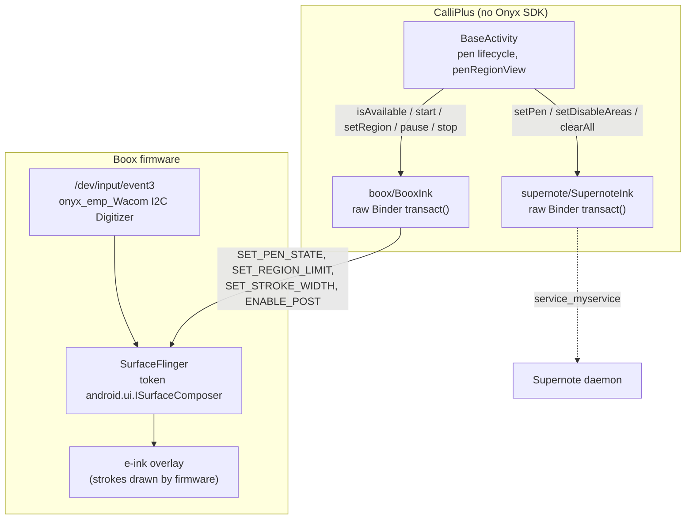
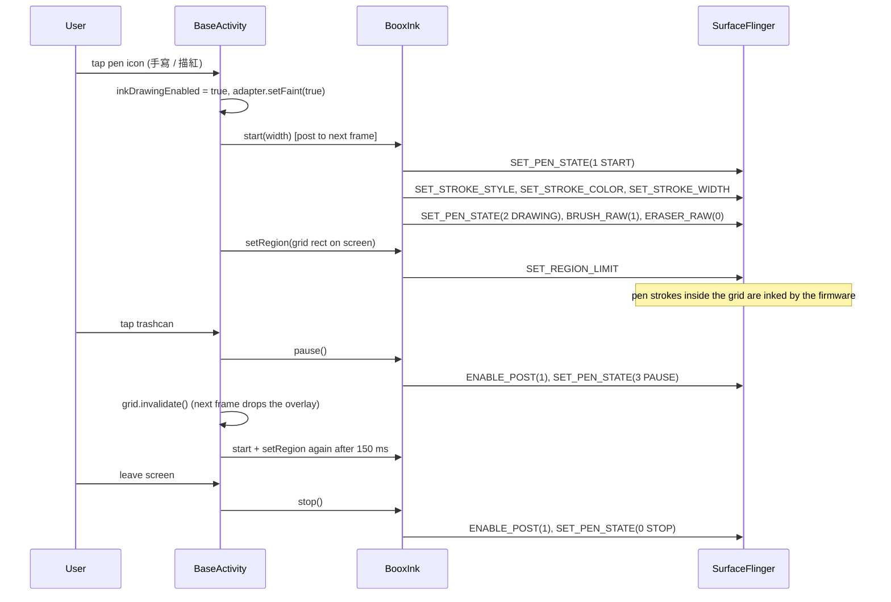

2026-08-29

# CalliPlus: Boox stylus inking without the Onyx SDK

CalliPlus now supports firmware-inked handwriting (手寫 / 描紅) on Boox e-ink tablets the
same way it already did on Supernote — and it does so **without importing
`com.onyx.android.sdk:onyxsdk-pen`**. Commit `a529c4b` on `calliplus_android`.
The SDK itself is dissected in the companion ADR
[calliplus-android-onyx-pen-sdk-analysis](calliplus-android-onyx-pen-sdk-analysis.md).

## What the user gets

- On a Boox, the pen icon in the header of both charbook screens (間架九十二法 / 心經 rule
  blocks, and the calligraphy sample grid) turns on gray "tracing" mode and hands the grid
  to the stylus. The firmware inks the strokes with sub-frame latency; the app never
  renders them. Ink is confined to the grid — nothing lands on the header.
- The trashcan (清除手寫) appears only while the pen is on and wipes the strokes.
- Settings gains a 手寫筆 category with 筆畫粗細 (1–30 px) — the Boox stroke width.
  It is hidden on devices without a firmware pen.
- Boox gets the same two-column grid layouts as Supernote (both are 10" tablets).
- Small extras that came out of testing on the device: the settings screen has an Up
  button, and `IntListPreference` no longer shows "null" above "目前設定" when a
  preference has no summary of its own.

## Why not the SDK

`onyxsdk-pen` weighs 1.8 MB and drags in onyxsdk-base/device, RxJava, fst, EventBus 3,
mmkv, retrofit, joda-time and more. Decompiling it showed that every pen call ends up in
the hidden framework class `android.onyx.ViewUpdateHelper`, whose methods are one-line
wrappers around `ServiceManager.getService("SurfaceFlinger").transact(code, parcel)` with
Onyx-private transaction codes. That is *exactly* the shape of CalliPlus's existing
`SupernoteInk` (raw Binder to the Supernote daemon), so a `BooxInk` twin of ~150 lines
replaces the whole dependency.

Doing it raw has a second benefit: `android.onyx.*` is hidden-API **blocked** for our
targetSdk (verified: `getMethod` throws `NoSuchMethodException` on the Tab Ultra C, which is
why Onyx's own demo ships `org.lsposed.hiddenapibypass`). Only `ServiceManager.getService`
is touched via reflection, and that is greylisted and works.

## How it is wired

- `boox/BooxInk` — `isBoox()` (build identity, for layout/menu decisions), `isAvailable()`
  (Boox **and** SurfaceFlinger answers `IS_PEN_STATE_VALID` — the transaction codes are
  non-final firmware statics, so a firmware that renumbers them simply gets no pen),
  `start(width)`, `setRegion(rects)`, `setStrokeWidth`, `pause()`, `stop()`.
- `BaseActivity` — the pen lifecycle now covers both devices behind `hasPen`. New
  `penRegionView`: subclasses point it at the grid, and on Boox its on-screen rectangle
  becomes the firmware's region limit. `isPenDevice()` (Supernote ∨ Boox) gates the
  pen/clear actions, the 2-column grids and the settings category. The existing
  `dispatchTouchEvent` stylus/palm filtering carries over unchanged — stylus MotionEvents
  still reach the app while the firmware inks.
- `CharBookActivity` — 手寫 now also fades the samples (previously fading was a separate
  淡墨 toggle there; 描紅 in the rule-block screen already combined the two). Menu titles
  are derived in `onPrepareOptionsMenu` so both items stay in sync.
- `MyPreferenceManager.PREF_PEN_WIDTH` + `settings.xml` category `pref_stylus_category`
  (removed at runtime by `MyPrefActivity` off pen devices).

## Things learned on the device

- **Style resets width.** The first build sent width before style and the 筆畫粗細
  setting had no effect: selecting a stroke style loads that style's default width, so
  the order must be style → width. The SDK demo does the same.
- **Clearing.** SurfaceFlinger drops the ink overlay on the next frame the app posts
  after `ENABLE_POST(1)`; pause + invalidate the grid + restart 150 ms later is enough.
  A full stop/restart also works. Both were tried in a throwaway test app before wiring.
- **Width units.** The SDK's default is 7.2 px; its demo converts millimetres with
  `mm × dpi / 25.4`, so 30 px ≈ 2.5 mm on the Tab Ultra C. 80 was tried and was far too
  much once the grids went two-column.
- `screencap` does not capture the firmware overlay (same as Supernote), so verification
  is by eye on the device; the CLAUDE.md note says as much.

## Caveats

- Transaction codes were read from firmware `D60_SMT_V02_2022_0309` (Android 11). They
  are `public static int` in the framework, i.e. Onyx may renumber them. `isAvailable()`'s
  probe is the guard; re-verify on a newer-firmware Boox when one is available.
- The Supernote stroke size (`sizeEmr`) is a different unit and was left untouched; the
  new setting only affects Boox.
