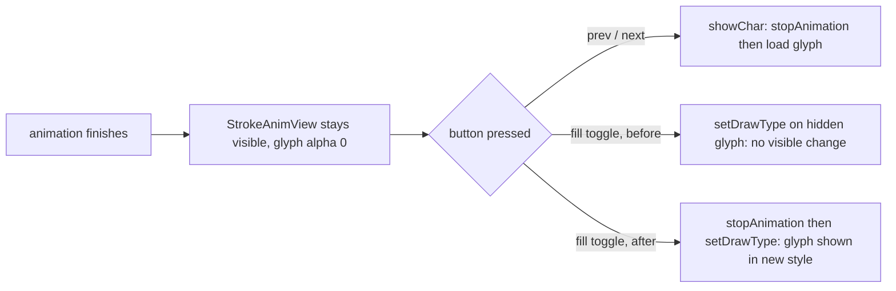

2026-08-29

# CalliPlus: 實心/空心 did nothing after a stroke animation

## What was broken

On the character panel, after playing the 筆順 / 手寫 stroke animation to the end, pressing the 實心/空心 (solid/outline) button appeared to do nothing. Prev/next still worked.

## Root cause

When the animation finishes, `CharPanel` intentionally leaves the finished frame on screen: the `StrokeAnimView` stays `VISIBLE` on top of the glyph and the real `CalliImageView` is kept at `imageAlpha = 0` ("the finished character stays until the user presses a button or moves on"). `showChar()` — used by prev/next — calls `stopAnimation()` first, which hides the overlay and restores the glyph's alpha. `toggleFill()` did not: it flipped the draw type and called `calliImageView.setDrawType(next)` on a view that was fully transparent and covered by the animation overlay, so the change was real but invisible.

## Fix

`CharPanel.toggleFill()` now calls `stopAnimation()` before switching the draw type, matching what prev/next already do. One line plus a comment; no change to the animation itself or to how the finished frame lingers when nothing is pressed.
