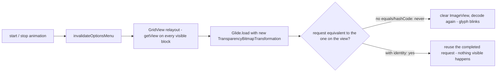

2026-08-29

# CalliPlus: rule-book glyphs blinked around the stroke animation

## What was broken

In a rule book (間架九十二法), starting or stopping the play-all stroke animation
made every calligraphy glyph on screen blink — go blank for a frame and come back.
It happened in normal ink but never in 淡墨 (faint) mode, which turned out to be
the whole clue.

## Root cause

Two things chained together:

1. `invalidateOptionsMenu()` is called on start/stop so the play action can turn
   into a stop button. That relayouts the action bar, and the layout pass reaches
   the `GridView`, which re-binds every visible rule block through `getView()`.
   `RuleBlockAdapter.getView()` reloads each glyph with Glide, as it should.
2. The normal-ink `TransparencyBitmapTransformation` had no `equals()`/`hashCode()`
   and an empty `updateDiskCacheKey()`. Each `getView()` builds a new instance, so
   Glide compared the new request against the one already on the `ImageView`,
   saw a different transformation, cleared the view and decoded again — with a
   memory-cache miss, because the transformation is part of the cache key. The
   glyph disappeared until the decode finished.

`FaintInkBitmapTransformation` already implemented identity, which is why faint
mode never blinked.

## Fix

Give `TransparencyBitmapTransformation` a stable `ID`, `equals()`/`hashCode()`
based on it, and write the ID into the disk-cache key — the same shape as the
faint transformation. Glide now treats the re-bind as the same request and
leaves the drawable alone.

Verified on the emulator by screen-recording play then stop and counting dark
pixels per frame: the old build drops to 12% of its ink for one frame at the
stop tap; the fixed build never dips below 94% (the small dips are the animating
cell itself).

## Also in this commit

The 筆順動畫 / 手寫動畫 actions were shown on every rule book, including 黃自元 and
心經 手寫, which have no recordings yet. `StrokeDataStore.hasBook()` checks whether
a book's `<book>_strokes/` asset directory has anything in it, and
`FileCharBookActivity` hides both actions when it does not. Long-pressing a
character offers the animation menu only when that character has a recording,
instead of a "no data" toast.
