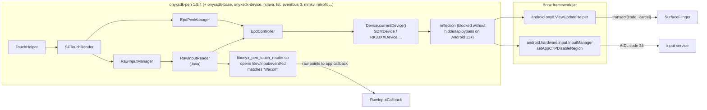

2026-08-29

# Analysis: what the Onyx (Boox) pen SDK actually does

Companion to [calliplus-android-boox-pen-without-sdk](calliplus-android-boox-pen-without-sdk.md).
This is the write-up of taking `onyxsdk-pen` apart to answer one question: *can CalliPlus
support the Boox stylus without importing it?* The answer is yes, and this document records
the evidence so the decision can be re-checked when Boox firmware changes.

Sources studied: `github.com/onyx-intl/OnyxAndroidDemo` (the `OnyxPenDemo` module and
`doc/*.md`), the artifacts `onyxsdk-pen:1.5.4`, `onyxsdk-base:1.8.5` and
`onyxsdk-device:1.3.4` from `repo.boox.com` (decompiled with jadx), the native
`libonyx_pen_touch_reader.so` (strings), and `/system/framework/framework.jar` pulled from
a Boox Tab Ultra C (firmware `D60_SMT_V02_2022_0309`, Android 11, platform `bengal`).

## Layer by layer



### 1. `TouchHelper` (public API)

`TouchHelper.create(view, callback)` builds a list of `TouchRender`s — `SFTouchRender` when
`DeviceFeatureUtil.hasStylus()` finds an input device named `onyx_emp`, `Wacom I2C
Digitizer` or `hanvon_tp`, else `AppTouchRender` (finger drawing via MotionEvents).
`openRawDrawing()` / `setRawDrawingEnabled()` / `closeRawDrawing()` fan out to them.

### 2. `SFTouchRender` — the stylus path

Two collaborators:

- `EpdPenManager` — pen state only: `startDrawing()` = `setScreenHandWritingPenState(1)`,
  `resumeDrawing()` = state 2, `pauseDrawing()` = 3, `quitDrawing()` = 0.
  `setStrokeStyle()` goes through `EpdController`.
- `RawInputManager` → `RawInputReader` — owns the **native touch reader** and maps raw
  digitizer points into view coordinates for the app's `RawInputCallback`. It also mirrors
  the limit/exclude rectangles to both the native reader (`nativeSetLimitRegion`, in raw
  touch units via `EpdController.mapToRawTouchPoint`) and SurfaceFlinger
  (`EpdController.setScreenHandWritingRegionLimit`).

Sequence on `openRawDrawing()` → `setRawDrawingEnabled(true)`:

1. `setStrokeStyle(0)`, start native reader thread, `PEN_START`
2. `PEN_DRAWING`, then `resetPenDefaultRawDrawing()`: `setBrushRawDrawingEnabled(true)`,
   `setEraserRawDrawingEnabled(false, 5)`
3. `setRawDrawingEnabled(false)`: `leaveScribbleMode(view)` (= `enablePost(1)`), pause
   native reader, `PEN_PAUSE`. `closeRawDrawing()` adds `PEN_STOP`.

Note the SDK never calls `enterScribbleMode` (= `enablePost(0)`) in this path; posting is
only ever *re-enabled*.

### 3. The native reader `libonyx_pen_touch_reader.so`

Strings tell the whole story: `/dev/input/event%d`, `try path %s result name %s`, `Wacom`,
`No touch device found!`, `poll`, `readTouchEventLoop`, classes `TouchConsumer`,
`EraseReader`, `SideEraseReader`, `BtnReader`, and JNI symbols
`Java_com_onyx_android_sdk_pen_RawInputReader_native{RawReader,RawClose,IsValid,SetStrokeWidth,SetLimitRegion,SetExcludeRegion,SetPenState,PausePen,SetRegionMode,EnableSideBtnErase,Debug}`.
It iterates `/dev/input/event*`, picks the device whose name contains `Wacom`, reads
evdev events itself and calls back `RawInputReader.onTouchPointReceived(x, y, pressure,
tx, ty, erasing, ...)`. It exists so the app can get **raw pen points** (for its own
stroke model); it is not what makes ink appear.

On the Tab Ultra C the digitizer is `/dev/input/event3` = `onyx_emp_Wacom I2C Digitizer`
(ABS_X 0..20966, ABS_Y 0..15725 → 8.45 units/px on the 2480×1860 panel, ABS_PRESSURE
0..4095, tilt ±63, BTN_TOOL_RUBBER/BRUSH, BTN_STYLUS/2). The node is `crw-rw-rw-`,
SELinux label `input_device`; a plain untrusted app can **open and read it** (verified),
while the `shell` user may read but not write (`sendevent` → permission denied).

### 4. `EpdController` → `Device.currentDevice()` → reflection

`EpdController` is a static façade over `BaseDevice` subclasses picked by
`ro.board.platform` (`SDMDevice` for Snapdragon models like the Tab Ultra C, `RK33XXDevice`
for Rockchip, …). Each resolves hidden framework methods once in a static initializer with
`ReflectUtil.getMethodSafely`:

| Reflected class | Members used by the pen path |
|---|---|
| `android.onyx.ViewUpdateHelper` | `setScreenHandWritingPenState`, `setScreenHandWritingRegionLimit(View,int[])`, `setScreenHandWritingRegionExclude`, `setScreenHandWritingRegionMode`, `enablePost`, `resetEpdPost`, `isValidPenState`, `getPenState`, `setStrokeWidth/Color/Style`, `setPainterStyle`, `setBrushRawDrawingEnabled`, `setEraserRawDrawingEnabled`, `setEnablePenSideButton`, `mapToRawTouchPoint`, `mapFromRawTouchPoint`, `mapToView`, `getMaxTouchPressure`, `moveTo/lineTo/quadTo/penUp`, `startStroke/addStrokePoint/finishStroke` |
| `android.view.View` | `invalidate(l,t,r,b,mode)` / `invalidateWithUpdateMode`, `postInvalidate(mode)`, `refreshScreen`, `setDefaultUpdateMode` |
| `android.hardware.input.InputManager` | `setAppCTPDisableRegion(int[],int[])`, `appResetCTPDisableRegion`, `isCTPDisableRegion`, `isEMTPDisabled` |
| `android.onyx.hardware.DeviceController` | front light, touchpad, LED … (not pen related) |

Every call is wrapped in `try/catch` and silently no-ops when the method is missing.

### 5. `android.onyx.ViewUpdateHelper` — the bottom of the stack

Decompiled from the device's `framework.jar`. All pen methods share one shape:

```java
Parcel data = Parcel.obtain();
data.writeInterfaceToken("android.ui.ISurfaceComposer");
... write args ...
ServiceManager.getService("SurfaceFlinger").transact(code, data, reply, 0);
```

Transaction codes on this firmware (declared `public static int`, **not final**):

| Purpose | Code | Payload |
|---|---|---|
| `SET_STROKE_COLOR` | 16711686 | int argb |
| `SET_STROKE_WIDTH` | 16711687 | float px |
| `SET_STROKE_STYLE` | 16711688 | int: 0 pencil, 1 fountain, 2 marker, 3 neo brush, 4 charcoal, 5 dash, 6 charcoal v2, 7 square |
| `MOVE_TO` / `LINE_TO` / `QUAD_TO` | 16711690 / 16711691 / 16711696 | hasView, x, y, width-or-mode, pressure |
| `ENABLE_POST` | 16711692 | -1, enable, pid |
| `SET_SCREEN_HANDWRITING_PEN_STATE` | 16711693 | state (0 stop, 1 start, 2 drawing, 3 pause, 4 erasing), pid |
| `SET_SCREEN_HANDWRITING_REGION_LIMIT` | 16711694 | hasView, int[] l,t,r,b… (screen px) |
| `SET_SCREEN_HANDWRITING_REGION_EXCLUDE` | 16711714 | same |
| `START_STROKE` / `ADD_STROKE_POINT` / `FINISH_STROKE` | 16711697 / 98 / 99 | six floats, returns width |
| `PEN_UP` | 16711784 | – |
| `MAP_EPD_TO_VIEW` / `MAP_FROM_RAW_TOUCH_POINT` / `MAP_TO_RAW_TOUCH_POINT` | 16711723 / 25 / 26 | x, y → x, y |
| `GET_EPD_WIDTH` / `GET_EPD_HEIGHT` | 16711727 / 16711712 | → float |
| `GET_MAX_TOUCH_PRESSURE` | 1048618 | → float (4095) |
| `SET_SCREEN_HANDWRITING_REGION_MODE` | 1048620 | int |
| `IS_PEN_STATE_VALID` / `GET_PEN_STATE` | 1048641 / 1048643 | → int |
| `SET_ERASER_RAW_DRAWING_ENABLED` | 1048833 | enable, style |
| `SET_BRUSH_RAW_DRAWING_ENABLED` | 1048834 | enable |

So **SurfaceFlinger itself owns the pen**: given a DRAWING state and a region, it reads the
digitizer and paints strokes onto the e-ink overlay. The app contributes nothing per
stroke unless it wants the points.

Finger/palm suppression is a separate service: Boox's `InputManager.setAppCTPDisableRegion`
calls the custom `IInputManager` methods `setCTPDisableRegion` (AIDL transaction 34),
`resetCTPRegion` (32), `isCTPRegion` (33), `enableCTPRegion` (35), guarded by
`EInkHelper.isSystemCTPEnable()`. CalliPlus doesn't need it: it already filters stylus
and palm events in `BaseActivity.dispatchTouchEvent`.

### 6. Hidden-API enforcement

The demo's `DemoApplication` calls `HiddenApiBypass.addHiddenApiExemptions("")` on
Android 11+. On the Tab Ultra C (targetSdk 36 test app) `Class.forName("android.onyx.ViewUpdateHelper")`
succeeds but `getMethod("setScreenHandWritingPenState", int)`, `getField(...)` and
`InputManager.getMethod("setAppCTPDisableRegion", …)` all throw `NoSuchMethodException` —
the Onyx additions are on the blocklist. The SDK therefore only works with a bypass
library; a raw Binder client needs none, because `ServiceManager.getService` is merely
greylisted.

## Empirical verification (throwaway app `booxpentest`, 850 KB, zero Onyx code)

| Probe | Result |
|---|---|
| `transact` to SurfaceFlinger | replies: `maxPressure=4095`, EPD `2480×1860`, `isPenStateValid=true`; after our START/DRAWING sequence `getPenState()==2` |
| Pen on the glass (user) | firmware inked instantly, **only inside the region limit** (a line 200 px above the bottom was respected) |
| Stylus `MotionEvent`s while inking | still delivered to the view (`tool=2`) |
| Clear | pause + `ENABLE_POST(1)` + `View.invalidate()` cleared the overlay; stop + full restart also cleared |
| `/dev/input/event3` from the app | open + blocking read allowed, no `avc: denied` |
| `screencap` | does not include the overlay |

## Conclusions

1. The SDK is a convenience layer, not a capability layer. Everything it can do with the
   pen is a Binder transaction any app may send; the only non-public piece is the
   transaction-code table above.
2. For CalliPlus's use case (firmware draws, the app only scopes the region and clears)
   ~150 lines of Kotlin — `boox/BooxInk` — replace the SDK, its ~15 transitive
   dependencies and the hidden-API bypass.
3. If raw stroke points are ever wanted on Boox (e.g. the stroke-order recorder), reading
   `/dev/input/event3` directly is permitted and the native reader's behaviour is simple
   to replicate; `MAP_FROM_RAW_TOUCH_POINT` converts digitizer units to screen px.
4. The risk is code drift: the codes are non-final statics in `framework.jar`. Guard with
   `IS_PEN_STATE_VALID` / `GET_MAX_TOUCH_PRESSURE` sanity checks (done) and re-pull
   `framework.jar` from any new Boox model to compare `ViewUpdateHelper`.
