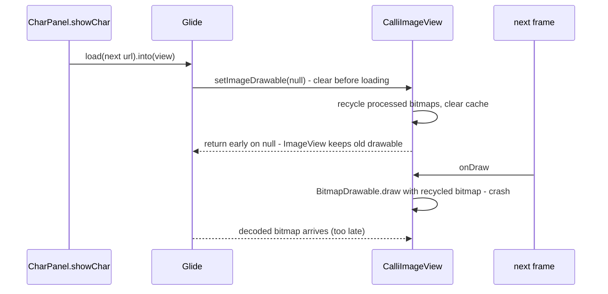

2026-08-29

# CalliPlus: crash on prev/next — drawing a recycled bitmap

## What was broken

After the tablet two-pane work, pressing the next/previous character button
crashed every time with `Canvas: trying to use a recycled bitmap` from
`CalliImageView.onDraw`. The same crash was already in an older emulator's log from
before any of today's changes, so it was a latent race, not a new bug.

## Root cause

`CalliImageView` keeps its own processed copies of the glyph (transparent /
contour / skeleton) and recycles them whenever a new drawable is set. Glide's
`ImageViewTarget` sets the drawable to `null` when it *starts* a load, and the
override returned early on `null` after recycling — without handing the `ImageView`
a new drawable. Any frame drawn before the new image finished decoding hit the
recycled bitmap. On a phone that window was usually empty; in the two-pane layout
the title label changes on every character, forcing a relayout and a draw right
inside it.

## Fix

Order of operations: give the view the new drawable (or `null`) first, then recycle
the stale processed bitmaps. Verified by hammering next/prev on both the tablet and
phone emulators, including the 實/空 toggle, with no crash.

## Also

The calligraphy stroke animation no longer paints the whole glyph in light gray
before revealing strokes — the cell starts blank and strokes appear in black. The
gray template paint and colour constant are gone from `StrokeAnimView`.
