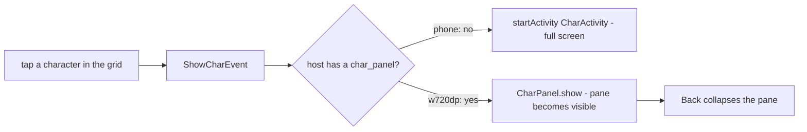

2026-08-29

# CalliPlus: tablet list-and-character panes, and a practice-size cap

## What it does

On a tablet the big-character screen no longer takes over. The grid you were
browsing (間架九十二法 rule blocks, a charbook, search results) stays on screen and
the character you tap opens in a pane next to it — to the right in landscape, below
it in portrait. Nothing shows until a character is tapped; Back collapses the pane
before it leaves the screen. Phones keep the full-screen character screen.

The glyph is also capped at a practice size (new setting 大字帖大小, default 中 =
400dp, about 6.5 cm) instead of stretching to the width. On a 10" tablet a
full-width glyph was far too big to write over; the old fix — 64/128dp side margins
on wide screens — only nibbled at it, and those overrides are gone.

## Layout

The three pane arrangements, chosen by the `app:arrangement` attribute on
`CharPanel`:

| arrangement | used by | placement |
|---|---|---|
| `phone` | `activity_char.xml` (CharActivity) | glyph on top, controls fill the space below (unchanged) |
| `top` | `layout-w720dp/` side pane, 420dp wide | title, icon row, pen-size row, then the glyph sunk to the bottom-right |
| `left` | `layout-w720dp-port/` stacked pane, full width | icons bottom-left in two rows with the slider under them; glyph bottom-right using the whole pane height |

Both tablet arrangements keep the corner a hand rests in free of buttons, and the
glyph 16dp off the navigation bar. The pen-size row went under the icons (not over
them) because it reads more balanced that way.

## How it was built

- `CharActivity`'s ~400 lines of glyph / PaintView / stroke-animation / prev-next /
  save logic moved into `ui/CharPanel.kt`, a `FrameLayout` inflating the old
  `activity_char.xml` (renamed `view_char_panel.xml`). It is a plain view rather
  than a Fragment on purpose: `BaseActivity` extends `android.app.Activity`, and the
  Holo screens have no fragment host. `CharActivity` is now a thin host that
  resolves the prev/next list from its intent and forwards the title to the action
  bar; two-pane hosts use the panel's own title label.
- The grid activities (`FileCharBookActivity`, `CharBookActivity`, `MainActivity`)
  look up `R.id.char_panel`; when present, `onEvent(ShowCharEvent)` calls
  `charPanel.show(...)` instead of `startActivity`. Preference changes are forwarded
  to the panel. The wide layouts wrap the grid and the pane in an outer vertical
  `LinearLayout` so `BaseActivity`'s ad banner still lands at the top.
- The arrangements are done in code at inflation (`moveControlsAboveGlyph`,
  `moveControlsBesideGlyph`) by reparenting the layout file's views, so there is one
  layout file for the panel and the phone order is the default.
- The size cap lives in `CharPanel.onMeasure`: it sets the glyph frame's width to
  `min(available, pref dp)` before measuring, subtracting the control block's
  natural width in the `left` arrangement.

## Things that bit along the way

- **Back exited the screen instead of collapsing the pane.** With targetSdk 36 on
  Android 16 predictive back is on by default and `Activity.onBackPressed()` is never
  called. The panel registers an `OnBackInvokedCallback` while it is showing (only
  when the host opts in with `collapseOnBack`, so CharActivity's Back still finishes).
- **The portrait pane swallowed the whole screen.** The spacer that sinks the glyph
  to the bottom was a bare `View` with weight 1. In a `wrap_content` pane that is
  measured `AT_MOST`, and `View.getDefaultSize` returns the full spec size — so the
  spacer claimed every pixel and the grid measured to nothing. `Space` measures to
  zero and behaves.
- **Rotating the emulator.** The Pixel Tablet's natural orientation is landscape, so
  `user_rotation 0` is landscape and forcing rotation through settings left the
  emulator window's touch mapping confused ("the tablet is not responding"). Use the
  emulator's own `adb emu rotate` and leave auto-rotate on.
- `PaintView.clear()` NPE'd when a host preloaded a character before layout — now a
  no-op without a bitmap.
- The Settings screen's blank band under the action bar on Android 16 turned out to
  be pre-existing double padding: `PreferenceActivity`'s list fits system windows
  itself, and `MyPrefActivity` also called `EdgeToEdge.padSystemBars`. Dropped the
  call.

## Not verified

Nothing was run on the Supernote. Its portrait screen (~1024dp wide) will take the
stacked `left` layout; 描紅 mode inks the whole screen and the pane is just more
screen, but it deserves a look on the device.
