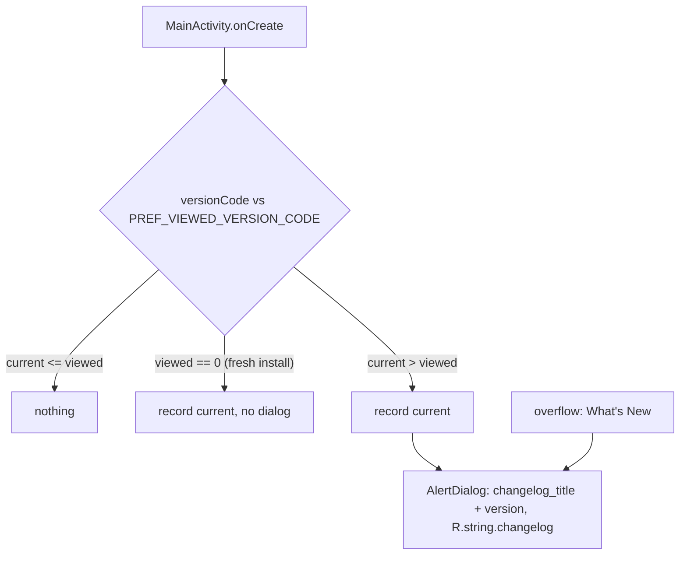

2026-08-29

# CalliPlus: "what's new" dialog after an update

## What it does

On the first launch after the app has been updated, CalliPlus shows a small dialog
with that release's notes; it never shows again for the same version, and never on
a fresh install. The same dialog is reachable any time from the overflow menu
(更新內容 / What's New, above About).

## How it was built

`utils/Changelog.kt` (`showIfUpdated`, `show`), the version code from
`BuildConfig`, and the preference in `MyPreferenceManager` as
`PREF_VIEWED_VERSION_CODE`. The key string is the one the old code already used:
a 2016 changelog dialog — a WebView fed HTML from `strings.xml` — still ran on every
launch and recorded the version code, but its `show` call had been commented out.
Because that recording never stopped, everyone on 4.9.1 is already marked as having
seen 4.9.1, so they get exactly one dialog after the next update. The WebView,
its layout and the 2015–2016 HTML history are gone; `changelog` in `strings.xml`
now holds the current release's notes only.

## Per release

1. Write the release's notes into `values/strings.xml` → `changelog` (plain text,
   `\n\n` between bullets — literal newlines in the XML collapse to spaces).
2. Bump `versionCode`; the bump is what triggers the dialog.

Verified on the emulator by installing a build with a higher versionCode (dialog),
relaunching (no dialog) and reinstalling fresh (no dialog), then restoring the
version.
