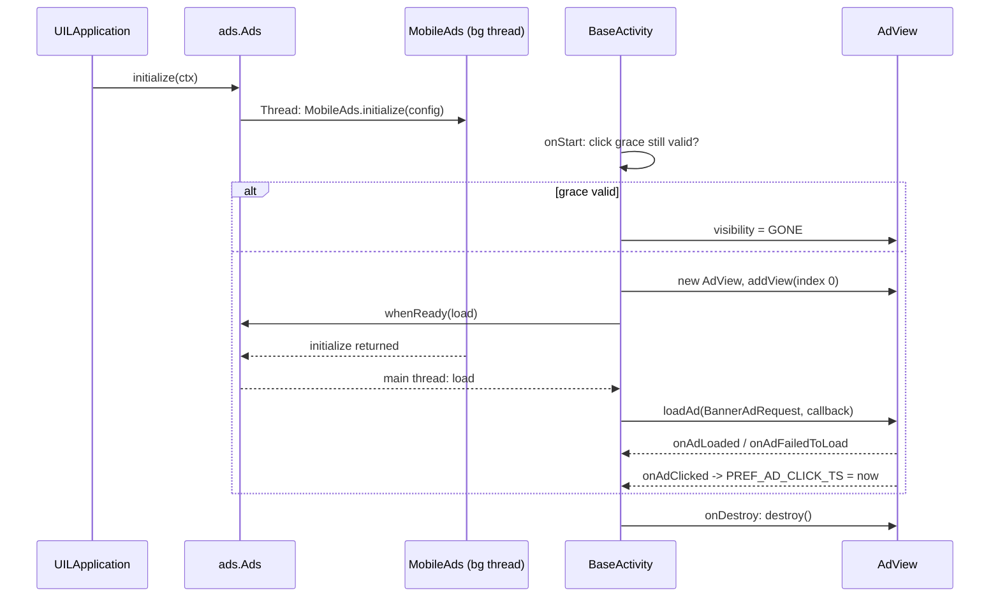

2026-08-26

# CalliPlus: banner ads return on the Google Mobile Ads Next-Gen SDK

Banner ads were stripped from CalliPlus in the April 2026 open-source prep commit (`a598ffb`) together with the paid flavor. This change puts the banner back — but on Google's **Next-Gen** Mobile Ads SDK (`com.google.android.libraries.ads.mobile.sdk:ads-mobile-sdk:1.4.0`) rather than the legacy `play-services-ads` line the old code used. The decision was explicit: rather than re-adding the legacy API (which would work today at 25.4.0 but is already labelled "Legacy" in Google's docs) and migrating again later, go straight to the SDK that will not need another migration.

Ships as 4.9.0 (versionCode 40900).

## Why Next-Gen, and what it costs

| | Legacy `play-services-ads` 25.4.0 | Next-Gen `ads-mobile-sdk` 1.4.0 |
|---|---|---|
| API | `com.google.android.gms.ads.*` — near-identical to the 21.x code removed in April | `com.google.android.libraries.ads.mobile.sdk.*` — new, Kotlin-first |
| minSdk | 23 | **24** |
| Effort | revert the old diff, tweak | rewrite the ~60 lines of banner code |
| Future | "Legacy" per Google; migration guides already point to Next-Gen | current line |

minSdk moves 21 -> 24 (Android 5.x/6.0 lose support — negligible share in 2026). compileSdk 36, AGP 9.1.1 and Java 17 already satisfied everything else.

A side note on how the API was pinned down: context7 only indexes the legacy SDK, Google's Next-Gen API-reference URLs 404, and web summaries of the banner guide contradicted each other (`BannerAd.load` vs `AdView.loadAd`). The reliable source was `javap -public` over the published 1.4.0 AAR, which is where the signatures below come from.

## How it is built

`ads/Ads` (new, Kotlin object) owns SDK bootstrap. `MobileAds.initialize()` must run on a background thread (ANR otherwise) and any ad load before it completes throws, so `Ads` starts the init from `UILApplication.onCreate` and exposes `whenReady { }`, which queues a block until init has returned and then posts it to the main thread. In debug builds `bannerUnitId` swaps in Google's sample anchored-adaptive unit so emulator runs never hit the real unit.

`BaseActivity` owns the banner, mirroring the pre-April design so screen code barely changes:

- a screen calls `setAdViewContainer(rootView)` before `setContentView` (Main, Char, CharBook, FileCharBook do; PoemList, SanxiList and WebView do not and therefore stay ad-free — the old `NoAdBaseActivity` subclass is no longer needed);
- `onStart` inserts an `AdView` at index 0 of that `ViewGroup` (`isTop`, default true) and, via `Ads.whenReady`, loads a `BannerAdRequest` sized with `AdSize.getCurrentOrientationAnchoredAdaptiveBannerAdSize(activity, containerWidthDp)`;
- `onDestroy` destroys the view;
- tapping an ad records `PREF_AD_CLICK_TS` in `MyPreferenceManager` and the banner stays hidden for 24 h (`isAdClickStillValid`), exactly the old grace-period behaviour.



The AdMob application ID appears twice on purpose: in `InitializationConfig.Builder(APP_ID)` for the ads SDK, and as the `com.google.android.gms.ads.APPLICATION_ID` manifest meta-data, which the bundled User Messaging Platform SDK reads.

## Two release-build problems found on the way

Both only showed up in `assembleRelease`, which is why the release APK was installed and launched on the emulator rather than trusting the debug run.

**Launch crash under R8.** Release builds died in `androidx.startup.InitializationProvider` with "Failed to create an instance of androidx.work.impl.WorkDatabase". The ads SDK depends on `androidx.work:work-runtime:2.7.0`, whose Room version ships the consumer rule `-keep class * extends androidx.room.RoomDatabase`. That rule predates R8 *full mode* (the AGP 8+ default), where `-keep class` no longer implicitly keeps the default constructor — so `WorkDatabase_Impl` survived by name but lost its `<init>()`, and Room's reflective `newInstance()` failed. Fix in `app/proguard-project.txt`:

```
-keep class * extends androidx.room.RoomDatabase { <init>(); }
```

**Gradle daemon OOM.** The R8 optimizing pass (`proguard-android-optimize.txt`, five passes) over the 5.8 MB SDK AAR blew the daemon's default 512 MB heap and left an 800 MB `java_pid*.hprof` in the repo root. `gradle.properties` now sets `org.gradle.jvmargs=-Xmx4g -XX:MaxMetaspaceSize=1g`; `*.hprof` and AGP's `.kotlin/` session dir are gitignored.

## Verification

Pixel 7 / API 34 (Google Play image) emulator, driven with sim-use:

- debug: "Test Ad" banner at the top of MainActivity and the 間架九十二法 charbook; none on the 三希堂 list;
- release (real unit ID, full R8): no crash; the banner loads and the AdMob unit `…/1451160672` is still active — the emulator is auto-registered as a test device so the creative is still labelled "Test Ad", but the request/response round-trip is the real one.

Sizes: debug APK 9.7 -> 16 MB, release APK 5.7 -> 7.9 MB.

## Still to do outside the code

- Play Console: Data safety form now declares *App interactions*, *Device or other IDs* (collected + shared, advertising/analytics/fraud-prevention), *Crash logs* and *Diagnostics* (collected, analytics/app functionality); App content -> Ads = yes.
- EEA/UK/CH users need a UMP consent flow before ads load. The SDK already bundles `user-messaging-platform:4.0.0`; the AdMob-side message (Privacy & messaging) and the `ConsentInformation` call in `Ads.initialize` are a follow-up, not in this release.
