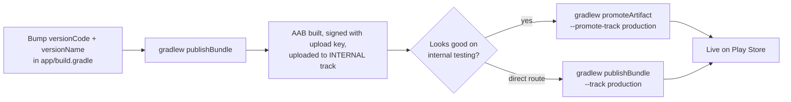

2026-08-01

# CalliPlus: one-command Play Store releases via Gradle Play Publisher

## What and why

With 4.7.1 live in production, releasing still meant building an AAB and dragging it
into the Play Console by hand — the project's old publishing automation died with its
2022 service account (Google purged the dormant `api-6924712661607823833` project, so
the checked-in-adjacent `key.p12` authenticated nothing; token exchange returned
*"Invalid grant: account not found"*).

A fresh service account (`play-publisher@calliplus.iam.gserviceaccount.com`, JSON key
at `~/.secrets/`, chmod 600) was granted release permissions in the Play Console, and
the **Gradle Play Publisher** plugin (3.12.1) is wired back into the build — the same
plugin the pre-open-source project used, now on supported auth.

## How it's wired

- The JSON key path lives in the **gitignored** `keystore.properties`
  (`playCredentials=…`), like the signing config — nothing secret enters the repo;
  `keystore.properties.sample` documents the field.
- `play {}` defaults: `defaultToAppBundles`, `track.set('internal')`. Publishing to
  production is always an explicit `--track production` (or a promote), never the
  default — a deliberate guard against fat-fingering a prod rollout.
- Staged rollouts: `--release-status inProgress --user-fraction 0.2`.

## Validation

Rather than a live upload (40701 was already consumed on every relevant track), the
account was validated by opening and deleting a transient edit via the API — which
also confirmed the current track state (production/internal at 40701, plus fossil
4.5.x alpha/beta from 2022) — and by GPP's own read-only `bootstrapReleaseListing`,
which pulled the store listing successfully. Its only failure was a 403 on
`inappproducts`, an endpoint CalliPlus (no IAPs) never touches; the grant skipped
financial-data permissions on purpose.
