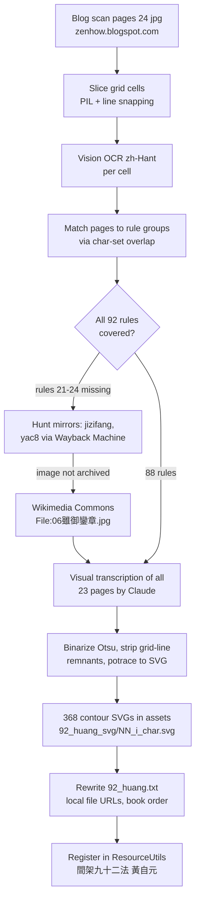

# CalliPlus: 間架九十二法 (黃自元) charbook with traced SVG glyphs

## Summary

Added a second 92-rules charbook to CalliPlus, sourced from the scanned
黃自元《間架結構摘要九十二法》 copybook (the famous 歐體 structure primer).
The existing `92_huang.txt` asset had been unregistered for years because its
per-character images lived on Flickr farm URLs that are now all 404. The file
was rebuilt to point at 368 locally bundled contour-only SVG glyphs
(`assets/92_huang_svg/NN_i_字.svg`, traced with potrace exactly like the
existing `92_ou_svg` book), and the book is registered in
`ResourceUtils.getBooks()` as 間架九十二法 (黃自元). Commit `3c2304a`.

## Approach

- **Source images.** The blog post (zenhow.blogspot.com/2016/07/blog-post.html)
  hosts 24 pages of the yac8.com scan: title page, 22 content pages
  (4 rules × 4 example characters per page, columns right-to-left), and a
  colophon. Each 750×1268 page was sliced on its white grid lines (vertical
  lines detected by brightness profile, snapped to expected positions
  x≈[34,206,377,549,719], y≈[25,187,348,510,671]).
- **Pages are shuffled.** The scan filenames (`51617328_N.jpg`) are not in book
  order. Each page was identified by OCRing its 16 cells (macOS Vision,
  zh-Hant) and scoring overlap against the known 4-character sets per rule from
  the old `92_huang.txt` transcription — every page matched one rule-group
  decisively.
- **The old transcription's character order was useless.** The legacy file
  listed each rule's 4 characters sorted by Unicode codepoint, not in book
  order, so cell-to-character assignment could not be taken from it. Font-
  template matching (Songti) against the handwriting proved unreliable, so all
  23 content pages were transcribed visually (by Claude reading the page
  images), constrained by the known per-rule character sets — final orders
  validated programmatically against those sets, 0 mismatches.
- **One page was missing everywhere.** The blog set (and the jizifang.com.cn
  mirror) lack the rules 21–24 page (雖願顧體/御謝樹術/鑾響需留/章意素累). The
  original yac8.com is unreachable (China-hosted, times out) and the Wayback
  Machine archived the paginated article but not that page's image. The page
  was finally recovered from Wikimedia Commons (`File:06雖御鑾章.jpg`, 649×1108,
  same edition uploaded as individual page files).
- **Vectorization, matching the 歐陽詢 book.** Grid lines are first erased in
  page space: along each detected line, pixels whose perpendicular glyph run
  is line-thin are blanked, so strokes that cross or overlap a grid line
  (e.g. 留 in rule 23, written over the column line) survive intact. Each
  cell is then cropped with a margin beyond the line positions, upscaled 3×,
  binarized with per-cell Otsu, cleaned with connected-component filtering
  (skinny line stubs and, on the noisier Commons page, a
  distance-transform test that drops fragments which are thin everywhere),
  tightly cropped, and traced with `potrace -s -t 12` — the same potrace 1.16
  pipeline whose output the existing `92_ou_svg` assets carry. Result: black
  contour glyphs on transparent background, identical in presentation to the
  間架九十二法 (歐陽詢) book. All 368 rendered glyphs were visually reviewed
  in contact sheets for leftover border lines and mis-crops.
- **Stroke-completeness pass.** The automated cleanup initially ate real
  strokes on eight glyphs whose ink sits on or near a grid line (顧體 in rule
  21, 意素累 in 24, 爾 in 28, 聲 in 59 — whose bottom 耳 nearly touches the
  row line — and 贏 in 72). Those cells were re-extracted with overflow-
  preserving margins and hand-specified junk-erase boxes instead of the
  heuristics. A final audit compared every glyph's traced ink area against
  its source-cell ink (ratio final/source); the distribution sits at
  0.86–1.07 with the lowest 10 verified visually — no missing components
  remain.
- **Old Flickr URLs are dead.** All `farmX.staticflickr.com` links in the
  legacy file 404, including via `live.staticflickr.com` rewrite — the photos
  were deleted, which is why the book had to be rebuilt from scans rather than
  just re-registered.

## Trade-offs

- SVG tracing loses the rubbing texture of the raw scans but gains
  resolution-independent rendering, transparent background over the practice
  grid, and visual consistency with the existing 歐陽詢 book — this is the
  approach the user explicitly wanted ("only the contour lines of the
  characters").
- Binarization quality depends on the scan: the Commons-sourced page
  (rules 21–24, lower resolution) yields slightly chunkier contours than the
  blog pages, but is clean after component filtering.
- The edge-cleanup heuristics could in principle clip a detached stroke tip
  that sits hard against the cell border; a full visual review of all 368
  rendered glyphs (contact sheets) showed no such loss.
- Scan variant forms are mapped to the legacy file's normalized characters
  (e.g. 衆→眾, 冄→冉, 纒→纏), keeping search/display behavior consistent with
  the rest of the app.

## Key Files

- `app/src/main/assets/92_huang_svg/` — 368 potrace-traced character SVGs,
  named `NN_i_字.svg` (rule number, position within rule, character).
- `app/src/main/assets/92_huang.txt` — rebuilt charbook: same 92 rule texts,
  characters reordered to match the printed book, URLs now
  `file:///android_asset/92_huang_svg/…`.
- `app/src/main/java/info/plateaukao/calliplus/utils/ResourceUtils.java` —
  added the `{"間架九十二法 (黃自元)","92_huang.txt", BOOKTYPE_RULE}` entry.
