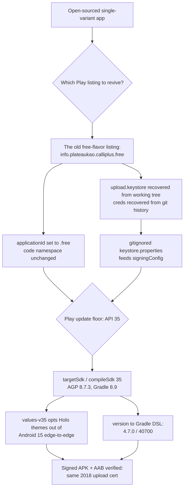

2026-08-01

# CalliPlus: Play Store release prep — .free applicationId, recovered upload key, target SDK 35

CalliPlus had been dormant on the Play Store since the 2022-era 4.6.1 release; the
open-source prep commit later stripped the free/paid flavors, ads, and the publishing
plugin, leaving a single unsigned-for-Play variant. This change makes the current
single-variant app releasable to the **existing** Play listing again, rather than as a
new app.

## Identity: .free is the listing, not a flavor

The published Play listing was always the *free flavor's* `info.plateaukao.calliplus.free`
(the `.free`-less ID belonged to the removed paid flavor). So the single remaining variant
takes `applicationId "info.plateaukao.calliplus.free"` while the code namespace stays
`info.plateaukao.calliplus` — no package renames, and the manifest's FileProvider
authority already used `${applicationId}` so it follows along.

## Signing: nothing was actually lost

`app/upload.keystore` (Oct 2022) was still sitting untracked-and-gitignored in the
working tree, and the pre-open-source `app/build.gradle` in git history preserved the
alias (`myanroidkey`) and passwords. A gitignored `keystore.properties` (the mechanism
the open-source prep had already scaffolded via `keystore.properties.sample`) now feeds
the release `signingConfig`. The built APK's signer matches the original 2018
"Daniel Kao / Daniel Studio" certificate (SHA1 `02:85:80:06:…:0A:06`), which is what the
Play console expects from the upload key. The repo is private on GitHub, so the
passwords living in git history was judged acceptable for now; rotating via Play's
upload-key reset remains an option if the repo ever goes public.

## Target SDK 35, and why not 34

Play's floor for app *updates* has been API 35 since Aug 2025, so 34 was never a real
option. That forced the toolchain bumps (AGP 8.2.2 → 8.7.3 is the first line that
officially supports compileSdk 35; Gradle 8.5 → 8.9 is AGP 8.7's requirement). Fallout
was small because the app has no services, receivers, alarms, or PendingIntents:

- **Android 15 edge-to-edge enforcement** is the one real behavior change. The app's
  legacy Holo themes don't handle insets, so `res/values-v35/styles.xml` re-declares
  `AppBaseTheme` and `FullscreenTheme` (mirroring the winning v14/v11 parents) with
  `windowOptOutEdgeToEdgeEnforcement=true`. This escape hatch dies at targetSdk 36 —
  proper inset handling is the eventual fix.
- **SDK 35 stubs nullability**: `OnSharedPreferenceChangeListener.onSharedPreferenceChanged`
  now takes a nullable key, and `PackageInfo.versionName` became nullable — two
  one-line fixes in `BaseActivity.kt`.
- **versionCode/versionName moved** from the manifest (long-deprecated location) into
  the Gradle DSL, bumped 40601/4.6.1 → 40700/4.7.0, keeping the `4xxyy` scheme.

## Publishing path

Both `assembleRelease` and `bundleRelease` produce correctly signed artifacts (verified
with `aapt dump badging` + `keytool -printcert -jarfile`). Automated upload via the Play
Developer API using the old `app/key.p12` service account was prepared but the
credential-extraction step is a manual action (and the 2022 service account may need
re-granting in the Play console anyway); manual upload of the AAB to the internal
testing track is the fallback.
