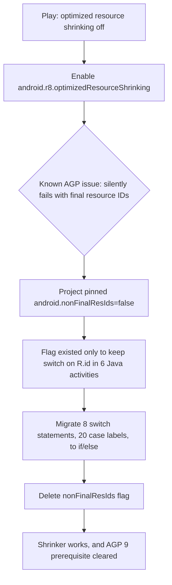

2026-08-02

# CalliPlus: Enable R8 optimization and optimized resource shrinking

Google Play Console flagged the 4.8.0 release build with two R8 warnings:
"Optimization isn't enabled" and "Optimized resource shrinking isn't enabled"
(plus a third recommendation to move to AGP 9, handled separately).

The surprise was that R8 *was* enabled — `minifyEnabled true` and
`shrinkResources true` had been on for years. The catch is that the build
passed `getDefaultProguardFile('proguard-android.txt')`, and that legacy rules
file contains `-dontoptimize`: R8 ran in shrink-only mode, stripping unused
code but never inlining, outlining, or class-merging. Switching to
`proguard-android-optimize.txt` is the whole fix for the first warning.

The second warning — optimized resource shrinking
(`android.r8.optimizedResourceShrinking=true`, where R8 considers code and
resources together) — had a hidden prerequisite chain:

`android.nonFinalResIds=false` forced final R fields solely so the old Java
activities could keep `switch (R.id.…)` statements (AGP 8 made R fields
non-final by default). But issue #454927488 documents that R8's optimized
resource shrinking *silently no-ops* when resource IDs are final — the flag
would have made the new setting a lie. And AGP 9 removes the flag entirely.
So the switch statements in `MainActivity`, `CharActivity`,
`CharBookActivity`, `FileCharBookActivity`, `PoemListActivity`, and
`SanxiListActivity` were mechanically converted to `if/else` chains, the flag
deleted, and the deprecated `zipAlignEnabled true` no-op removed while in the
file.

Safety checks: the app has no `Resources.getIdentifier()` lookups, so precise
resource shrinking cannot strip anything reached only by name; and the broad
`-keep class info.plateaukao.calliplus.**` rules mean optimization mostly
bites library code (Glide, jsoup, androidsvg), limiting behavioral risk.

Result: release APK 5.93 MB → 5.74 MB. Verified on emulator against the
paths most likely to break under optimization — SVG charbook rendering
(Glide generated module + androidsvg decoder), 淡墨 faint-ink transformation,
DB search, character pager, and every migrated menu/button handler
(contour toggle, Sanxi sort toggle) — with a clean logcat.
