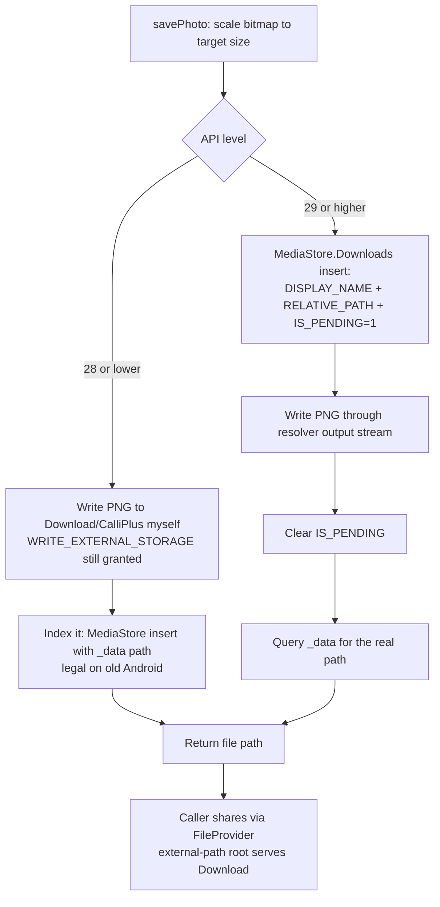

2026-08-01

# CalliPlus: pre-launch "16 KB page size" crash was really a scoped-storage save bug

## What was broken

Right after the 4.7.0 upload, Play's pre-launch report flagged the release under the
banner *"Your release may not support 16 KB page sizes"* with a crash on a 16 KB-page
lab device. That framing was a red herring: the app ships **zero native libraries**
(no `.so` in the APK or AAB), so it is inherently 16 KB-compatible — Play just files
any crash that happens on a 16 KB device under that banner.

The actual crash, reproduced locally on an Android 16 emulator with a 2000-event
monkey run (and byte-for-byte identical to the console's stack):

```
IllegalArgumentException: Mutation of _data is not allowed.
  at ContentResolver.insert
  at BitmapUtils.savePhoto
  at CharActivity$SavePhotoTask.doInBackground
```

Every "save/share character image" action (CharActivity's Share menu, MainActivity's
export) crashed the app on Android 10+.

## Root cause

`BitmapUtils.savePhoto` used the pre-Android-10 MediaStore recipe: write the PNG to
`Download/CalliPlus/` with `File` APIs, then register it by inserting a row whose
`_data` column carries the file path. Scoped storage (API 29+) forbids apps from
setting `_data` — the provider throws. The app previously targeted SDK 33, so this
had been broken on modern devices for a while; the 4.6.1 Play release predated
scoped-storage enforcement, which is why it never surfaced in production.

## The fix

Branch on API level inside `savePhoto` (callers unchanged):



Design points:

- **Same user-visible destination** (`Download/CalliPlus/`) on both branches, via
  `RELATIVE_PATH` on the modern one. MediaStore also takes over duplicate-name
  handling, replacing the old manual `filename1`, `filename2`… loop.
- **Callers still get a real file path.** The share flow hands the result to a
  FileProvider with an `external-path` root, so returning a `content://` URI would
  have rippled through `share()` / `viewImageExternally()`. On API 29+ an app may
  read its *own* MediaStore files by path, so `savePhoto` queries `_data` back from
  the inserted row and returns that.
- The API split mirrors the manifest: `WRITE_EXTERNAL_STORAGE` is declared with
  `maxSdkVersion="28"`, exactly the ceiling of the legacy branch.

Bumped 4.7.0 (40700) → 4.7.1 (40701) since the flawed 40700 was already consumed by
the internal-track upload.

## Verification

On the Android 16 emulator: 心經 charbook → 觀 → Share → "Calligraphy Char." — the
share sheet opens, the PNG appears in `Download/CalliPlus/`, crash buffer clean.
Amusingly, the old build's crash left forensic evidence: a PNG written at the moment
of the monkey-run crash — the file write succeeded, then the `_data` insert threw.
