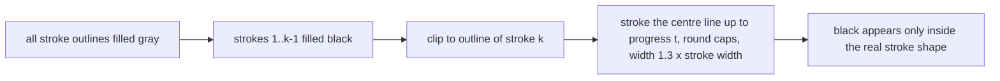

2026-08-29

# CalliPlus: stroke-order animation in the 歐陽詢 rule book

## What it does

In 間架九十二法 (歐陽詢), any character that has been traced with the recorder build (see
`calliplus-stroke-order-recording.md`) can play its stroke order in place, inside its cell
of the rule grid:

* **筆順動畫** — the glyph sits in light gray and each stroke's own shape is revealed in
  black along its centre line, so what appears is 歐陽詢's brushwork, stroke by stroke.
* **手寫動畫** — the glyph is hidden and the pen trace that was written over it is replayed
  as thin strokes, at twice the speed it was written.

Long-pressing a character offers the two for that character. Two new action-bar buttons,
left of Settings, play the whole book character by character; while a run is on, the
button becomes a stop square and tapping it ends the run. Playback speed (1x–7x) is a new
preference. The characters finished by a play-all run stay on screen until the run ends or
is stopped, so a 手寫 run accumulates the hand-written page rather than flipping each
character back as soon as it is done.

On the same screen the 淡墨 and 手寫 actions are merged into one Supernote-only **描紅**
toggle (faint template + stylus inking + touch lock switch together); the plain 淡墨 button
is hidden, it was never useful by itself.

Branch `stroke-animation`; 172 of 368 characters have data so far, the rest follow as they
are recorded.

## Data

`assets/92_ou_strokes/<image>.json`, written by `~/src/calli_strokes/export_app_data.py`,
keyed by the SVG's file name (`92_ou_svg/01_1_宫.svg` → `92_ou_strokes/01_1_宫.json`;
`StrokeDataStore` does the mapping and checks the asset listing once per directory). Per
stroke: `m` centre line, `w` width, `o` outline polygons (even-odd), `r` pen trace as
`[x, y, tMillis]`. Everything is in glyph-square units (0..1) so it is independent of cell
size. About 17 KB per character; medians are resampled to ~8 px at 512 and outlines
simplified to 1.2 px, which brought the set from 38 KB to 17 KB a character.

## How the reveal is drawn

The outline polygons come from the offline pipeline, which already resolved crossings
(width interpolated through junctions, corner fillets given to the later stroke), so the
app never has to reason about geometry: it fills and clips paths. `StrokeAnimView` steps
with the `Choreographer` rather than a `ValueAnimator` so it keeps running when the grid is
laid out again and can report an interruption if its cell is recycled.

## Play-all over a recycling grid

`StrokeAnimSequencer` walks the character indices, skipping those without data. For each
it finds the rule block's view in the `GridView`; if the block is not fully visible it
`setSelection`s to it and retries after layout. The two things that made this fragile:

* `RuleBlockAdapter.getView` used to rebuild every cell (`removeAllViews`) on each bind, so
  any relayout — the banner loading, the action bar changing — detached the view that was
  animating. It now reuses the existing cell views and leaves a running (or held)
  animation alone when the cell is bound to the same character again.
* If a cell is nevertheless detached mid-animation, the view fires `onInterrupted` instead
  of completing, and the sequencer looks the character up again and replays it instead of
  silently skipping it.

Held characters are remembered by index; when a block scrolls back into view its held
cells are re-shown in their finished state, and `releaseHeld()` restores everything when
the run ends.

## Notes

* Debug builds show no banner: it shifts the layout when it loads and was in the way while
  recording and testing.
* The Supernote's e-ink refresh makes continuous animation look rough; the emulator was
  used to verify the motion, the tablet to verify the controls.

## Follow-up (same day)

* Long-press on a character no longer animates it alone: it starts the play-all run
  (either mode) *from* that character, so a session can be resumed anywhere in the book.
  `RuleBlockAdapter` reports the choice through `OnPlayFromListener`, and
  `StrokeAnimSequencer.start(fromIndex)` takes the starting character.
* The single-character screen (`CharActivity`) has the same two animations as bottom
  buttons in the existing round style, visible only when the character has stroke data.
  The `StrokeAnimView` sits between the glyph and the `PaintView`, so the user can still
  draw over a finished animation; it stays until the button is pressed again or the user
  moves to another character. The 👁 hide-glyph button was removed as useless, which also
  keeps the seven-button row on screen on a phone.
* Reveal speed tuned down to 0.7x (630 px/s at 1x on a 512 px glyph) — the stroke motion
  read as rushed at the original 900 px/s. Hand-written replay is unchanged.
* Pacing was rewritten per stroke: time proportional to length (glyph-wide stroke =
  1/(630/512) s at 1x), 100 ms floor at any speed, and a 1 s look at the gray template
  before the first stroke. The previous "distance per second" model finished short strokes
  within one frame, so speed changes were imperceptible. Big-view buttons: press while
  running = stop, press after it finished = replay; their icons are dark-gray variants so
  the round buttons' red lighting tint (which only colours dark pixels) applies.
* Hand-written replay showed a dot at the first stroke's pen-down point during the 1 s
  pause: the current stroke was drawn "up to t = 0", a zero-length path that the round
  line cap renders as a dot. The current stroke is now skipped until time has elapsed.
