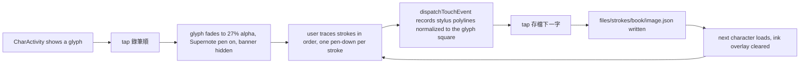

2026-08-29

# CalliPlus: recording stroke order by tracing on the Supernote

## What it does

CalliPlus is getting stroke-by-stroke animation for the bundled SVG charbooks
(間架九十二法 歐陽詢 / 黃自元, 心經 手寫). The glyphs are potrace contour tracings —
one `<path>` per connected blob, so a nine-stroke 宫 is four paths and nothing in the
data says where one stroke ends and the next begins. Rather than attempt automatic stroke
segmentation of calligraphy, the user traces every character once on the Supernote, and
that trace becomes the stroke-order data.

This commit is the capture side: a special debug build of the app that records the
traces. It lives on the `stroke-recording` branch and is *not* meant to ship; the APK is
kept at `~/src/calli_strokes/apk/calliplus-stroke-recorder-debug.apk` so more characters
can be recorded later without rebuilding.

## Recording flow

* `strokes/StrokeRecorder` holds the polylines: rows of `[x, y, tMillis, pressure]`, with
  `x`/`y` in 0..1 of the glyph square. Coordinates are mapped through the
  `CalliImageView` image matrix inverse and divided by the drawable size, so the data is
  independent of the screen it was traced on (`glyphPx` is kept for absolute speed).
* `CharActivity.captureStroke` records in `dispatchTouchEvent` *before* calling super:
  on a Supernote `BaseActivity` swallows stylus events below the action bar (the firmware
  inks them onto the EPDC overlay), and elsewhere they fall through to `PaintView`, which
  draws them as feedback. On a Supernote only `TOOL_TYPE_STYLUS` pointers start a stroke.
* The action bar while recording: 停止錄製 / 存檔下一字 / 刪一筆 / 重錄 — all
  `showAsAction="always"`, with Settings and Share hidden to make room. The title shows
  the live stroke count.
* Recordings are pulled with
  `adb pull /sdcard/Android/data/info.plateaukao.calliplus.free/files/strokes` and kept in
  `~/src/calli_strokes/recordings/`.

## Things learned while recording

* **Palm contact leaks into the pen stroke.** The touch panel and the EMR pen are separate
  input devices that both hand out pointer id 0, and the recorder matches by pointer id,
  so a hand resting on the screen appends its movements to the pen stroke as long straight
  jumps. An attempt to also match on device id + tool type broke recording entirely on the
  Supernote firmware and was reverted; the working rule is simply to keep the palm off the
  screen. The `✍ 手寫軌跡` view in the offline preview makes any leak obvious.
* **Two apps with the same icon.** An old `info.plateaukao.calliplus` dev build was still on
  the tablet next to the `.free` build; opening the wrong one showed no 錄筆順. It was
  uninstalled.
* Stroke counts are the calligrapher's, not the dictionary's — 安 traced as five strokes
  is correct because 歐陽詢 joins 宀's 橫鉤 into 女.

## Offline pipeline (`~/src/calli_strokes/`)

`process_strokes.py` turns one SVG + one recording into animation data: rasterize the SVG
the way the app's `SvgModule` does (xMidYMid meet into a square), snap each traced point to
the ridge of the distance transform, take the local half-width from it, interpolate the
width linearly across every crossing (the distance transform balloons at junctions; a
brush doesn't), extend each median along its tangent into the parts of the glyph the trace
stopped short of, and hand any still-uncovered ink (hook tips, flared ends, junction
corners) to a stroke — corners go to the stroke drawn later so the earlier one stays a
clean band. The output is, per stroke, a median polyline, a width, and outline polygons
whose union is the whole glyph; `coverage` below 100% flags a missed stroke.
`preview_all.py` batches a directory and writes an interactive HTML page (animation,
step-through, hand-written trace replay, play-all with a speed slider).

## Continuing later

The step-by-step procedure for recording more characters — install the kept recorder APK on
the Supernote, find where the recordings left off, pull, check the preview page, export into
`assets/92_ou_strokes`, reinstall the normal build — is documented in the project's
`CLAUDE.md` under "Stroke-order recordings", so any later session can pick it up from the
phrase "continue recording hand-written data".
