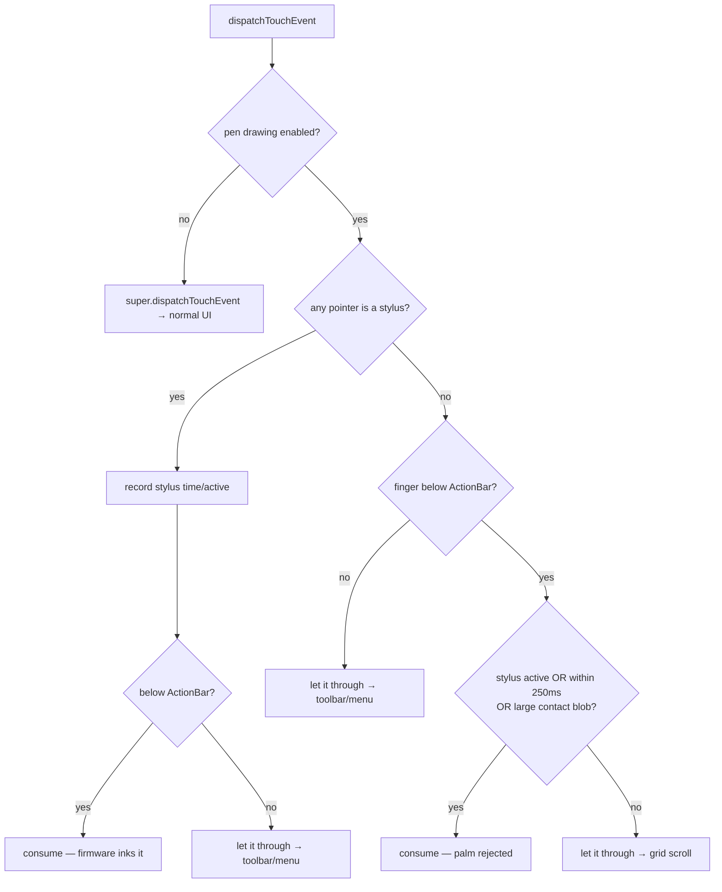

# CalliPlus — Supernote e-ink drawing, faint tracing, and 2-rules-per-row charbooks

## Summary

CalliPlus runs on a Supernote Nomad (a large-screen Android 11 e-ink tablet). Three
study affordances were added to the charbook screens — primarily **間架九十二法**
(`FileCharBookActivity`) and **心經** 綜合 + 手寫 (`CharBookActivity`):

1. **Supernote EPDC pen drawing** — a header **手寫** toggle lets the stylus ink directly
   on the firmware's electrophoretic-display overlay, so the user can write over the
   reference characters. A **清除** icon wipes the strokes; nothing else clears them.
2. **淡墨 (faint) toggle** — recolors the reference glyph to light gray so it reads as a
   soft tracing template rather than competing with the user's own black ink.
3. **2-rules-per-row layout** — the wide e-ink screen shows two rule-blocks per row for
   間架九十二法 (sticky headers dropped); 心經 keeps its grid but doubles its columns.

All EPDC calls are no-ops on non-Supernote hardware, so phone/emulator builds are
unaffected and the pen/clear buttons simply don't appear there.

## Approach

### Talking to the EPDC layer

There is no public Supernote SDK. Drawing is driven by a Binder service
(`service_myservice`, interface token `android.demo.IMyService`) reached via reflection on
`android.os.ServiceManager`. `supernote/SupernoteInk.kt` is a thin wrapper (ported from a
sibling reverse-engineering project) exposing `sendWriteAppInfo`, `setPen`,
`setDisableAreas`, `setFullScreenDisable`, `clearAll`, and `enableFullUiAuto`. The firmware
owns the actual ink rendering and refresh — the app never draws strokes itself; it only
configures the pen and tells the firmware which screen rectangles to ignore.

`isAvailable()` (binder present) doubles as authoritative Supernote detection, with a
`Build.MANUFACTURER/BRAND` fallback in `isSupernote()`.

Lifecycle (in `BaseActivity`, shared by all screens): `onResume` registers pen ownership
but starts with the pen disabled everywhere; **手寫** enables the INK pen and disables
inking over the top ActionBar strip (so the toolbar stays tappable); **清除** calls
`clearAll()`; `onPause` disables the pen. Crucially `clearAll()` is invoked **only** from
the clear handler, so strokes persist across toggles, scrolls, and faint re-renders until
the user explicitly clears them.

### Touch routing and palm rejection

While the pen is on, the firmware inks stylus strokes at the driver level — but those same
`MotionEvent`s also reach the Android view tree and would scroll the grid or open a
character. `BaseActivity.dispatchTouchEvent` intercepts them. A resting palm (reported as
a large `TOOL_TYPE_FINGER` blob on this Android-11 device, which predates
`TOOL_TYPE_PALM`) is rejected by a stylus-proximity time window plus a contact-size
threshold. Deliberate finger scrolling still works when not writing; stylus taps on the
ActionBar still drive the menu.

### Faint rendering

Both books render black-on-white glyphs through Glide (SVG-decoded for 間架/手寫, cns11643
PNGs for 綜合). `ui/FaintInkBitmapTransformation` mirrors the existing
`TransparencyBitmapTransformation` but recolors ink pixels to a light gray (`#C8C8C8`) and
drops the background to transparent — one code path that works for both sources. It carries
a stable `updateDiskCacheKey`/`equals` so Glide caches faint and normal variants under
distinct keys, making the toggle reliable. The faint color was tuned across a couple of
iterations (B5 → DC → C8) on the actual panel.

### 2-rules-per-row

`StickyGridHeadersGridView` renders one full-width header band per rule, so it cannot place
two rule-blocks side by side. Since `FileCharBookActivity` only ever serves the rules book,
it was switched to a plain `GridView` whose items are **rule-blocks** (`RuleBlockAdapter` +
`item_rule_block.xml` / `item_rule_char.xml`): each block is a caption plus its example
characters in a weighted row. `numColumns` = 2 on Supernote, 1 elsewhere. Character cells
reuse `SimpleCharImageView` + Glide + the faint toggle exactly like the original grid.

## Trade-offs

- **Reflection/Binder instead of an SDK.** There is no alternative; the wrapper degrades to
  no-ops off-device and is kept by the existing `-keep` rule on `calliplus.**`.
- **Pen ownership registered app-wide in `BaseActivity`** (not just the charbook screens):
  simpler and harmless since the pen stays disabled until toggled, at the cost of
  `enableFullUiAuto` toggling on every screen's resume/pause.
- **Palm rejection is heuristic.** With no `TOOL_TYPE_PALM` on Android 11, it leans on
  stylus proximity in time plus contact size rather than a definitive palm signal; the
  window (250ms) and size threshold (40dp) are tunable.
- **Dropped sticky headers for 間架.** A true side-by-side rule layout was worth more than
  pinned captions on the large screen; safe because that activity only serves the rules
  book.
- **Faint via bitmap recolor, not SVG styling.** Uniform across the SVG and PNG books and
  independent of per-glyph SVG viewBox scale.

## Key Files

| File | Role |
|---|---|
| `supernote/SupernoteInk.kt` | Binder ink wrapper + `isSupernote()` |
| `BaseActivity.kt` | pen lifecycle, 手寫/清除 handlers, stylus consume + palm rejection |
| `ui/FaintInkBitmapTransformation.java` | light-gray trace-template Glide transform |
| `adapters/RuleBlockAdapter.java` | rule-block items for the 2-per-row GridView |
| `adapters/ImageAdapter.java` | faint toggle for 心經 |
| `FileCharBookActivity.java` | plain GridView of rule-blocks, faint/menu wiring |
| `CharBookActivity.java` | doubled columns, faint toggle, menu gating |
| `res/layout/{activity_ninetytwo,item_rule_block,item_rule_char}.xml` | rule-block UI |
| `res/menu/{book,char_book}.xml`, `res/drawable/ic_{faint,pen,clear}.xml`, `strings.xml` | menu items, icons, titles |

Commit: `6346b23` on branch `supernote_ink`.
