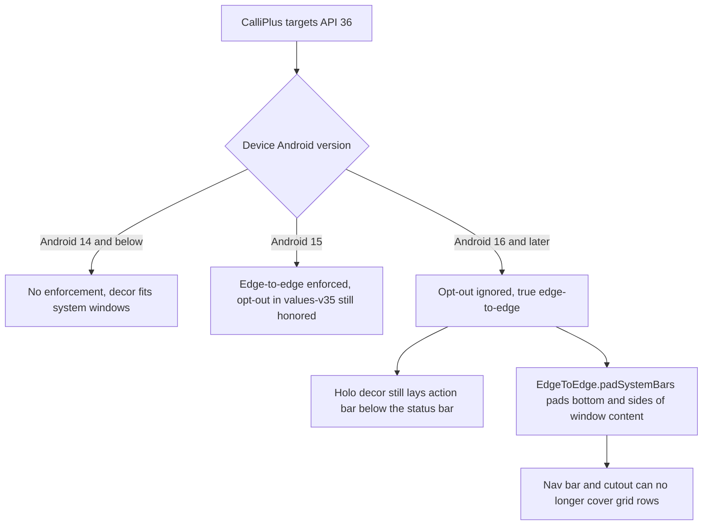

2026-08-02

# CalliPlus: target Android 16 (API 36) and release 4.8.0

Google Play now requires the target API level to be within one year of the
latest Android release; from Aug 31, 2026 an app targeting anything below API
36 can no longer ship updates. CalliPlus was at targetSdk 35, so this release
(4.8.0, versionCode 40800) moves it to compileSdk/targetSdk 36 and publishes
to the production track.

## Toolchain

AGP 8.7.3 tops out at compileSdk 35. The minimal jump that officially supports
API 36 is AGP 8.13 (max supported level 36.1), which in turn requires Gradle
8.13 — so both were bumped together (AGP 8.13.2, the latest 8.x patch),
deliberately staying off AGP 9 to avoid a plugin-model migration in a release
that should only change the target API. Kotlin 1.9.22, GPP 3.12.1, and the R8
config all carried over unchanged; the release build minifies and installs
fine.

## The one real behavior change: edge-to-edge

The app's legacy Holo screens had opted out of Android 15's forced
edge-to-edge via `windowOptOutEdgeToEdgeEnforcement` in
`res/values-v35/styles.xml`. Android 16 ignores that attribute for apps
targeting 36 — there is no opt-out anymore, so the app must survive drawing
edge-to-edge.

Verified on an Android 16 emulator (AVD `calliplus_a16`), the damage was
narrower than feared: the Holo decor (`ActionBarOverlayLayout`, built in the
KitKat translucent-bar era) still positions the action bar below the status
bar on its own, so the top of every screen was already correct. The gap was
the navigation side — grids and lists drew to the very bottom edge, which is
cosmetic under gesture navigation but permanently hides the last row behind an
opaque 3-button navigation bar.

The fix is one small Kotlin object, `utils/EdgeToEdge.padSystemBars`, gated to
API 36+: an `OnApplyWindowInsetsListener` on `android.R.id.content` that pads
the left/right/bottom by the system-bar and display-cutout insets and leaves
the top to the decor. `BaseActivity` calls it for every screen;
`MyPrefActivity` (the one activity not extending `BaseActivity`) calls it
directly. The values-v35 opt-out stays, because Android 15 still honors it.

The other API 36 behavior changes turned out not to apply: predictive back is
now on by default, but no activity overrides `onBackPressed` or intercepts
`KEYCODE_BACK`, so system back keeps working untouched (verified on the
emulator); and the large-screen ignore-orientation-lock change only affects
600dp+ devices, where letting the grids rotate is acceptable. Supernote
devices run far older Android, so the API-36-gated shim can never interfere
with the pen/e-ink path.

## Verification and release

On the Android 16 emulator, with both gesture and 3-button navigation: main
book list, 間架九十二法 sticky-header grid (scrolled to the last rule), 心經
grid, SanXiTang DB list, and the overflow menu all render with the last row
clear of the navigation bar. The R8-minified release APK was smoke-tested
on-device before publishing (this app has a history of release-only keep-rule
crashes). Published with `./gradlew publishBundle --track production`;
commit `3ffc1d5`.
