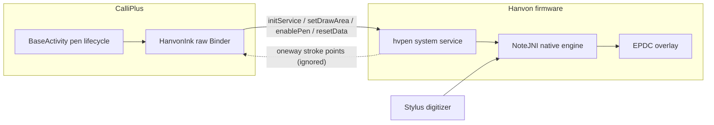

2026-09-03

# CalliPlus: Hanvon stylus inking via the firmware hvpen service

CalliPlus now inks stylus strokes on Hanvon e-ink devices (tested on the N10,
RK3566 / Android 11) the same way it already does on Supernote and Boox: the
firmware draws the strokes straight onto the EPDC overlay with sub-frame
latency, and the app only manages pen state. This replaces nothing in the UI —
the existing 描紅/清除 actions and the two-rules-per-row pen layouts simply
light up on a third device family.

## How Hanvon does firmware inking

Unlike Supernote (a standalone pen daemon) and Boox (Onyx-private transactions
on SurfaceFlinger), Hanvon builds pen drawing into the Android framework
itself as a real system service:

- `service list` shows `hvpen: [android.os.IHvPenDrawService]`, implemented by
  `com.android.server.hvpendraw.HvPenDrawService` in `services.jar`, backed by
  a native engine (`NoteJNI`) that reads the digitizer and draws to the EPDC.
- Apps normally reach it through `context.getSystemService("hvpen")`, which
  returns a Hanvon-private `android.os.HvPenDrawManager` — present in the
  device's `framework.jar` but not in the public SDK.
- The service does **no permission checks**; any app may register.

The protocol was reverse-engineered by pulling `framework.jar`, `services.jar`,
and the stock hvNote / hvCalligraphy apps off the device and decompiling them
with jadx. The AIDL surface (descriptor `android.os.IHvPenDrawService`,
transaction codes 1–14):

| call | code | meaning |
|---|---|---|
| `initService(l,t,r,b, listener)` | 1 | register a draw area, returns a native handle |
| `uninitService(handle, listener)` | 2 | release the area |
| `setDrawArea(handle, l,t,r,b)` | 3 | move/resize the area |
| `setDrawStatus(handle, mode)` | 5 | 0 = pen, eraserWidthPx+105 = region eraser |
| `setPen(handle, style)` | 6 | 1 crayon, 6 graffiti, 15 pencil, 20 fountain, 22 re-fountain |
| `setPenWidth(handle, px)` | 7 | stroke width in panel px |
| `setPenColor(handle, idx)` | 8 | 0 alpha, 1 black, 2 white, 3 dark gray, 4 light gray |
| `enablePen(handle, bool)` | 9 | start/stop inking |
| `setAreaActive(handle, bool)` | 10 | activate the area |
| `resetData()` | 12 | wipe the whole overlay |

The listener is a oneway callback (`android.os.IHvPenDrawListener`, code 1)
delivering each finished stroke as `[n, x0, y0, w0, x1, y1, w1, ...]` — the
same shape the stroke recorder could someday consume, but ignored for now.

## Why raw Binder instead of getSystemService

`HvPenDrawManager` isn't in the SDK, so calling it means reflection against a
vendor framework class — exactly the hidden-API territory that blocked the
Onyx SDK route on Boox. Instead `HanvonInk` mirrors `BooxInk`: fetch the
`IBinder` with the greylisted `ServiceManager.getService("hvpen")` (the only
reflection involved) and speak the wire format directly. The listener the
service requires is a plain `Binder` subclass answering the oneway callback —
public API only. Every call is a no-op off-device, and
`BaseActivity.isPenDevice()` / `HanvonInk.isAvailable()` gate the feature on
build identity plus the service actually existing.

## Three on-device surprises

**Panel-native coordinates.** The first build only inked the lower part of the
grid: the EPDC panel is landscape-mounted, and the pen engine expects rects in
panel space, not UI space. The stock hvNote transforms every rect through
`getPenDrawArea(rect, displayRotation, originPos, w, h)` where `originPos` is
a per-model origin offset (N10Pro/M10/C10 are 0, everything else 1, plus a
hardware-version probe we can't reach without their native lib). `HanvonInk`
reproduces the transform; on the N10 in portrait that is
`Rect(H - bottom, left, H - top, right)`.

**The action-bar trap.** Hanvon's screen has **no finger touch layer** — the
stylus is the only pointer. The ink-mode touch-swallow used an
ActionBar-height cutoff on window-relative Y, which misses the status-bar
offset and so ate stylus taps on the lower half of the ActionBar: once 描紅
was on, the user couldn't tap it again to leave. The swallow now tests the
actual pen region (`penRegionRect()`) in screen coordinates on all devices —
strictly more correct on Supernote/Boox too, where a finger had been masking
the same bug.

**Boox-calibrated widths.** The shared pen-width preference defaults to 3 px,
which the Hanvon engine draws hairline-thin (its stock apps use ~10–60 px on
the same panel). Hanvon scales the preference by 4, clamped to 10–60, and uses
the graffiti style (6) — the one the stock calligraphy-practice app picks.

## The character pane, too (follow-up commit)

Same-day follow-up: the single-char view's practice square was still the
software "fake calligraphy brush" — slow on e-ink, and on Hanvon stylus-only.
Now, whenever the character pane is showing, its square becomes a second hvpen
draw area (the firmware happily holds several, one handle each), with the
pane's brush-size slider driving that area's `setPenWidth`. To make that
clean, `HanvonInk` grew from one tracked handle into a rect-keyed map with an
`apply(regions)` reconciler: unchanged rects keep their handle *and their
inked strokes* (a slider tweak only re-sends widths), new rects register,
stale ones unregister.

One asymmetry against Boox: the Hanvon engine's clear (`resetData`) is
global — there is no per-area clear — so clearing the pane also wipes grid
ink on two-pane screens. The pane's 清除, prev/next, and the menu 清除 all
route through the existing PaintView clear listener.

## What's deliberately not done yet

The stroke-point callback is consumed and discarded; wiring it into the
stroke recorder would let the N10 record 筆順 traces like the Supernote does.
