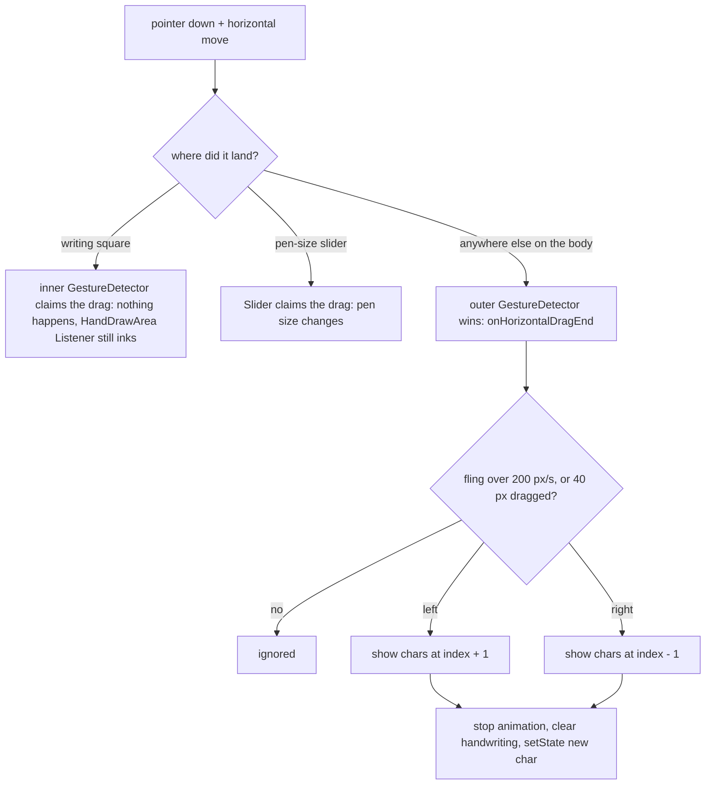

2026-09-02

# calliplus_flutter: swipe between characters on the detail screen, drop 隱藏

The character detail screen (the "big view" with the writing square) can now
page to the previous or next character with a horizontal swipe on the empty
area above or below the square. The 隱藏 (hide glyph) button is gone from the
bottom bar. This is iOS-only for now; calliplus_android's CharPanel still
steps with its prev/next buttons.

## How the swipe is wired

`CharacterDetailScreen` gains optional `chars` and `index`: the list the
character was opened from, in reading order. Both callers pass it — the
charbook grid (`CharBookScreen`, its flattened `_chars`) and the search /
book column (`CharsListWidget`). Paging happens in place: stop any stroke
animation, clear the handwriting, `setState` the new character and re-check
whether it has stroke data. No route is pushed, so the back button still
returns to the list, and the Hero tag follows the new character.

The whole body sits in one `GestureDetector` with `HitTestBehavior.opaque`,
so a drag anywhere on the screen reaches it, including the blank strips the
`Center`ed square leaves above and below itself. Two regions must never
page, and both are handled by letting a deeper recognizer win the gesture
arena rather than by geometry:

- the writing square is wrapped in a `GestureDetector` with no-op horizontal
  drag callbacks. `HandDrawArea` inks from raw `Listener` pointer events and
  never enters the arena, so without this guard the outer detector would win
  every horizontal stroke and flip the page mid-stroke;
- the pen-size `Slider` already owns horizontal drags on its own box (which,
  as a `Slider` in a bounded row, is the row's full height).

The first cut paged only on fling velocity. That passed a scripted 0.15 s
swipe but not the user's slow mouse drag in the simulator, which comes to
rest before lift-off with near-zero `primaryVelocity`. The end handler now
also accepts 40 logical px of accumulated drag, so a slow deliberate swipe
pages too.

## Two small fixes that came along

- `CalliImage` kept the glyph bytes used by 評分 across a character change
  (its element is reused through the `GlobalKey`), so scoring after a swipe
  would have compared against the previous glyph. It now drops them when the
  file name changes and falls back to the cached PNG on disk.
- The stroke-data index was empty in one build: a defensive `Uri.decodeFull`
  on the asset-manifest keys throws on non-ASCII input (it expects
  percent-encoded ASCII), and the surrounding catch turned that into "no
  stroke data anywhere". The keys are plain paths and are now used as-is.
