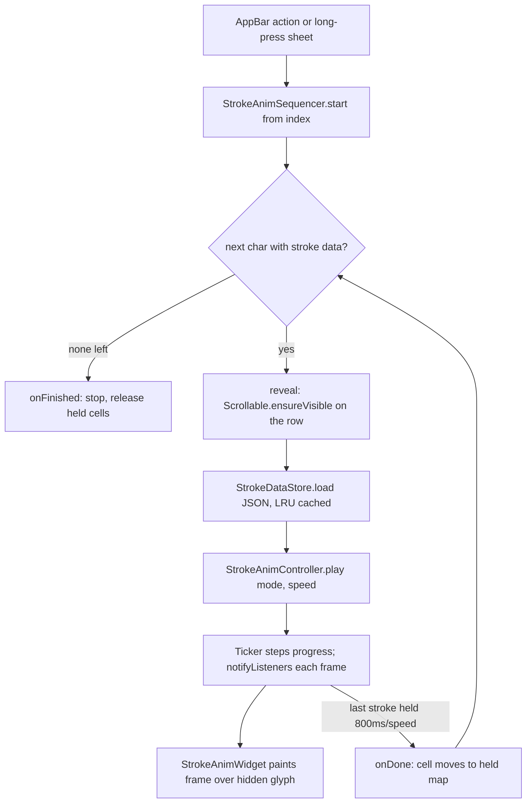

2026-09-02

# calliplus_flutter: port the stroke-order animation from Android

The iOS app (calliplus_flutter) now plays the 間架九十二法 (歐陽詢) glyphs the
way calliplus_android has since 4.10: **筆順動畫** reveals each stroke's
calligraphic outline along its centre line, and **手寫動畫** replays the pen
trace that was recorded over the glyph on the Supernote. Both run for a
single character on the detail screen and as a play-all over the whole book
on the charbook screen (AppBar actions; long-press a character to start from
it). A shared 1x–7x speed lives in SharedPreferences.

## Why now, and what had to come with it

The data already existed: Android's `assets/92_ou_strokes/*.json` is exported
by `~/src/calli_strokes/export_app_data.py` from hand traces, in glyph-square
units (0..1) relative to the square the SVG is fitted into. Flutter's
`rasterizeAssetSvg` fits the SVG into its 512 px square exactly the way
AndroidSVG's `xMidYMid meet` does, so the coordinates carry over unchanged:
the overlay is laid on the glyph's box and maps 0..1 onto its largest centred
square.

The catch was that the Flutter copy of the book was behind Android. Android
had since fixed shuffled glyphs (60 SVGs rewritten in place, same file names)
and relabelled 12 glyphs plus 3 rule texts, and the stroke JSON is named after
and traced over the *corrected* SVGs. So the port also syncs `92_ou_svg/`,
`92_ou.txt` and adds `92_ou_strokes/` (351 files, ~6 MB). Because SVG content
changed under unchanged names, and the PNG cache in the documents directory is
keyed only by file name, `SvgUtil.purgeStaleSvgCache()` deletes the cached
rasterizations once, gated by a `svgCacheVersion` preference.

## Shape of the port

`lib/strokes/` mirrors the Android classes, but the state lives outside the
widgets because Flutter list cells are rebuilt on scroll:

- `StrokeData` / `StrokeDataStore` parse the JSON into `Float32List`s and
  index which files exist from `AssetManifest.json`, so `has()` is synchronous
  once `ensureLoaded()` has run (the book list awaits it at startup). Parsed
  data is LRU-cached (96 entries).
- `StrokeAnimController` is the playback state machine (start delay, per-stroke
  timing proportional to arc length in calligraphy mode, recorded timestamps
  at 2x in handwriting mode, gap, hold). It owns a `Ticker`, so the animation
  keeps stepping when its cell scrolls out of the list, and the completion
  still fires — the sequencer relies on that. Frame dt is clamped to 100 ms so
  a backgrounded app does not skip strokes on resume.
- `StrokeAnimWidget` paints a `StrokeFrame` with a `CustomPainter`, caching the
  scaled geometry per (data, size). It takes either a live controller or a
  finished frame, the latter for characters play-all has already completed.
- `StrokeAnimSequencer` plays the book in order, skipping characters without
  data. The screen supplies `reveal` (scroll the row on screen via
  `Scrollable.ensureVisible`, with an estimated `jumpTo` for far-away rows
  that are not built yet) and `play`.

On the charbook screen the current cell renders the live overlay over an
`Opacity(0)` glyph, and finished cells render a static finished frame from a
`held` map until the run ends, so the hand-written characters accumulate down
the page rather than flipping back one by one. Tapping a character stops the
run before opening the detail screen, and 描邊 / 隱藏 on the detail screen
stop a finished animation, since it sits over the hidden glyph.

## A toolchain wrinkle

Flutter 3.7's `flutter gen-l10n` now emits null-safe code
(`AppLocalizations?`) that this pre-null-safety package cannot compile, and
with the default synthetic package it only writes into `.dart_tool/` anyway.
The committed `lib/l10n/app_localizations*.dart` files are therefore
hand-maintained: the five new strings were added to both ARBs and to the three
Dart files by hand. CLAUDE.md records this.
