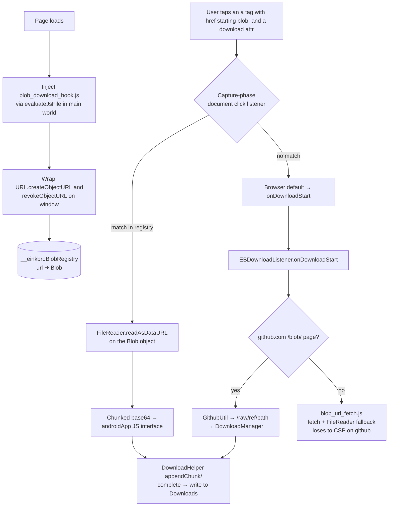

<!-- added: 2026-05-10T15:30:00Z -->
# einkbro — blob: URL downloads on CSP-strict sites

Commits: `69c4b180` (initial fix, codex), `b1879a06` (cleanup)

## Problem

Tapping "Download raw file" on a github.com file view (and similar pages that
hand the user a `<a href="blob:..." download>` link) showed a "Download link is
not valid" toast and saved nothing. The same UI worked fine for direct file
URLs (`.apk`, `.epub`, …); only blob-mediated downloads broke.

## Root Cause

Two layered failures, neither fixable in isolation.

1. **`Uri.parse("blob:...").host` is null.** `DownloadHelper.internalDownload`
   guards on `host == null` and toasts the error, so anything that reached it
   with a `blob:` URL bailed out immediately. Even if the guard were dropped,
   `DownloadManager` cannot fetch a `blob:` URL — the bytes live only in the
   WebView's heap.

2. **Naive recovery (re-fetch the URL inside the page) is blocked by CSP.**
   github.com sends a strict `Content-Security-Policy` whose `connect-src` does
   not include `blob:`, so any in-page `fetch(blobUrl)` is refused. A
   "react at `onDownloadStart` and re-fetch via injected JS" approach therefore
   loses on every CSP-strict site.

A subtler issue made the obvious next attempt (wrap `URL.createObjectURL` so we
can later look up the Blob object by URL) also fail when the wrap was installed
via `WebView.evaluateJavascript`: that call runs in an isolated world while the
page's own scripts run in the main world, so the wrap is invisible to the page.

## Solution

Three layers of defence, ordered from earliest interception to last resort:

1. **Capture-phase click hook in main world** (`blob_download_hook.js`,
   loaded via `evaluateJsFile` from `WebContentPostProcessor`). Wraps
   `URL.createObjectURL` to remember the underlying `Blob`, then attaches a
   `document.addEventListener('click', …, true)` that intercepts taps on
   `<a href="blob:…">`, calls `preventDefault`/`stopImmediatePropagation`, and
   reads the in-memory `Blob` directly with `FileReader.readAsDataURL`. No
   network fetch — no CSP problem. The base64 result is streamed in 50 KB
   chunks across the JS interface to keep individual JNI strings small.

2. **`EBWebChromeClient` blob-navigation catch.** When a popup window
   (`target=_blank` anchors) tries to navigate to a `blob:` URL, intercept and
   route to the same path: if the host page is github.com, derive the raw URL;
   otherwise hand off to the Kotlin downloader.

3. **`EBDownloadListener` / `DownloadHelper.download` last-resort path.** If
   `onDownloadStart` still fires with a `blob:` URL (page didn't have an
   anchor in the DOM), `GithubUtil.rawUrlForBlobPage(webView.url)` resolves the
   github page URL to a `/raw/<ref>/<path>` URL that `DownloadManager` can
   fetch directly. For non-github pages, `WebViewJsBridge.downloadBlobUrl`
   evaluates `blob_url_fetch.js`, which tries `fetch(blob:…)`. That fallback
   only succeeds where CSP permits it; on github we never reach it because
   layer 1 caught the click.

### Native-side bookkeeping

`DownloadHelper` keeps a `ConcurrentHashMap<String, PendingBlobDownload>` keyed
by a UUID handed to JS. Each entry holds a `WeakReference<Activity>`, the
target filename, fallback MIME, accumulated base64, and a creation timestamp.
On every new session start the table is pruned of entries older than 5 minutes
or whose Activity has been GC'd, so a page that calls `beginBlobDownload` and
never reports completion can't leak.

## Key Files

- `app/src/main/assets/blob_download_hook.js` — main-world hook + click capture
- `app/src/main/assets/blob_url_fetch.js` — CSP-bound fallback fetch path
- `app/src/main/java/info/plateaukao/einkbro/unit/GithubUtil.kt` — single
  source of truth for the github page-URL → raw-URL transform; uses
  `java.net.URI` so it stays unit-testable
- `app/src/main/java/info/plateaukao/einkbro/unit/DownloadHelper.kt` —
  blob-session lifecycle (`beginBlobDownload`, `appendBlobDownloadChunk`,
  `completeBlobDownload`, `failBlobDownload`); routes blob URLs through the
  github fast-path or prompts for a filename before invoking the fetch fallback
- `app/src/main/java/info/plateaukao/einkbro/browser/EBDownloadListener.kt` —
  hands the `EBWebView` to `DownloadHelper.download` so JS bridge access is
  available at recovery time
- `app/src/main/java/info/plateaukao/einkbro/browser/EBWebChromeClient.kt` —
  popup-window blob catch
- `app/src/main/java/info/plateaukao/einkbro/browser/JsWebInterface.kt` —
  `androidApp.beginBlobDownload`/`onBlobDownloadChunk`/`onBlobDownloadComplete`/
  `onBlobDownloadError`, with bounded id/length checks
- `app/src/main/java/info/plateaukao/einkbro/view/WebViewJsBridge.kt` —
  `downloadBlobUrl` substitutes JSON-quoted placeholders into the asset script

## Lessons Learned

- **Where you intercept matters more than how**. The recovery-side approach
  ("hook the WebView download listener and re-fetch") is the obvious one and is
  what we tried first. It cannot work on any site that ships a strict
  `connect-src` CSP, because re-fetching a blob URL from inside the page
  goes through CSP. Intercepting the click *before* the page's own download
  flow runs sidesteps both CSP and the WebView download-listener entirely.

- **`evaluateJavascript` does not share a JS world with the page** in a
  reliable enough way to wrap globals like `URL.createObjectURL`. If the wrap
  has to be visible to page scripts, install it through a path that runs in the
  main world before page scripts (`WebViewCompat.addDocumentStartJavaScript`,
  or — as used here — an early `evaluateJsFile` from `onPageFinished` that the
  page hasn't started downloads from yet).

- **Generic recovery pipelines need session bookkeeping with weak refs**.
  Storing `Activity` directly in a long-lived `ConcurrentHashMap` is a leak
  waiting for any JS path that fails to call `complete` or `error`. A weak
  reference plus TTL pruning costs nothing and removes the worry.

- **`URLDecoder.decode(url, "UTF-8")` is wrong for whole URLs**. It treats `+`
  as space (the `application/x-www-form-urlencoded` rule), which is correct
  for query parameters but not for path segments. Filenames like
  `app-1.0+rc1.apk` were silently corrupted to `app-1.0 rc1.apk`. Strip the
  query/fragment first, then decode only the segment that needs it
  (`Uri.decode`).

- **`/raw/refs/heads/<branch>/<path>` is needlessly specific**. github.com
  redirects `/raw/<ref>/<path>` correctly for branches, tags, *and* commit
  SHAs, so committing to `refs/heads/` would silently break tag and commit
  views.
