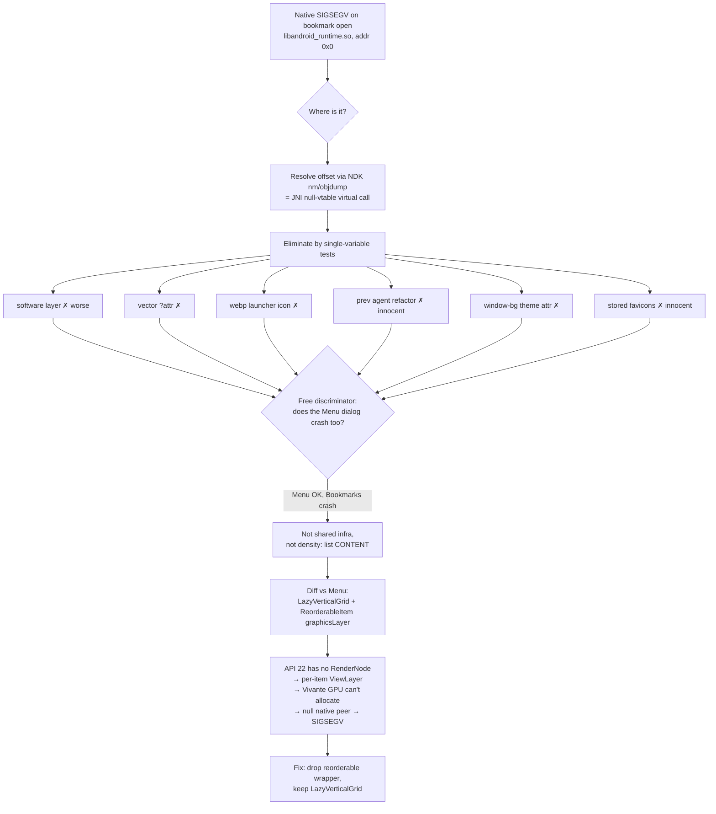

2026-05-18

# EinkBro — Bookmark dialog native SIGSEGV on Sony DPT (API 22)

## Problem

On the Sony DPT-CP1 digital-paper device (Android 5.1 / API 22,
`armeabi-v7a`, Vivante GC e-ink GPU), tapping the bookmark icon on the
toolbar killed the app instantly. There was **no Java stack trace** — the
process died from a native fatal signal:

```
F/libc    : Fatal signal 11 (SIGSEGV), code 1, fault addr 0x0 in tid NNNN
F/DEBUG    : signal 11 (SIGSEGV), code 1 (SEGV_MAPERR), fault addr 0x0
F/DEBUG    :     r0 00000000  r1 befbf7bc  r2 00000000 ...
F/DEBUG    : backtrace:
F/DEBUG    :     #00 pc 0008ac12  /system/lib/libandroid_runtime.so
F/DEBUG    :     #01 pc 000b3de3  /data/dalvik-cache/arm/system@framework@boot.oat
```

The crash was 100% reproducible, byte-for-byte identical every time
(same offsets, same register pattern), and the pre-crash log line was
always the same: the dialog window being added —
`WindowManager: Adding window … BrowserActivity at 2 of 5`.

A previous agent had already attempted a fix by refactoring the
bookmarks dialog; it did not work.

## Root Cause

`BookmarkList` rendered the bookmark grid with a `LazyVerticalGrid`
whose every item was wrapped in `sh.calvin.reorderable`'s
`ReorderableItem` (for drag-to-reorder). `ReorderableItem` applies a
`Modifier.graphicsLayer` to each item (it needs a layer to translate /
elevate the dragged item).

The chain that makes this fatal **specifically on API 22**:

1. Compose backs `Modifier.graphicsLayer` with a *layer* object. On
   **API ≥ 23** that is a hardware `RenderNode`. On **API < 23**
   `RenderNode` is unavailable, so Compose falls back to **`ViewLayer`**
   — a real `android.view.View` added to the `AndroidComposeView`, each
   with its own hardware layer / off-screen buffer.
2. The bookmark dialog therefore tried to allocate **one ViewLayer
   (hardware-layer surface) per visible bookmark item**, at the moment
   the dialog window was first drawn.
3. The Sony DPT's 2015 Vivante GC e-ink GPU driver could not allocate
   those layer surfaces. The framework code that consumes the layer
   then dereferenced a **null native peer** and called a C++ virtual
   method through it.

The disassembly of the faulting address pins this down exactly. The
2-frame backtrace looked corrupt, but resolving the offset with the
NDK's `llvm-nm`/`llvm-objdump` against the device's own
`libandroid_runtime.so` (pulled via `adb pull /system/lib/...`) showed
`0x8ac12` is a tiny Thumb-2 thunk in the resource/graphics JNI region:

```
8ac0e: push {r3, lr}
8ac10: mov  r0, r2
8ac12: ldr  r3, [r2]       ; r3 = *this   ← r2 == 0  → SIGSEGV
8ac14: ldr  r1, [sp, #8]
8ac16: ldr  r3, [r3, #0x20]; r3 = vtable[8]
8ac18: blx  r3             ; this->virtual_method_8(this, arg)
8ac1a: pop  {r3, pc}
```

This is the canonical "JNI native peer is 0" pattern:
`obj = arg; vtable = *obj; method = vtable[8]; method(obj, …)` with
`obj == null` — a Java object whose `mNativePtr`-style handle was never
created (here: the layer/surface allocation that failed on the Vivante
GPU), called unchecked by framework code (`boot.oat`).

The decisive structural observation: the **Menu dialog**
(`MenuDialogFragment`) is the *same* `ComposeDialogFragment`, in the
*same* window, at the *same* 2× density — and it never crashed. The
only difference: the menu uses a plain `Column.verticalScroll` with **no
`graphicsLayer`**, whereas the bookmark list applied a `graphicsLayer`
per item via `ReorderableItem`. That asymmetry is the whole bug.

## Solution

Keep `LazyVerticalGrid` (its grid/list layout and lazy scrolling were
never the problem) and remove **only** the reorderable drag wrapper.
Items now attach the existing tap / long-press `pointerInput` directly,
with no `graphicsLayer`, hence no `ViewLayer`, hence no GPU layer
allocation.

```kotlin
// before: itemsIndexed { … ReorderableItem(state, key) { isDragging -> Item(…) } }
// after : itemsIndexed { … Item(modifier = tapModifier) }   // no graphicsLayer
```

One file, ~35 insertions / ~79 deletions. **Trade-off:**
drag-to-reorder bookmarks is gone. It is intrinsically tied to the
crashing `graphicsLayer` path and is impractical on an e-ink device
anyway; reordering can be re-added later via a non-drag mechanism if
wanted.

## Directions Tested (and why each was wrong)

This took ~16 build/test cycles. Every wrong turn was eliminated by a
**single-variable isolation test**, not by reasoning alone. Recorded
here because the *path* is the lesson.

| # | Hypothesis | Test | Result |
|---|------------|------|--------|
| 1 | Hardware-accelerated *dialog* rendering | force `LAYER_TYPE_SOFTWARE` on the dialog ComposeView | **Worse** — Compose software path crashed at startup via `MenuDialogFragment.prewarm`. Reverted. |
| 2 | Vector drawables with `?attr` theme refs (`NewApi`/script-unaware resolver) | bulk-replace `?attr/colorControlNormal` → literal in 93 vectors | Still crashed. Reverted. |
| 3 | WebP launcher icon used as faviconless fallback (device fails on lossless VP8L) | replace `getApplicationIcon()` fallback with a bundled vector | Still crashed. |
| 4 | The previous agent's uncommitted bookmark refactor | `git stash` the refactor; run committed code only | Still crashed → **refactor exonerated** (the crash is in committed code). |
| 5 | Window-background drawable resolving custom `?attr` theme attrs during native inflation | `background_with_border_margin.xml` → literal colors | Still crashed. Reverted. |
| 6 | Stored favicon `BitmapFactory.decodeByteArray` → GPU-invalid bitmap | `FaviconInfo.getBitmap()` → return null (favicons off) | Still crashed → **favicons exonerated**. |
| 7 | Global 2× density override (commit `90ae354f`) | argued for a 1× diagnostic | Pre-empted by #8: the Menu dialog works at 2× density, so density was exonerated *without* a build. |
| 8 | **Bookmark-list content specifically** (`LazyVerticalGrid` + reorderable `graphicsLayer`) | rewrite `BookmarkList` with no lazy/reorderable | **No crash.** Root cause confirmed. Then narrowed to *reorderable only* (kept `LazyVerticalGrid`). |



## Key Files

- `app/src/main/java/info/plateaukao/einkbro/view/dialog/compose/BookmarksDialogFragment.kt`
  — `BookmarkList`: removed `rememberReorderableLazyGridState` /
  `ReorderableItem` / `draggableHandle`; kept `LazyVerticalGrid`,
  `GridCells.Adaptive`/`Fixed`, RTL grid fill, `reverseLayout`.
- Reference (the working sibling): `MenuDialogFragment.kt` —
  `Column.verticalScroll`, no `graphicsLayer`.

## Lessons Learned

1. **A native crash with a corrupt-looking 2-frame backtrace is still
   localizable.** Pull the device's own `.so`
   (`adb pull /system/lib/libandroid_runtime.so`), resolve the offset
   with the NDK's `llvm-nm -D` / `llvm-objdump --triple=thumbv7…`, and
   disassemble the faulting instruction. It turned a black box
   (`pc 0x8ac12`) into "`ldr r3,[r2]` with `r2==0` → virtual call on a
   null native peer", which framed every later hypothesis.

2. **Find the working sibling and diff it.** The single highest-leverage
   move was the *zero-cost* question "does the Menu dialog crash too?".
   It killed the density, shared-dialog-infra, and window hypotheses in
   one step and pointed straight at bookmark-list content. When two code
   paths share infrastructure and only one crashes, the bug is in the
   delta — enumerate that delta explicitly.

3. **Guessing is expensive; isolate one variable at a time.** Cycles
   1–6 were hypothesis-driven guesses against a confounded working tree
   (a previous agent's uncommitted refactor + my own experimental
   patches all stacked together). Progress only became reliable after
   `git stash`-ing everything down to a known commit and changing
   exactly one thing per build. Establish a clean baseline *first*.

4. **"It works on modern Android" hides API-floor regressions.**
   `Modifier.graphicsLayer` (and thus any reorderable/drag library built
   on it) is invisible on API ≥ 23 because of `RenderNode`. Lowering
   `minSdk` (here 24 → 22 for this device) silently activates the
   `ViewLayer` fallback. When you drop a `minSdk`, audit `graphicsLayer`
   / layer-backed effects and per-item layers, not just `NewApi` lint.

5. **Old/embedded GPUs fail allocations instead of degrading.** On a
   2015 e-ink Vivante driver, an unsatisfiable layer/surface request
   returns null and the framework dereferences it. Treat per-item
   hardware layers as a scarce resource on such hardware.

6. **Match the fix scope to the proven cause.** The first working fix
   (rewrite the whole list as a plain `Column`) over-corrected and broke
   scrolling and grid layout. Once the cause was *confirmed* to be the
   reorderable `graphicsLayer` (not `LazyVerticalGrid`), the correct fix
   was the minimal one: keep the lazy grid, delete only the reorderable
   wrapper. Confirm the mechanism, then change the least that addresses
   exactly it.

7. **Record exoneration, not just the culprit.** Knowing that density,
   favicons, the window background, and the prior refactor were *proven
   innocent* is what made the final diagnosis trustworthy and stopped
   the thrashing.
