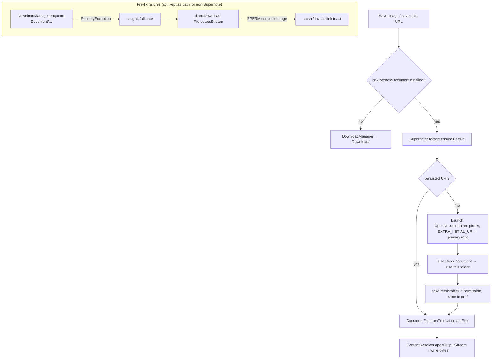

<!-- added: 2026-05-10T09:05:39Z -->
# einkbro: Supernote Save-Image Crash → SAF Tree Routing

## Problem
On Supernote devices, saving an image from the long-press context menu crashed
the app with `SecurityException: Unsupported path
/storage/emulated/0/Document/...`. An earlier commit had routed downloads to
the Supernote-specific `Document/` directory so files would show up in the
device's reader library, but had not been tested on the long-press save path.

## Root Cause
Two stacked failures, both rooted in Android 11+ scoped storage:

1. `DownloadManager.enqueue()` validates the destination against an internal
   path allowlist (Download, Pictures, DCIM, Documents *plural*, …). The
   Supernote convention is `Document/` — singular — which is not on the
   allowlist, so `enqueue` throws `SecurityException` server-side. This
   happens at `enqueue()` time, *not* at `setDestinationInExternalPublicDir()`,
   so a try/catch wrapped only around the setter is useless.
2. The fallback `directDownload` path used `File.outputStream()` to write
   directly to the resolved folder. Under scoped storage on API 30+, that
   fails with `EPERM` — `requestLegacyExternalStorage="true"` in the manifest
   is ignored on Android 11+ for new installs.

The image-save path lacked the outer try/catch that the regular download path
had, so the `SecurityException` propagated and killed the process. Even with
the catch added, the fallback hit EPERM — the underlying problem is that
neither DownloadManager nor direct File I/O can write to a custom public
directory on API 30+.

## Solution
Bypass both unusable APIs entirely on Supernote: write through SAF using a
persisted `OpenDocumentTree` grant.

- Add a persisted `supernoteFolderUri` preference.
- Register an `OpenDocumentTree` launcher in `FileHandlingDelegate`; on grant,
  take persistable URI permission and store the URI.
- New `SupernoteStorage` object: resolves the persisted URI, prompts via the
  registered launcher when missing, and exposes `openOutputStream` that
  `createFile`s under the granted tree via `DocumentFile`.
- `DownloadHelper.saveDataUrl` and `directDownload` route writes through
  `SupernoteStorage` when running on a Supernote.
- The picker is launched with `EXTRA_INITIAL_URI` pointing at the *root* of
  primary external storage, not at `Document/` itself, so the user can tap
  `Document` from the list (Android's tree picker hides the grant button on
  the auto-selected initial folder as an anti-clickjacking guard, which would
  otherwise force the user to navigate up then back down).

## Key Files
- `app/src/main/java/info/plateaukao/einkbro/unit/SupernoteStorage.kt` — new
- `app/src/main/java/info/plateaukao/einkbro/preference/BrowserConfig.kt` —
  `supernoteFolderUri` pref
- `app/src/main/java/info/plateaukao/einkbro/activity/delegates/FileHandlingDelegate.kt` —
  `OpenDocumentTree` launcher registration
- `app/src/main/java/info/plateaukao/einkbro/unit/DownloadHelper.kt` —
  `useSupernoteStorage()` branching, `writeBytesViaSupernote`
- `app/src/main/java/info/plateaukao/einkbro/unit/HelperUnit.kt` —
  `supernoteStorageRootInitialUri()`

## Lessons Learned
- Path validation in `DownloadManager` happens at `enqueue()`, not at the
  destination setter. Try/catch around the setter is meaningless; wrap the
  enqueue call.
- On Android 11+, `requestLegacyExternalStorage` is silently ignored for new
  installs. There is no path-based escape hatch for writing into custom public
  directories — only SAF, MediaStore (with its own allowlist limited to
  standard public dirs, plural), or `MANAGE_EXTERNAL_STORAGE`.
- MediaStore's `RELATIVE_PATH` allowlist also excludes `Document/` (singular).
  SAF was the only viable option here.
- Android's tree picker hides the "Use this folder" / grant button when the
  initial URI lands you *inside* the target folder. Pre-pointing the picker
  at the parent directory (so the target appears as a tappable list item) is
  a meaningful UX fix on top of just persisting the grant.
- When testing across multiple connected devices (emulator + physical), avoid
  `gradle installDebug`: it tries every device and fails on signature
  mismatch with release-signed installs. Prefer `adb -s <serial> install -r`
  with the matching variant.
- When introducing a new "destination" in download code, audit *every* call
  site (saveDataUrl, internalDownload, directDownload, saveFileWithName,
  openDownloadFolder) — the original Supernote-routing commit landed without
  verifying the long-press image save path, which is why this only surfaced
  later.
