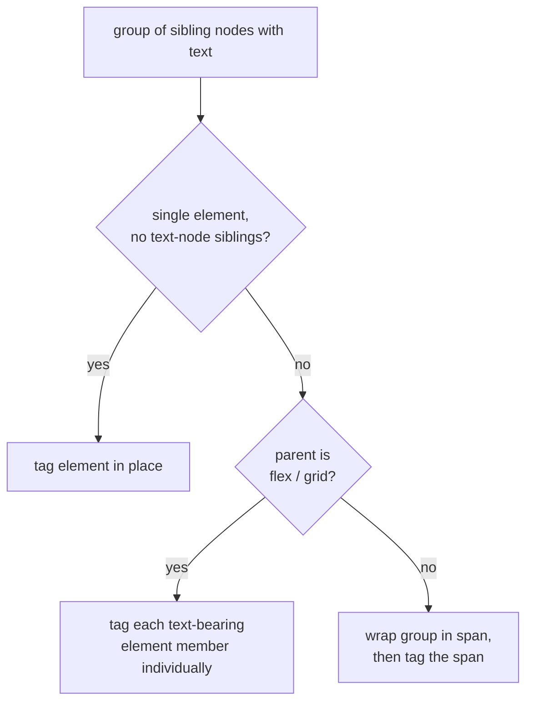

<!-- added: 2026-05-10T14:11:03Z -->
# einkbro: preserve page layout and avoid caching errors in paragraph translation

## Problem

The translate-by-paragraph feature visibly broke layouts on common modern
sites and, when the ChatGPT backend hiccuped, persisted the literal string
`"Something went wrong."` as the translation for that paragraph. Three
distinct symptoms:

1. **Flex/grid pages got mangled.** Header bars, navs, and card grids that
   used `display: flex` or `display: grid` shifted, collapsed, or
   re-stacked the moment translation ran on them.
2. **A vertical gap appeared under each translated paragraph.** Even with
   the "hide original" CSS in effect, every translated `
` had a stray
   line-box below it.
3. **A transient ChatGPT failure became permanent.** If the API call
   failed once, the cache stored `"Something went wrong."` against the
   source string and served that text forever after.

## Root Cause

- **Wrapping is destructive on flex/grid parents.** `fetchNodesWithText`
  collected each text-bearing run of sibling nodes, created a fresh
  ``, inserted it before the first sibling, and moved the run into
  it. That works on a plain block parent, but on a flex/grid container it
  reparents N flex/grid items into a single non-item `` (the span
  itself becomes the item), shifts decorative whitespace siblings into
  the wrapper, and invalidates `:nth-child` and `> *` selectors on the
  parent. The visible result is a layout reflow whose severity depends on
  how much the page leans on the affected selectors.

- **Single-element groups didn't need wrapping at all.** When a group
  consisted of exactly one element node and no text-node siblings worth
  translating, the wrapper was pure overhead and the source of the
  reflow.

- **The hide-original CSS used `height: 0; overflow: hidden`**, which
  removes the painted content but still produces a zero-height inline
  formatting context — i.e., the line box still occupies its line-height
  worth of vertical space. `display: none` removes the element from the
  layout flow entirely.

- **`translateWithChatGpt` returned a hardcoded English error string on
  any non-success path.** The caller cannot distinguish "the model said
  'Something went wrong.'" from "the API errored out" and writes the
  string into the persistent translation cache. The Gemini path already
  returned `""` on failure and the caller's empty-string handling
  ("leave the placeholder blank, skip caching") was already correct.

## Solution

`fetchNodesWithText` now picks the cheapest correct strategy per group:

- **Tag-in-place** for a lone inline element keeps the DOM shape
  unchanged.
- **Per-element tagging** on flex/grid parents preserves item-level
  identity: each child stays a flex/grid item, parent selectors keep
  matching, decorative whitespace siblings stay where they are.
- **Wrap-in-span** is preserved as the fallback for normal block flow,
  where mixing element and text nodes into a single translatable unit
  is the right behavior.

For the hidden-original styling, all five `TRANSLATED_P_CSS_*` variants
in `WebViewJsBridge` now use `display: none` instead of zeroed
margin/padding/height, eliminating the leftover line-box gap.

For `translateWithChatGpt`, the `?: "Something went wrong."` fallback is
replaced with `.orEmpty()`. The caller already treats `""` as
"no translation" — leave the placeholder blank, do not cache — so a
transient API failure no longer poisons the cache.

## Key Files

- `app/src/main/assets/translate_by_paragraph.js` — wrapping logic
- `app/src/main/java/info/plateaukao/einkbro/view/WebViewJsBridge.kt` — hide-original CSS variants
- `app/src/main/java/info/plateaukao/einkbro/browser/JsWebInterface.kt` — ChatGPT failure return value

## Lessons Learned

- DOM-mutating instrumentation has to respect the parent's layout
  contract. A `` wrapper is invisible-by-default on inline flow
  but is layout-significant on flex/grid parents (it becomes the item)
  and on parents whose CSS targets `:nth-child` or `> *`. The fix is to
  branch on the parent's `getComputedStyle().display` rather than
  always wrapping.
- "Hide an element" via `height: 0; overflow: hidden` removes paint but
  not layout participation. For block elements, prefer `display: none`
  unless you specifically need the element to keep occupying space
  (e.g., transition/animation use cases).
- Boundary functions returning a human-readable error string are a
  caching trap. The caller can't tell error from content, so the error
  ends up in the cache. Either return `null` / `""` and let the caller
  handle "no result", or wrap the result in a sealed type — never a
  bare string that doubles as a sentinel.
