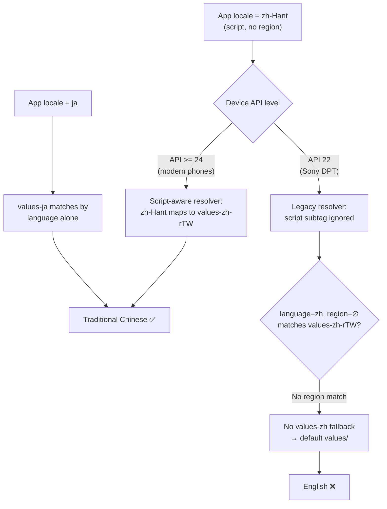

2026-05-17

# EinkBro — zh-Hant locale fallback & 2x UI density (Sony DPT)

## Problem

On the Sony DPT-CP1 (Android 5.1 / API 22), choosing Traditional Chinese
in EinkBro's in-app "App language" setting left the UI in English. Other
languages such as Japanese worked. Separately, the default-density
toolbar was too small to use comfortably on the DPT's large,
high-resolution e-ink panel.

## Root Cause

The app's locale picker stores Chinese as the BCP47 *script* tags
`zh-Hant` / `zh-Hans` (no region). The only Chinese resource folders are
the *legacy* region-qualified `values-zh-rTW` / `values-zh-rCN`.

Android's resource resolver only became script-aware in API 24. On
API 22 the legacy resolver ignores the script subtag, so a requested
locale of language `zh` with **no region** cannot match a folder that
requires region `TW`/`CN`. With no `values-zh` fallback, resolution
dropped to the default `values/` (English).

`ja` worked on every API level because `values-ja` matches by language
alone — no script/region mapping is involved. Only the Chinese variants
depend on the script→region mapping, so only they broke on this device.

## Solution

Added `LocaleManager.localeFor()` mapping the stored tags to legacy
language+region locales that the pre-24 resolver can match, and still
resolve correctly on modern devices:

- `zh-Hant` / `zh-TW` → `Locale("zh", "TW")` → `values-zh-rTW`
- `zh-Hans` / `zh-CN` → `Locale("zh", "CN")` → `values-zh-rCN`
- everything else → `Locale.forLanguageTag(code)` (unchanged)

It is used by `setLocale`, `updateResources`, and
`DisplayConfigDelegate.applyLocaleInPlace` so every locale path is
consistent. Also corrected a zh-rTW typo: `setting_app_locale`
介面語面 → 介面語言.

Bundled enhancement — **2x global UI density**: `setLocale` now also
scales `Configuration.densityDpi` by `LocaleManager.UI_DENSITY_SCALE`
(2f), enlarging the whole app UI (toolbar, menus, dialogs, text)
uniformly. `setLocale` was made tolerant of an empty language code
(system locale + density only) and every activity's `attachBaseContext`
now calls it unconditionally, so density applies even when the user
keeps the system locale. The original base context is passed in each
time, so density is scaled exactly once with no compounding across
activities.

Verified on-device: explicit Traditional Chinese app-locale renders the
app UI in Chinese; toolbar and all chrome render ~2x larger.

## Trade-offs

- The 2x density is a global multiplier, so the web-content viewport is
  correspondingly smaller. This was an accepted, explicit choice for
  this device-targeted branch (`for_sony_dpt`); `UI_DENSITY_SCALE` is a
  single constant, easy to tune.
- The fix maps tags to language+region rather than adding BCP47
  `values-b+zh+Hant` folders. Mapping is centralized in one function and
  avoids duplicating every Chinese resource folder.

## Key Files

- `app/src/main/java/info/plateaukao/einkbro/unit/LocaleManager.kt`
  — `localeFor()`, density scaling, empty-code handling
- `app/src/main/java/info/plateaukao/einkbro/activity/delegates/DisplayConfigDelegate.kt`
- `BrowserActivity.kt`, `SettingActivity.kt`, `StatusbarConfigActivity.kt`,
  `MenuItemHideActivity.kt`, `ToolbarConfigActivity.kt`
  — `attachBaseContext` now calls `setLocale` unconditionally
- `app/src/main/res/values-zh-rTW/strings.xml` — typo fix

## Lessons Learned

Android resource resolution is script-aware only from API 24. Storing
locale preferences as BCP47 script tags (`zh-Hant`) while shipping only
legacy region-qualified resource folders (`values-zh-rTW`) silently
works on modern devices but falls back to default on older ones. When
supporting pre-24 devices, normalize Chinese (and other script-bearing)
locales to language+region before applying them.
