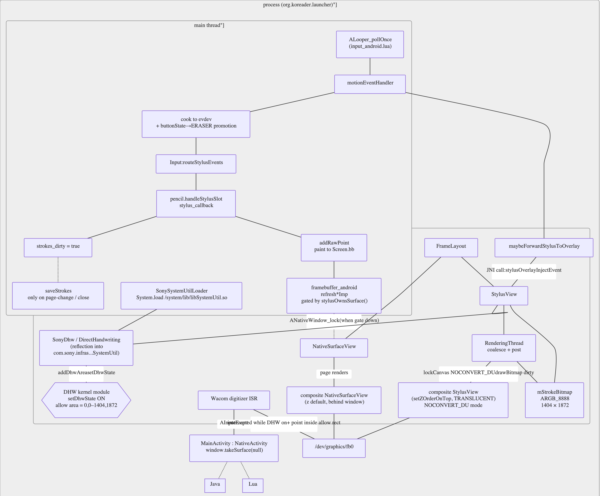
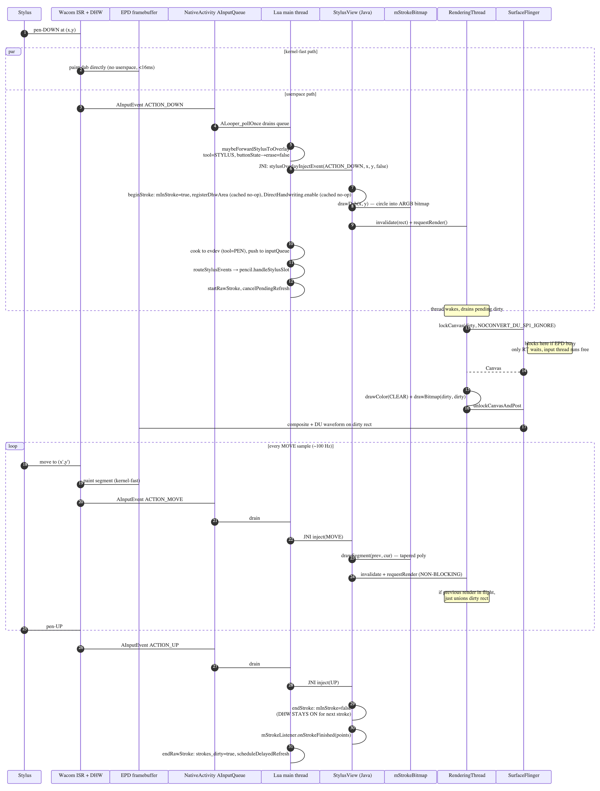
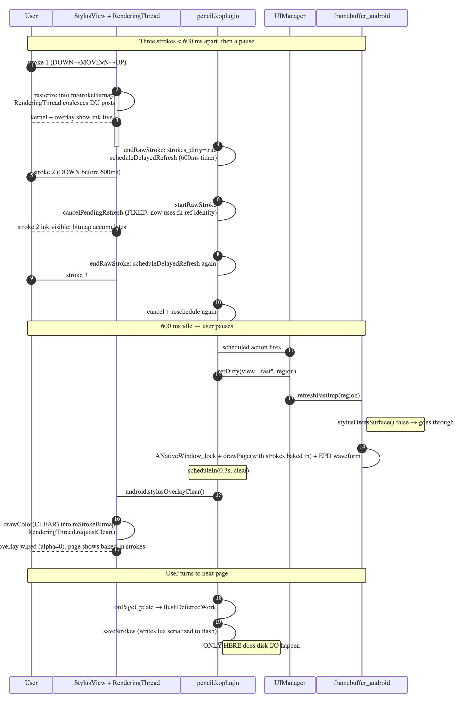

# KOReader Sony DPT stylus: from "so slow" to smooth — a one-day rebuild

**Date:** 2026-05-26
**Status:** Done; running on the user's DPT-CP1.
**Companion ADR:** [`koreader-pencil-port-to-sony-dpt.md`](./koreader-pencil-port-to-sony-dpt.md) covers the initial port (the day before this work).

## Summary

We started the day with stylus drawing on the Sony DPT-CP1 working *but feeling unusable* — "so slow!!!!" was the verbatim opening. By the end we had:

- DHW kernel-fast ink under the pen.
- Userspace overlay drawing strokes in DU mode at sub-50ms perceived latency.
- Continuous-write coalescing so fast multi-stroke handwriting doesn't stutter.
- A working eraser button.
- Save-to-disk policy that doesn't block the input thread.
- Pencil menu surfaced at the top of `Tools` instead of buried in `More Tools`.

Eleven build cycles, four submodules touched, and one big architectural change (a `RenderingThread` that decouples input event rate from EPD waveform rate). This document captures every cycle, the wrong turns, and the final architecture.

## Where we were at the start of the day

A first pass had landed the night before — `pencil.koplugin` was registering a stylus callback, a `StylusView` SurfaceView had been sketched in `luajit-launcher`, and a `SonyDhw.kt` reflected into Sony's framework `SystemUtil`. But nothing on screen was fast.

Specifically:

- **DHW reflection was set up but never engaged.** Sony's framework `SystemUtil` class is reachable via `Class.forName`, but its `nativeSetDhwState` etc. throw `UnsatisfiedLinkError` until `libSystemUtil.so` is explicitly `System.load`-ed. We weren't loading it; every DHW call was a silent no-op.
- **Userspace `lockCanvas` was guaranteed to fail.** The lone `StylusView` *was* KOReader's primary `SurfaceView`. KOReader's NativeActivity binds that Surface to `ANativeWindow` so the native renderer can blit pages — and once a Surface is NDK-bound, `SurfaceHolder.lockCanvas` throws `IllegalArgumentException` forever. Our per-segment EPD posts were never reaching the panel.
- **The Lua-side stylus path forwarded events to the overlay**, but it didn't carry the eraser button state across, and it had multiple `UIManager:scheduleIn` bugs that meant per-stroke timers piled up instead of cancelling.

Today's work was: figure out which of these were real, fix them in the right order, and avoid the wrong fixes that the wrong diagnosis would lead to.

## Final architecture



The final layout is essentially [sony_draw](../sony_draw)'s setup grafted into a NativeActivity host. The key shape:

- A **FrameLayout** root with two stacked `SurfaceView`s:
  - `view` (`NativeSurfaceView`) at **default Z** — `setContentView` lets it punch through the activity window. ANativeWindow binds here; KOReader's native renderer writes pages via `ANativeWindow_lock`.
  - `stylusOverlay` (`StylusView`) on top with `setZOrderOnTop(true)` and `PixelFormat.TRANSLUCENT`. Its Surface is *not* NDK-bound, so Java's `SurfaceHolder.lockCanvas` works. Stroke pixels go through this overlay.
- A **`RenderingThread`** owns the overlay Surface's `lockCanvas` calls and coalesces them so input-thread cost stays O(rasterise into RAM) regardless of EPD speed.
- A **DHW kernel path** runs in parallel: when `setDhwState(true)` and the digitizer is inside an `addDhwArea` rect, the Wacom ISR paints pixels directly into `/dev/graphics/fb0` with no userspace involvement.

When a stroke is committed (after a 600 ms idle), `pencil.koplugin` flushes via KOReader's normal refresh path so the page redraws with strokes baked in, and the overlay wipes itself.

### Single-stroke sequence



Things to notice on this diagram:

- The kernel-fast path (DHW) and the userspace overlay path run **in parallel**. DHW writes directly to the EPD framebuffer; the overlay also writes there via SurfaceFlinger composite. Sony's `NOCONVERT_DU_SP1_IGNORE` mode tells the EPD waveform to preserve DHW pixels when our overlay buffer is composited.
- Input thread work is bounded by **bitmap rasterisation** (a few µs) + **non-blocking `invalidate` / `requestRender` on `RenderingThread`** (also negligible). The slow part — `lockCanvas` blocking on a free buffer when EPD is busy — happens on the render thread, not the input thread.
- DHW state stays on between consecutive pen strokes. Only an eraser stroke flips it off.

### Multi-stroke with deferred commit



The flow when the user writes several quick strokes:

1. Every stroke goes through the overlay path and ink stays visible (overlay bitmap accumulates).
2. Each `endRawStroke` sets `strokes_dirty = true` and schedules a 600 ms commit. The next `startRawStroke` cancels it — so during continuous writing, the page is never redrawn from KOReader's side.
3. After 600 ms of idle, the commit fires: `setDirty` triggers a partial fast refresh that paints the page (with strokes now baked into the on-page stroke list), and 300 ms later the overlay is cleared via SRC blit of a fully transparent bitmap.
4. On page turn or document close, `flushDeferredWork` writes the stroke file to disk. Mid-write disk I/O never happens.

## The journey, iteration by iteration

This was the order the bugs surfaced. The take-away patterns are at the bottom.

### 1. "DHW never actually engaged" — `SonySystemUtilLoader`

Logs showed `SonyDhw: SonyDhw available` (reflection found the class) but no panel pixels ever appeared. The class loads, but its native bindings don't until `libSystemUtil.so` is in the process. Added `SonySystemUtilLoader.kt`: copy `/system/lib/libSystemUtil.so` to `filesDir` (since `nativeLibraryDir` is read-only for third-party apps) and `System.load` it once. After this, `setDhwState(true) readback=true` started showing up in the log.

### 2. `lockCanvas` throws `IllegalArgumentException`

With DHW genuinely on, the user reported "no strokes when drawing. it only appears afterward". Logcat had piles of:

```
E/SurfaceHolder: Exception locking surface
E/SurfaceHolder: java.lang.IllegalArgumentException
```

Cause: the StylusView's Surface was the *primary* SurfaceView — bound to `ANativeWindow` by KOReader's native renderer (`window.takeSurface(null)` + `view?.holder?.addCallback(this)`). Once any Surface is NDK-bound, Java's `lockCanvas` will reject every future call on it.

A naive "remove all the broken lockCanvas calls and rely on DHW alone" actually made things worse — the kernel's DHW pixels were visible briefly but kept getting overwritten by SurfaceFlinger compositing the cached page buffer, because we no longer had a userspace mechanism to keep the EPD framebuffer aligned with the layered surfaces.

### 3. Two stacked SurfaceViews (the right fix)

[sony_draw](../sony_draw) runs as a regular `Activity` with one `SurfaceView` in an XML layout — no NDK binding, lockCanvas works. We can't drop NativeActivity (KOReader's core renderer is in C), so the answer is **two** SurfaceViews:

```
MainActivity (NativeActivity)
└── FrameLayout (content view)
    ├── view = NativeSurfaceView       ← default Z, NDK-bound, for pages
    └── stylusOverlay = StylusView     ← setZOrderOnTop(true), TRANSLUCENT, Java-owned
```

The stylus overlay's Surface is independent and Java's `lockCanvas` works there.

#### 3a. The Z-order pitfall

First attempt put `view` on `setZOrderOnTop(true)` (matching the existing NGL4 code for Kobo) and the overlay on `setZOrderMediaOverlay(true)`. Logcat:

```
Adding window {SurfaceView}  at 11 (after MainActivity)    ← native on top
Adding window {SurfaceView}  at 10 (before MainActivity)   ← stylus BELOW window
```

On DPT-CP1 firmware 1.6.50.14130, `setZOrderMediaOverlay(true)` places the surface *below* the activity window, not above other media surfaces as the Android docs imply. The stylus overlay's `lockCanvas` writes happened correctly but were buried under the window AND the native surface above it.

Fix: keep `view` at default Z (it punches a hole through the window for the page) and put `stylusOverlay` on top. After this swap, `StylusView: surfaceCreated` and `surfaceChanged 1404x1872` finally showed up in the log.

### 4. Per-segment NOCONVERT_DU restored

With the overlay on its own Surface, the per-segment `EpdHelper.lockCanvas(holder, dirty, UPDATE_MODE_NOWAIT_NOCONVERT_DU_SP1_IGNORE)` pattern from sony_draw works. The `NOCONVERT` + `SP1_IGNORE` flags tell Sony's EPD path to preserve DHW kernel pixels when applying the DU waveform to our buffer changes. Strokes appeared in real time, finally.

### 5. Framebuffer gate

KOReader's native renderer was occasionally firing `ANativeWindow_lock`-based refreshes during the stroke, racing with the overlay. Added a gate in `base/ffi/framebuffer_android.lua`: every `refresh*Imp` consults `android.stylusOverlayOwnsSurface()` (a JNI bool flag set in `MainActivity` on stylus DOWN / cleared on UP) and short-circuits while the gate is up. Exception: eraser strokes don't gate, because pencil's eraser path *needs* KOReader's refresh to show erased regions immediately.

### 6. Eraser, take 1: forward `buttonState` to the overlay

Pen side-button → wanted-eraser → was painting strokes. `MotionEvent.getToolType` returns `TOOL_TYPE_STYLUS` even when the eraser button is held; the button shows up in `getButtonState`. Updated `maybeForwardStylusToOverlay` to OR in `BUTTON_TERTIARY | BUTTON_STYLUS_PRIMARY | BUTTON_STYLUS_SECONDARY`.

### 7. Eraser, take 2: also promote evdev `ABS_MT_TOOL_TYPE`

After (6) the StylusView correctly disabled DHW for eraser strokes, but the actual erase still didn't fire. Why: pencil's `handleStylusSlot` keys eraser mode off `slot.tool == TOOL_TYPE_ERASER`, and `slot.tool` comes from the cooked evdev event in `emitToolType`. That function was still emitting `ABS_MT_TOOL_TYPE = 1` (PEN). Fixed `emitToolType` to also promote PEN→ERASER when buttonState has the same mask.

This was a real "the eraser fix you shipped only fixed half of it" moment — JNI overlay path and evdev cook path are siblings, both have to translate the button.

### 8. Thickness sync between StylusView and pencil

`StylusView.mPenWidthPx` was hardcoded to 2f; `pencil.koplugin`'s `tool_settings[TOOL_PEN].width` was user-configurable (default 3). Live stroke thickness didn't match the final stroke baked into the page. Added a JNI method `stylusOverlaySetPenWidth(widthPx)` and call it from `setupSonyDhw` + `setPenWidth`.

### 9. `UIManager:scheduleIn` returns nothing — three cancel bugs

This was the silent killer. The pattern looked correct:

```lua
self.pending_refresh = UIManager:scheduleIn(0.6, function() ... end)

function Pencil:cancelPendingRefresh()
    if self.pending_refresh then
        UIManager:unschedule(self.pending_refresh)
        self.pending_refresh = nil
    end
end
```

But `UIManager:scheduleIn` *has no `return` statement* — `self.pending_refresh` was always `nil`, so the cancel never fired. Every stroke piled another 600 ms timer onto the queue, and all of them fired in succession. KOReader's page redrew multiple times in a row, stroke-by-stroke, mid-write.

The same pattern broke in three places:

- `scheduleDelayedRefresh` (KOReader page commit timer)
- `scheduleDeferredWork` (debounced disk save — every stroke wrote all strokes to flash, on the input thread)
- `scheduleColorPickerCheck` (100 ms poll for the long-press color-picker gesture)

Fix in all three: store the **function itself** (since `UIManager:unschedule(action)` compares by action identity), pass the same reference to `scheduleIn` and `unschedule`.

### 10. DHW ioctl churn between strokes

Even with the timer cancels fixed, fast multi-stroke writing still stuttered. The user's exact diagnostic was excellent: *"a long stroke could update very smoothly even it take several seconds to finish the stroke writing, but a quick continuous 3 short stroke, the 2nd and 3rd strokes won't be shown immediately"*.

Long stroke = many MOVEs, all the same code path. Short strokes = many DOWN/UP cycles. The DOWN/UP cycle was doing **5 kernel ioctls** through `SystemUtil` JNI per transition:

1. `removeAllDhwArea`
2. `addDhwArea`
3. `setDhwState(true)`
4. `getDhwState()` — debug readback
5. `setDhwState(false)` on UP

Each ioctl is a kernel round-trip; collectively several tens of ms per stroke. Fixed:

- `SonyDhw` caches `lastArea`, `lastPenPx`, and `enabled`. Idempotent calls skip the ioctl.
- Dropped the `getDhwState` readback log (debug only, but it fired every stroke).
- `StylusView.endStroke` no longer calls `DirectHandwriting.disable()` on pen-up. Matches sony_draw; only eraser-DOWN flips DHW off.

After this, between two consecutive pen strokes: **0 ioctls**.

### 11. Save policy: stop writing to disk on the input thread

KOReader is single-threaded Lua. `saveStrokes` does `io.open + write + close` synchronously on the main thread — when it runs, no new `AInputEvent` drains and no JNI inject fires. The disk write is the very gap the user feels.

The original pencil plugin was already trying to debounce saves (`scheduleDeferredWork` with a 1500 ms delay), but the cancel bug from (9) meant every stroke fired another save. After fixing the cancel, the user still asked: "why save to disk that often??"

Right question. The cleaner policy: don't debounce, *defer entirely* to lifecycle events.

- `scheduleDeferredWork` now just sets `self.strokes_dirty = true`.
- `flushDeferredWork` saves only if `strokes_dirty` (or `dirty_groups`).
- `onPageUpdate`, `onUpdatePos`, `onCloseDocument` all call `flushDeferredWork`.
- Eraser paths also set `strokes_dirty = true` instead of saving inline.

Result: zero disk I/O during writing. Strokes persist on page turn or close.

### 12. The big one — SurfaceFlinger BufferQueue saturation

After all of the above, the user's report stayed: *"still have delay if drawing quickly more than 3 strokes"*. Saves disabled. DHW idempotent. Cancels working. Long strokes smooth. Yet 3+ short consecutive strokes still stuttered.

The insight: touch events arrive at ~100 Hz. Sony's DU waveform takes ~120 ms. Android's `BufferQueue` has a small fixed depth (typically 3). So:

- pushLive #1 at t=0: lockCanvas → buffer A → unlockAndPost. EPD waveform starts on A.
- pushLive #2 at t=10ms: lockCanvas → buffer B (A still in use) → unlockAndPost. EPD queues B.
- pushLive #3 at t=20ms: lockCanvas → buffer C → unlockAndPost. EPD queues C.
- pushLive #4 at t=30ms: lockCanvas **blocks** waiting for A's waveform (~90ms remaining).
- All subsequent pushLives queue up behind that block, on the input thread.

Long single strokes hide this — the user is still moving, so "lag" feels like "ink trailing the pen". For short strokes with visible gaps, each "missing stroke" stands out.

[sony_draw](../sony_draw) avoided this with a `RenderingThread`: touch handlers just rasterise into the offscreen bitmap and *signal* the render thread; the thread coalesces multiple signals into one post and absorbs the `lockCanvas` block. We had removed that pattern earlier (thinking synchronous was simpler). The user feedback ended up being clear-cut evidence we needed it back.

Added `RenderingThread.java`:

- Input thread on every MOVE: `drawSegment` into bitmap → `mRenderer.invalidate(rect) + requestRender()`. Both wait-free.
- Render thread: `wait()` until invalidated → drain pending dirty → `lockCanvas` (blocks here only — input thread keeps running) → `drawColor(CLEAR) + drawBitmap(src=dirty, dst=dirty)` → `unlockAndPost`.
- New events arriving during the `lockCanvas` block just keep painting the bitmap and `union`-ing into `mPendingDirty`. The next iteration picks up the whole coalesced batch.
- Same thread handles `requestClear()` for the post-idle wipe.

User feedback after this build: **"much better now!"**

## Key files (today's changes)

### Java / Kotlin (luajit-launcher)

- `app/src/main/java/org/koreader/launcher/MainActivity.kt` — two-SurfaceView setup, `SonyDhw.setContext`, eraser gate skip, JNI bindings for overlay control.
- `app/src/main/java/org/koreader/launcher/LuaInterface.kt` — new methods: `stylusOverlay*` family, including `stylusOverlaySetPenWidth`.
- `app/src/main/java/org/koreader/launcher/device/sony/StylusView.java` — overlay surface, beginStroke/continueStroke/endStroke, bitmap rasterisation, RenderingThread integration, clear()
- `app/src/main/java/org/koreader/launcher/device/sony/RenderingThread.java` — coalescing post loop (final iteration).
- `app/src/main/java/org/koreader/launcher/device/sony/SonyDhw.kt` — idempotent state, no debug readback, area cache.
- `app/src/main/java/org/koreader/launcher/device/sony/SonySystemUtilLoader.kt` — new; extracts and `System.load`s `libSystemUtil.so`.
- `app/src/main/java/org/koreader/launcher/device/sony/{DirectHandwriting,EpdHelper,EinkMode}.java` — kept from earlier work, unchanged.
- `assets/android.lua` — Lua FFI bindings to the new JNI methods.

### KOReader base / frontend

- `base/ffi/input_android.lua` — `maybeForwardStylusToOverlay`; `emitToolType` promotes PEN→ERASER on buttonState; `ERASER_BUTTON_MASK` hoisted.
- `base/ffi/framebuffer_android.lua` — `stylusOwnsSurface()` gate on every `refresh*Imp`.
- `frontend/ui/elements/{reader,filemanager}_menu_order.lua` — `pencil_annotation` is now the first item in `tools`.

### On-device plugin (NOT in the repo)

- `/sdcard/koreader/plugins/pencil.koplugin/main.lua` — three `UIManager:scheduleIn` cancel-by-fn-ref fixes (`scheduleDelayedRefresh`, `scheduleDeferredWork`, `scheduleColorPickerCheck`); save-on-event policy via `strokes_dirty`; thickness sync via `android.stylusOverlaySetPenWidth`; deferred `stylusOverlayClear` 0.3 s after `setDirty`; menu sorting_hint moved to `"tools"`.

### Commits (HEAD bumps to force koreader.7z re-extraction)

```
76a255d4f base: bump for eraser-button buttonState detection
f1478632b base: bump for emitToolType eraser-button promotion
4edab4904 menu_order: surface pencil_annotation as first item in Tools
9fac41793 base: bump for Sony stylus framebuffer gate
```

## Approach: why this shape

A few of the bigger calls explained.

### Two SurfaceViews, not one TextureView

`TextureView` would give us a hardware-accelerated GL surface we control entirely, no NDK contention. But:

- TextureView writes via OpenGL, which doesn't have Sony's NOCONVERT_DU / SP1_IGNORE hooks. The whole DHW preservation trick depends on `SurfaceHolderEink.lockCanvas(Rect, int updateMode)` — a Sony-specific reflection-only API on `SurfaceView`.
- TextureView's pixel readback is async; mixing it with the page-render path would be more complex than the two-Surface stack.

Two SurfaceViews is more boilerplate but everything else falls out naturally.

### Coalescing render thread, not motion prediction

Android's `MotionPredictor` (and notable's `GLFrontBufferedRenderer`) interpolates touch input ahead of the next frame. Useful when you can render at ≥60 fps. On a DPT-CP1 with ~8 Hz EPD waveform, interpolation is useless — we'd be predicting motion that won't be displayed for 100ms. Coalescing past events is the right pull-direction.

### Save on lifecycle event, not on timer

Debouncing was the wrong instinct. As long as Lua is single-threaded, *any* disk I/O on the input thread will be felt as latency. The only safe place is when the user has already paused for a real reason — page turn, document close. The dirty flag pattern is trivial; the failure mode (crash mid-write loses recent strokes) is acceptable because we save on close too.

### `setZOrderOnTop(true)` for the stylus, default Z for the page

A more defensive design would put both on `setZOrderOnTop(true)` and rely on declaration order, but Android's docs are vague about Z-order between two on-top SurfaceViews. Tested setup is the one that works on this firmware: the page punches through, the stylus floats on top with alpha. Other Sony firmwares may behave differently — verify Z-order via `dumpsys SurfaceFlinger --list` if anything changes.

### Leave DHW on between consecutive pen strokes

Matches sony_draw exactly. Eraser is the only thing that disables DHW. If the user puts the pen down and the screen "hovers" with proximity detection but no contact, nothing paints because the kernel only paints on actual touch. The cost of leaving it on is zero; the saved ioctls per stroke are obvious in latency.

## Trade-offs

- **Two SurfaceViews = more surface memory.** ~10 MB ARGB for each at 1404×1872. Acceptable on DPT-CP1 (1 GB RAM); would matter on a constrained device.
- **No pen-up GC16 in the overlay path.** Strokes are DU-mode (1-bit) until KOReader's debounced fast refresh fires and rebakes them through the page render. Brief 1-bit appearance is fine; only matters if user is staring at a single stroke for >120 ms.
- **Save-on-lifecycle loses up to the last unsaved stroke set on a hard crash.** No autosave timer. Acceptable; users get the file flushed on page turn or close.
- **`pending_image_captures` still runs the 4-second debounced page-capture for bookmark previews.** This can fire during writing if a stroke ends >4 s before the next one. The image capture paints the full page widget into an offscreen buffer and writes JPEG — could be hundreds of ms. Not seen as a problem yet, but if it becomes one, push the capture onto a worker thread or move it to lifecycle events too.
- **`stylusOverlayOwnsSurface()` is read by a JNI call from every `refresh*Imp`.** Tiny constant cost per refresh; not measurable but it's there.

## Lessons learned

1. **NativeActivity permanently NDK-binds its Surface.** Once a Surface has been through `ANativeWindow_lock`, any Java `lockCanvas` on it throws `IllegalArgumentException`. If you need both paths, use two SurfaceViews.
2. **Sony's framework `SystemUtil` class isn't enough.** Its native methods are unbound until *we* `System.load` the `.so` ourselves. Extract from `/system/lib` to `filesDir` since `nativeLibraryDir` is read-only.
3. **`setZOrderMediaOverlay(true)` on DPT-CP1 firmware 1.6.50.14130 puts a SurfaceView *below* the activity window** — opposite of the typical Android behaviour. `setZOrderOnTop(true)` is the reliable "put it on top" call.
4. **DHW pixels need NOCONVERT + SP1_IGNORE to survive SurfaceFlinger composites.** Plain `lockCanvas(Rect, DU)` will wipe them. The exact constant we need is `UPDATE_MODE_NOWAIT_NOCONVERT_DU_SP1_IGNORE` (decimal 16385); SP1_IGNORE is the "don't run stage-1 preservation conversion" flag that protects kernel-painted pixels.
5. **`UIManager:scheduleIn` returns nothing.** Storing its return value gives you `nil`. To cancel, keep the function reference itself and pass it to both `scheduleIn` and `unschedule`. `unschedule(action)` compares by identity (`==` on the action) in a linear scan of the task queue.
6. **Touch event rate >> EPD waveform rate.** ~100 Hz touch vs ~8 Hz DU. Always coalesce. A render thread that owns the post is the simplest pattern; it absorbs `lockCanvas` blocking while the input thread keeps rasterising.
7. **Disk I/O on a single-threaded interpreter blocks input.** KOReader is one Lua main loop; any synchronous `io.open/write/close` stalls the AInputQueue drain *and* the JNI inject path (they're called from the same thread). Saves must happen at lifecycle events, not during user input.
8. **Two places to translate eraser intent.** The JNI inject path (`maybeForwardStylusToOverlay`) and the evdev cook path (`emitToolType`). Either fix alone is insufficient — the overlay's DHW toggle needs one; the pencil plugin's `handleStylusSlot` reads the other.
9. **Don't trust timers without verifying cancel works.** A debounce that doesn't cancel is just a bounded queue. Check whether the timer source returns something you can use as a handle before assuming it does.
10. **Long-stroke-smooth + short-stroke-laggy is the BufferQueue signature.** Latency that scales with stroke *count* rather than stroke *length* points to per-event posts saturating against a slow downstream consumer.

## References

- [`koreader-pencil-port-to-sony-dpt.md`](./koreader-pencil-port-to-sony-dpt.md) — initial port (the night before).
- [`../sony_draw/`](../sony_draw/) — minimal sony_draw port; the working reference for the per-segment NOCONVERT_DU + RenderingThread pattern.
- [`../notable/app/src/sony/`](../notable/app/src/sony/) — notable's Sony flavor with DHW + GLFrontBufferedRenderer. Reference for `addDhwArea` semantics; doesn't apply directly because notable isn't a NativeActivity.
- Memory note: `~/.claude/projects/-Users-maoyuankao-src-koreader/memory/reference_sony_stylus_arch.md` — canonical architecture summary for future sessions.
