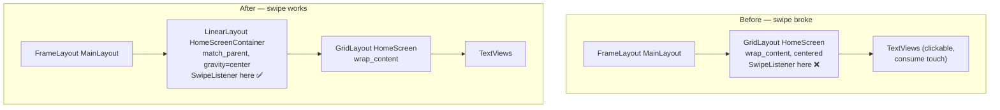

# eLauncher — Supernote 2-column layout & simplified drawer UX

**Branch:** `supernote`
**Commit:** `d2b9201`
**Date:** 2026-06-04

## Summary

Tailored eLauncher for the Supernote Nomad (an eInk device) by making the UI
denser and animation-free:

- **Home screen** now lays apps out in **2 columns** instead of a single
  centered column.
- **App drawer** now shows the full app list in **2 columns**, with the
  **search bar removed** and the **soft keyboard suppressed** (few apps are
  installed, so type-to-search isn't worth the IME).
- **Fade transition** between home and drawer **removed** — switching is now
  instant to avoid eInk ghosting.
- **Browser chooser** replaced with our own dialog that has **no dimmed mask**
  background.
- Removed the now-dead fuzzy type-to-launch / `Filterable` code.
- Added `CLAUDE.md` documenting build commands and architecture.

## Approach

### Home screen → GridLayout

The home screen was a vertical `LinearLayout` with `gravity="center"` whose
`TextView` children were appended in a loop. Switching to a `GridLayout`
(`columnCount=2`) keeps those `TextView`s as direct children, so the existing
child-iteration logic (used to bold running apps and place the trailing
"last app" slot) keeps working unchanged. Each cell uses
`GridLayout.spec(col, 1f)` with `width=0` so the two columns split the screen
evenly, placed row-major (`col = i % 2`, `row = i / 2`).

**Swipe-area regression and fix.** The original `LinearLayout` was
`match_parent`, so the `SwipeListener` attached to it covered the whole screen.
A `GridLayout` sized to `wrap_content` (needed to center the block vertically)
shrank the touch target to just the app rows — which are clickable and consume
touches — so swipe-up to open the drawer stopped working. The fix separates
"where the grid sits" from "where swipes are detected": the grid lives inside a
full-screen, centered `LinearLayout` container, and the `SwipeListener` (plus
`changeLayout`'s visibility toggle and the removed transition target) now
operate on that container.

### App drawer → 2 columns, no search, no IME

- `RecyclerView` switched from `LinearLayoutManager` to
  `GridLayoutManager(ctx, 2)`.
- The search `EditText` was deleted from the layout and the `RecyclerView`
  expanded to fill the drawer.
- All keyboard plumbing was removed: the `keyboardAction()` method, the
  `search` field, and the `TextWatcher` that drove filtering. With no focusable
  input present, the IME never appears (the manifest's `adjustResize` is now a
  harmless no-op). The overscroll-past-top/bottom → return-to-home behavior in
  the scroll listener was preserved.

### Removed fuzzy type-to-launch

`recyclerAdapter` previously implemented `Filterable` with a subsequence fuzzy
match, match-character underlining, and auto-launch when a single result
remained. All of that was driven by the (now-deleted) search field, so it was
dead code. The adapter was rewritten to bind directly off `appList`, keeping
only tap-to-launch, long-press → App Info, and running-app bolding.

### Instant transition + dim-free browser chooser

- `changeLayout()` no longer builds a `Fade` transition; visibility flips
  immediately.
- `getDefaultBrowserIntent()` (which returned a bare `ACTION_VIEW` intent and
  let the **system** resolver show a dimmed chooser) was replaced by
  `openBrowser()`: if a real default browser exists it launches directly;
  otherwise it shows our own `AlertDialog` of browsers with the dim disabled via
  `clearFlags(FLAG_DIM_BEHIND)` + `setDimAmount(0f)`.

## Trade-offs

- **No type-to-search / type-to-launch.** Removing the search bar drops the
  OLauncher-style fuzzy launch. This is intentional for a device with few apps,
  but it's a real capability loss on a fuller device.
- **Custom browser dialog can't set a system default.** Unlike the OS chooser,
  our `AlertDialog` has no "Always / Just once", so it reappears until a default
  is set elsewhere. Could be addressed later by persisting the choice.
- **Odd app counts look uneven** in a 2-column grid — the last row may hold a
  single app in its half.
- **`changeLayout(..., animated)`** keeps its now-unused `animated` parameter to
  avoid churning call sites.

## Key Files

- `app/src/main/res/layout/activity_main.xml` — `GridLayout` + full-screen
  `HomeScreenContainer`; search bar removed; `RecyclerView` fills the drawer.
- `app/src/main/java/me/pompel/elauncher/MainActivity.java` — grid cell params
  (`gridCell`), swipe listener on the container, keyboard/search removal,
  `GridLayoutManager`, fade removal, `openBrowser()`.
- `app/src/main/java/me/pompel/elauncher/recyclerAdapter.java` — stripped of
  `Filterable`/fuzzy logic; binds off `appList`.
- `CLAUDE.md` — build commands and architecture overview (new).
