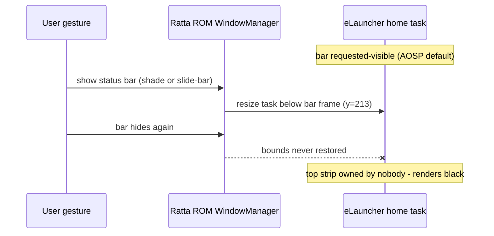
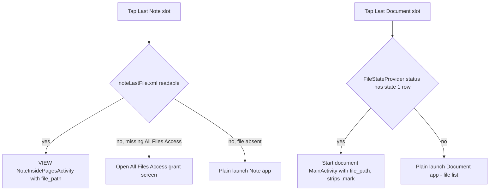

2026-07-10

# eLauncher — Supernote: black status-bar band fix + "last note / last document" home slots

**Device:** Supernote Nomad (Android 11, Ratta ROM), eInk
**Branch:** `supernote`, commit `b3085a2`, released as [sn1.1](https://github.com/plateaukao/eLauncher/releases/tag/sn1.1)

## Part 1 — the black band (bug fix)

The top ~213px of the eLauncher home screen turned solid black. Nothing in the
recent commits touched theming, and the committed screenshots looked fine, so it
had to be device state. `dumpsys window` / `dumpsys activity` showed:

- the **home task itself** had been resized to `bounds=[0,213][1920,2560]`, and
- the StatusBar window was `isVisible=false` with a zero frame.

So the 213px strip belonged to *nobody* — the launcher was laid out below it and
SystemUI drew nothing in it. An unowned strip of screen renders black.

Root cause: Ratta's SystemUI never draws the AOSP status bar (their own overlay
panel replaces it), but eLauncher — like any normal app — left the status bar
*requested-visible*. After some bar show/hide cycle (the swipe-down
notification-shade gesture, or the bezel slide-bar showing Ratta's status
overlay), the ROM's window manager insets the home task below the bar frame and
then fails to restore it when the bar hides. Every stock Ratta app avoids this
by running with the bar hidden (`IMMERSIVE_STICKY`); their windows are never
inset in the first place.

**Fix:** new `SupernoteShims.hideStatusBar(Window)` — gated on
`Build.MANUFACTURER == "Supernote"` — hides the status bar via
`WindowInsetsController` with `BEHAVIOR_SHOW_TRANSIENT_BARS_BY_SWIPE`
(legacy `systemUiVisibility` flags below API 30). Called from
`MainActivity.onCreate`/`onResume` and `SettingsActivity.onCreate`. Verified on
device: window frame back to `[0,0][1920,2560]`, and a forced
expand/collapse of the notification shade no longer re-insets the task.
Recovery on builds without the fix: restart the launcher (force-stop + HOME) —
the bounds reset on task recreation.

## Part 2 — 最後打開筆記 / 最後打開文檔 home slots (feature)

Ratta's slide-bar panel has "last opened note" and "last opened document"
entries; the goal was the same actions as eLauncher home-screen slots. Tapping
the panel entry while watching `logcat` captured the intent, and decompiling
`GesturePresenter` from `SupernoteLauncher.apk` (jadx) gave the exact recipe —
plus the catch: **all Ratta apps share uid 1000**, so their launcher reads the
other apps' private files directly. A normal app can't, so each slot needed an
externally reachable source:

- **Last note** — the Note app persists its last-opened path in
  `/storage/emulated/0/.noteCache/noteLastFile.xml` (a `file://` URI in a
  `last` tag). It sits in a hidden dir as a non-media file, so reading it needs
  **All Files Access** (`MANAGE_EXTERNAL_STORAGE`); the slot redirects to the
  grant screen until granted. Then fire Ratta's own intent: `ACTION_VIEW` +
  component `NoteInsidePagesActivity` + `file_path` + `from_APP="Recent"`.
  A plain component launch is *not* enough: it resumes a warm task, but a cold
  start opens a blank editor (verified by force-stopping the Note app).
- **Last document** — the Document app exposes an exported in-memory provider,
  `content://com.ratta.supernote.document.provider.file/status`, whose
  `state=1` row is the currently-open document (sometimes with a `.mark`
  annotation-sidecar suffix to strip). The reader activity is not exported, so
  the intent goes through `com.supernote.document/.MainActivity` (their only
  exported activity) with a `file_path` extra — the same fallback route
  `GesturePresenter.openLastDoc` uses; MainActivity chains to the reader
  internally. The persistent last-doc record lives in the app's private data
  and is unreachable without uid 1000.

Both slots fall back to a plain app launch when no path is resolvable.

The slots render italic (same style as the existing "last app" slot), labeled
via string resources — `values-zh-rTW` carries 最後打開筆記/最後打開文檔 to match
the device locale, base English elsewhere. They're gated on the Ratta apps
being installed and are inserted **before** the last-app slot, because
`changeLayout`/`homeUpdateUsage` assume the last grid child is the last-app
slot. Slot-building code was deduplicated into an `actionSlot()` helper.

## Verification

All on-device (Nomad, USB adb), against both the debug and the released
minified APK: window frames via `dumpsys window`, shade expand/collapse
regression cycle, and live taps on both slots — the document slot resumed the
open PDF (page 5/19 preserved), the note slot reopened the diary note through
the XML + `file_path` pipeline. `MANAGE_EXTERNAL_STORAGE` was granted on the
test device via `adb shell appops set me.pompel.elauncher
MANAGE_EXTERNAL_STORAGE allow`.
