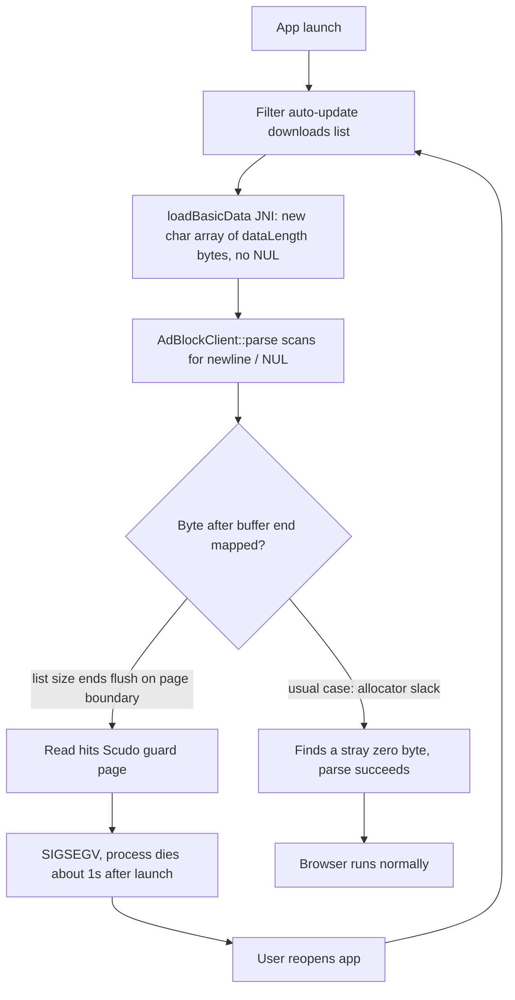

2026-09-04

# Adblock native crash loop: missing NUL terminator in the JNI bridge

## What was broken

A Boox Go Color 7 running EinkBro 16.6.0 crash-looped: every launch died with
a native SIGSEGV about one second in, before the user could do anything. The
tombstone pointed into `libadblock-client.so` with `SEGV_ACCERR` on a
page-aligned fault address, on a coroutine worker thread, with identical
registers across four consecutive crashes — a deterministic parse of the same
data every time.

## Root cause

Disassembling the exact APK from the device (matching build id) located the
faulting instruction: the byte-scan loop of `AdBlockClient::parse`, which
walks the filter-list text looking for `\n` / `\r` / `\0`. Its only loop exit
is the NUL check — the function requires a C string.

The JNI wrapper never provided one:

```cpp
int dataLength = env->GetArrayLength(data);
char *dataChars = new char[dataLength];      // exactly dataLength, no room for NUL
env->GetByteArrayRegion(data, 0, dataLength, ...);
client->parse(dataChars, preserveRules);     // parse scans until '\0'
```

So every filter parse ever done read past the end of the buffer. It was
almost always invisible: the allocator's rounding slack after the buffer is
mapped and usually contains a zero byte within a few bytes. It turns fatal
only when the buffer ends flush against the end of its mapped region. On
Android 11+ the Scudo allocator places large "secondary" allocations (a
filter list is hundreds of KB) in their own mmap with a guard page directly
after — when the list's byte length lands the end of the allocation exactly
on the page boundary, the first out-of-bounds read hits unmapped memory.
Every fault address in the log was page-aligned, confirming the geometry.



## Why it appeared now

Filter lists are live documents whose size changes with every upstream edit.
Around 2026-09-03 the enabled list published a revision whose byte length hit
the unlucky alignment (roughly a 1-in-4096 lottery per revision). Same bytes,
same size, same guard page — and because the auto-updater re-downloads and
re-parses shortly after every launch, one bad revision became a crash loop
instead of a one-off. Nothing on the device changed; it would also have
"fixed itself" at the next upstream size change. A Kotlin try/catch cannot
catch a native SIGSEGV, so the loader's exception handling never saw it.

## The fix

`adblock-client/src/main/cpp/adblockclient-lib.cpp`: allocate one extra byte
and NUL-terminate in `loadBasicData`, and the same in `loadProcessedData` —
a valid processed blob is internally NUL-delimited, but a truncated store
would let `deserialize` overread the same way. Existing offsets are
untouched, and the buffer's lifetime handling (freed later via the returned
pointer) is unchanged, so the +1 is invisible to callers.

Verified by disassembling the rebuilt library (the NUL store is present),
installing the signed build over the crashing install, and watching the app
run past the auto-update window that previously killed it within a second.
