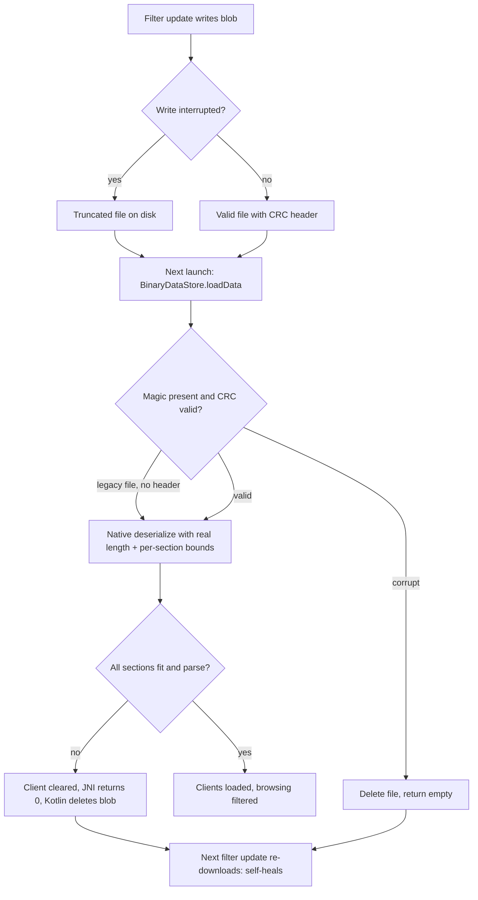

2026-09-04

# Adblock native/JNI hardening: closing the crash classes the NUL bug exposed

## Why

The Boox Go Color 7 crash loop ([[einkbro-adblock-jni-nul-crash]]) came from
one missing NUL terminator, but the underlying pattern — native code trusting
bounds it was never given — runs through the whole ad-block engine. A
follow-up audit of the JNI wrapper and the third-party native code
(brave/ad-block lineage) found two families of the same disease, and this
change fixes both.

## Family 1: the persisted-data path

`AdBlockClient::deserialize` loads the processed filter blob that
`BinaryDataStore` keeps on disk. It never received the buffer's real length:
every bound it used came from the untrusted blob itself — a fake hardcoded
16KB per-filter limit, header-claimed section sizes fed straight into
`memcpy`, string scans with no terminator guarantee. A file truncated by an
interrupted write (the store wrote in place, truncate-then-write) would crash
at whichever section the cut landed in. Worse than the parse() bug: the bad
file persists, so the crash loop never heals.

Now there are two independent layers:

- **Kotlin gate** — `BinaryDataStore` frames every file with magic + length +
  CRC32 and writes via temp file + atomic rename. Torn writes and bit rot are
  detected and the file discarded before native code ever parses it. Legacy
  headerless files still load (the native layer covers them).
- **Native validation** — `deserialize(buffer, bufferSize)` gets the real
  length; the header is validated (field count, negative values, implied
  filter total vs actual size) and every section extent checked before use.
  Each record deserializer (`Filter`, `NoFingerprintDomain`,
  `CosmeticFilter`, `MapNode`, `HashSet`) bounds its string scans and size
  fields and fails cleanly. On failure the client is cleared (dropping
  borrowed pointers), the JNI wrapper frees the buffer and returns 0, and
  Kotlin deletes the blob — the next filter update re-downloads it.

## Family 2: the runtime matching path

Code that runs per request or per page, with attacker-influenced input:

- **Dangling cache keys (worst finding).** The cosmetic-selector caches
  stored `NoFingerprintDomain` keys whose data pointer aimed into the JNI URL
  buffer, and the copy constructor propagated the borrow — after
  `ReleaseStringUTFChars` every stored key dangled, and each later page load
  memcmp'd freed memory. The copy constructor now always deep-copies (the
  deserialize path, which legitimately borrows into the long-lived blob,
  does not use it).
- **Unsynchronized caches.** The UI thread, each WebView's JS-bridge thread,
  and the WebView IO threads all hit the same four lazy caches; a duplicate
  put deleted the value another thread was still serializing to Java. One
  per-client mutex now serializes probe + compute + insert, and misses are
  cached too (which also fixes a per-miss `LinkedList` leak that page
  scripts could drive without bound).
- **Byte-exact overreads.** `indexOfFilter` consumed the URL's terminator
  when a filter's `^` aligned with end-of-string and kept scanning past the
  buffer — the same guard-page geometry as the parse() crash, but per
  request. `removeException` sized a VLA exactly and then copied one byte
  past it; when nothing was removed the result could be unterminated, and
  the following strlen overread could leak heap bytes into the stylesheet
  handed to page JavaScript. Both scan bounds are fixed.
- **Smaller items.** `Filter::domainsParsed` is atomic (double-checked
  locking published a hash set without a release fence — torn reads on ARM),
  `GetStringUTFChars` results are null-checked at all six call sites, the
  dead 1KB stack buffers in `AddFilterDomainsToHashSet` (an out-of-bounds
  write for a long `$domain=` entry, feeding only commented-out debug code)
  are deleted, and `extractScriptletArgsAsData` bounds both its forward and
  backward scans.

## Verification

On the emulator, with real EasyList-sized blobs: valid legacy files still
load both filter clients; truncation at the header, mid-filter-section, and
hashmap-tail cut points, plus a bit-flipped header count (which previously
implied a 35GB allocation), are each discarded with a warning log, no crash,
and the surviving list still loads; browsing with adblock active works, and
the discarded blob heals on the next update. The new `BinaryDataStore`
framing has JVM unit tests (round trip, legacy passthrough, truncation,
bit flip, temp-file cleanup).
