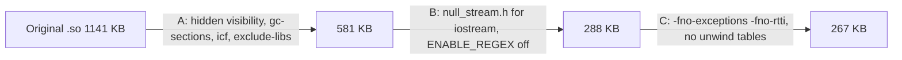
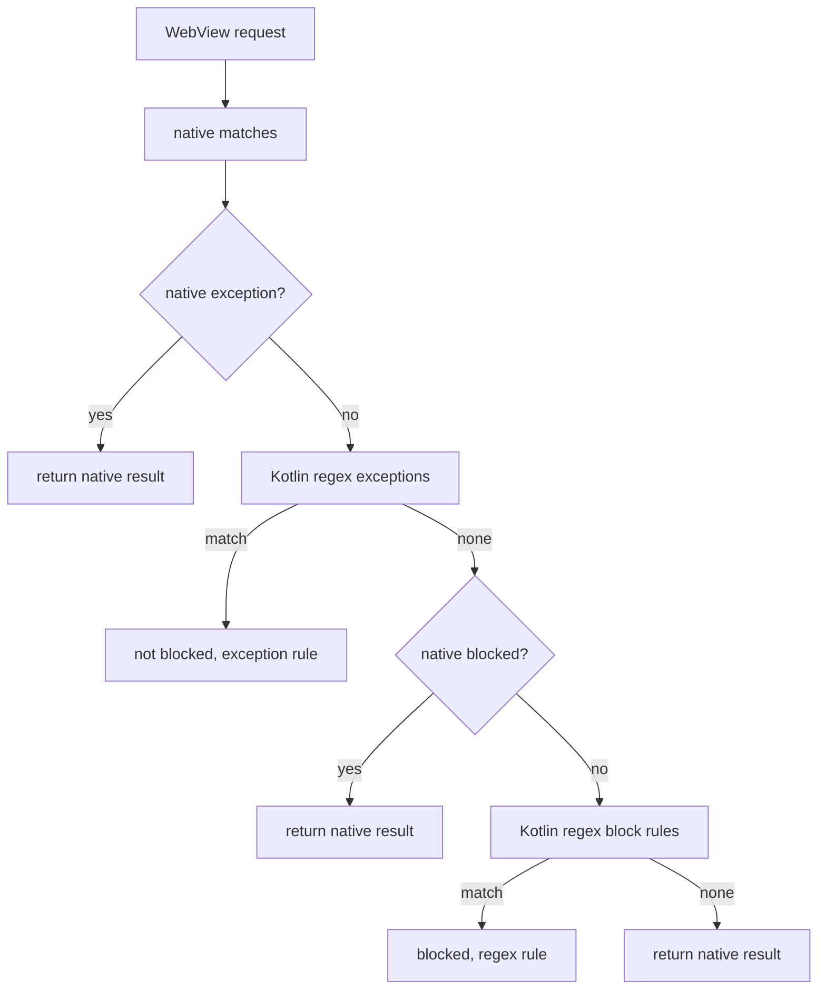

2026-08-22

# EinkBro: shrink the native ad-block library 77% and move regex rules to Kotlin

## What it does

`libadblock-client.so` (the Brave-derived ad-block engine behind the `adblock-client` module) drops from 1,141 KB to 267 KB on arm64-v8a and from 727 KB to 160 KB on armeabi-v7a, with no change to what gets blocked. Native `.so` files are stored uncompressed in the APK, so this is a straight 0.85 MB off every per-ABI APK and 3.2 MB off the universal one. The engine itself is untouched except for two `#include` swaps; the saving comes from build configuration and from moving a tiny, rarely used feature — `/regex/` filter rules — to the Kotlin side.

## Why the library was that big

The question that started this was whether rewriting the C++ engine in Kotlin would save binary size. Attributing the linked bytes with a linker map answered it differently:

| Component | arm64 bytes |
|---|---|
| libc++ statically linked (locale, wchar, iostream facets, `std::regex`) | ~343 KB |
| libunwind + `.eh_frame` / `.gcc_except_table` | ~200 KB |
| `.dynsym` / `.dynstr` / `.rela.dyn` for 2,509 exported symbols | ~290 KB |
| **The ad-block engine itself** | **~125 KB** |

Three things caused the bloat:

- `#include <iostream>` in `ad_block_client.cc` and `filter.cc`, used only for `std::cout` debug statistics that are invisible on Android. In a statically linked libc++ that pulls in the whole locale/number/money/time facet machinery.
- `#define ENABLE_REGEX` in `filter.cc`, which instantiates `std::regex` for `/.../` rules. AdGuard Base has 222 such lines out of 150k.
- No `-fvisibility=hidden`, so every libc++ internal was exported alongside the 13 `Java_*` JNI entry points, and the linker could not garbage-collect any of it.

A Kotlin rewrite would have removed the remaining ~125 KB of engine code too, but at the cost of reimplementing a 5.5k-line engine and designing a flat serialization format to keep startup load time at parity. The measured options made that a poor trade. (An April 2026 experiment swapped the module for Brave's `adblock-rust` — see `einkbro-adblock-rust-backend` — but `main` still ships the C++ engine, so that is what was slimmed.)

## How it was built

Each step was measured on a scratch build before touching the repo:

- **A — CMake flags only.** `-fvisibility=hidden -fvisibility-inlines-hidden -ffunction-sections -fdata-sections` plus `-Wl,--gc-sections -Wl,--exclude-libs,ALL -Wl,--icf=all`. `JNIEXPORT` carries default visibility, so the 13 JNI symbols stay exported (verified with `llvm-nm -D`); everything else becomes local and collectable. −49% with zero source changes.
- **B — drop iostream and regex.** `null_stream.h` defines a `std::cout`/`std::endl` that swallow everything, so the engine sources stay diff-friendly against upstream. `ENABLE_REGEX` is commented out. −75% cumulative.
- **C — no exceptions, no RTTI.** The engine's only `try/catch` guarded `std::regex` construction, which is now compiled out, and nothing uses `dynamic_cast`/`typeid`. With `-fno-exceptions -fno-rtti -fno-unwind-tables -fno-asynchronous-unwind-tables` the unwinder and most exception tables go. −77% cumulative. An allocation failure now aborts instead of throwing `bad_alloc`; nothing caught it before either, so the outcome under OOM is unchanged.

## Regex rules on the Kotlin side

Disabling `std::regex` would silently drop the `/regex/` rules, so they are now handled in `RegexFilterSet.kt` with `java.util.regex`, which costs no binary size.

Precedence mirrors the engine: any exception wins, then any block. Option handling mirrors `Filter::matchesOptions` in `filter.cc` — resource types and `~type`, `domain=` lists (plus AdGuard's `site.*` wildcard TLD, which the engine never matched), `third-party`/`~third-party` using the same host-suffix test, `match-case`. An unknown option such as `header=`, `badfilter` or `csp=` disables the whole rule, exactly as the engine does; of AdGuard Base's 222 regex lines, 187 are accepted and all 187 compile under Java's regex dialect. One deliberate divergence: `first-party` is treated as `~third-party` per the ABP spec, whereas the engine effectively ignored it.

### Keeping it cheap

Running ~190 regexes per request would cost more than the native engine does, so each rule is gated before its regex runs:

1. Options first — resource type, third-party, domain list. Allocation-free; rejects most rules for any given request.
2. Required literals — every top-level run of literal characters in the pattern (escapes like `\.` and `\/` resolved, a run followed by `?`/`*`/`{n,m}` loses its optional last character, patterns with top-level `|` get none). Each is checked against a per-URL **bigram bitset** (the same trick as the engine's per-input bloom filter) and then with `indexOf`.
3. Patterns starting with `^` and containing no `|` use `Regex.matchesAt(url, 0)` instead of scanning every start offset.

Against the real AdGuard Base list on the JVM: ~1.5 µs per image/unknown request, ~5–8 µs per third-party script request, where eight "generic obfuscated domain" rules whose only literal is `https://` genuinely have to run. That is in the same range as the JNI marshalling the native call already pays.

### Storage

`FilterDataLoader` stores one processed-data blob per list, so the regex rules are appended to the engine's serialized buffer followed by an 8-byte trailer (section length + `EBRX`). `loadProcessedData` splits the blob and passes only the native length over JNI (the one signature change in `adblockclient-lib.cpp`). Blobs written by older versions have no trailer and load unchanged — they simply carry no regex rules until the list is re-downloaded from settings, since the app has no automatic list updates.

## Verification

- `RegexFilterSetTest` (14 JVM tests): option semantics, domain lists, exception precedence, unsupported options, literal extraction, anchored matching, pack/unpack round trip and legacy blobs.
- `AdBlockClientTest` (4 instrumented tests on an arm64 API 34 emulator): the real `.so` built with the new flags — native rule, native exception, regex rule, regex type gating, regex exception, cosmetic selectors, processed-data round trip, legacy blob.
- `./gradlew test` green; the 13 JNI exports confirmed present in the stripped release library.
