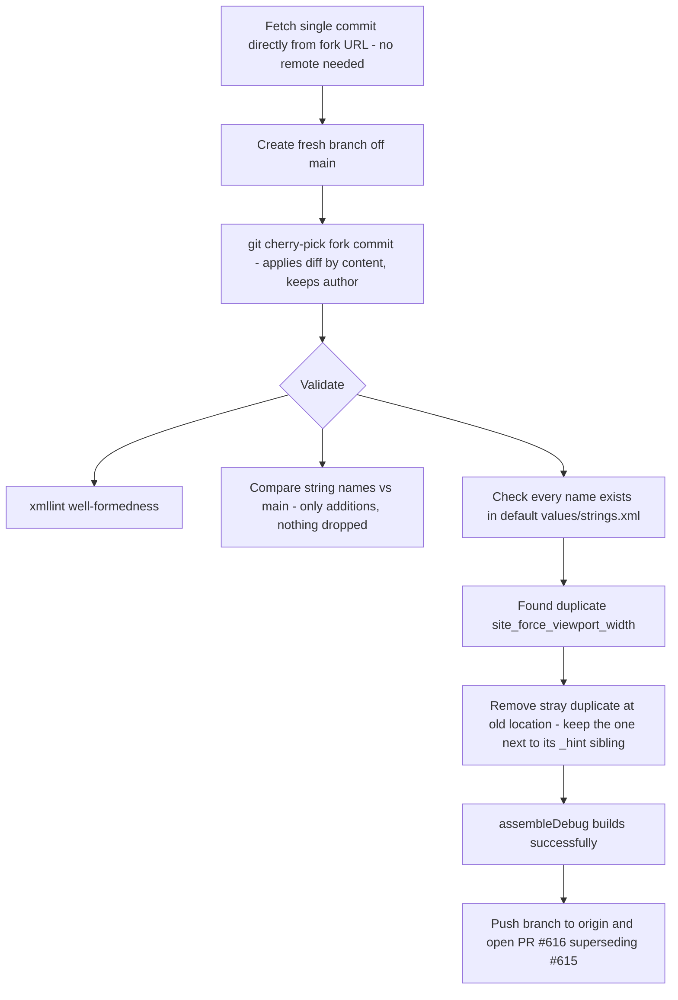

2026-07-08

# Adopting a contributor commit after the history rewrite (zh-rCN translations, PR #616)

## What was broken

PR #615 (XuBaocai's Simplified Chinese translation update) became unreadable: after the
mp4 files were purged from git history, every commit hash in the repository changed, so
the PR's fork branch no longer shared any ancestry with `main`. GitHub rendered the diff
against a base that no longer exists, making the PR look like it rewrote far more than it
did.

Additionally, the contributor's commit itself contained a latent bug: the string
`site_force_viewport_width` was defined twice in `values-zh-rCN/strings.xml`. Duplicate
resource names fail Android resource merging, so the branch would not have built.

## How it was fixed

The key insight is that `git cherry-pick` applies a commit by *content* (its diff), not by
ancestry, so a rewritten history is irrelevant — and it preserves the original author, so
the contributor keeps credit without needing to redo their work on the new history.



Concretely:

```bash
git fetch https://github.com/XuBaocai/browser.git <commit-sha>
git checkout -b zh-rcn-strings-update main
git cherry-pick <commit-sha>          # author stays XuBaocai
# validate, fix duplicate, build
git push -u origin zh-rcn-strings-update
gh pr create ...
```

The duplicate fix went in as a separate follow-up commit rather than amending the
cherry-pick, keeping a clean attribution boundary between the contributor's work and the
maintainer's correction.

## Gotchas worth remembering

- A `comm`-based "which names are new" check silently masked the duplicate: the sorted
  name lists differed by collation around the duplicate entry, producing a confusing
  false positive on exactly the string that was duplicated. `grep -o 'name="[^"]*"' |
  sort | uniq -d` is the reliable duplicate check.
- Duplicate string names in a locale file are not caught by `xmllint` (it is valid XML) —
  only resource merging (`mergeDebugResources`) or a lint pass catches them, so a local
  build is the real verification for translation PRs.
