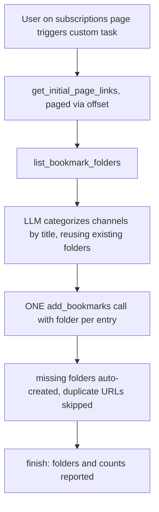

2026-08-02

# EinkBro: AI agent can now file bookmarks into folders

## What it does

The free-form LLM agent ("Page AI → Tasks → Custom task") gained bookmark
capabilities, built for prompts like *"read my YouTube subscriptions and
categorize the channels into bookmark folders"*. Three new tools
(commit `fc23c0644`):

- `add_bookmarks` — batch add; each entry can name a folder, missing folders
  are created automatically, and already-bookmarked URLs are skipped so
  re-running the same prompt is idempotent.
- `list_bookmark_folders` — lets the model reuse the user's existing folders
  as categories instead of inventing near-duplicates.
- `add_bookmark_folder` — explicit folder creation (case-insensitive dedupe);
  rarely needed since `add_bookmarks` auto-creates.

## How it was built

The tool surface follows the existing three-layer pattern: JSON-schema
declarations in `AgentToolSchema` (with a BOOKMARK-ORGANIZATION workflow
paragraph in the system prompt), dispatch in `ChatWebInterface`, and
primitives on `BrowserTools`/`BrowserToolsImpl`. The impl became a
`KoinComponent` to inject `BookmarkManager` without touching either
construction site. Folders are `Bookmark(title, "", isDirectory = true)` rows,
resolved by case-insensitive title; bookmarks dedupe via `findBy(url)`.

A latent problem surfaced while designing for real subscription lists: the
link tools silently truncated at 50 links, so the model would have treated a
partial list as the whole page. They now accept an `offset` and prefix
windowed results with "links X-Y of N (pass offset to continue)" — silent
truncation became visible paging.

Verified end-to-end on the emulator with the committed
`test_server/subscriptions.html` fixture (12 fake channel links): the agent
listed folders first, reused an existing folder for the tech channels, created
three new topic folders, and filed all twelve — then skipped all twelve on a
second run.
