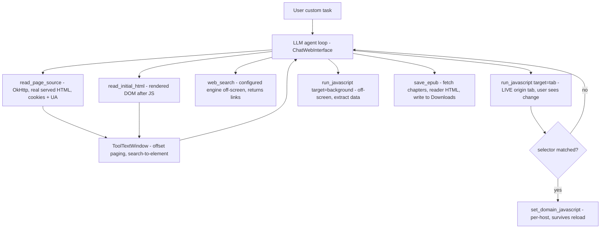

2026-07-11

# EinkBro AI agent: real HTML source, JS eval, web search, and EPUB export

EinkBro's free-form LLM agent (a tool-calling loop in `ChatWebInterface`) could
read a page's reader-mode text and links, open URLs in an off-screen WebView, speak
via TTS, and persist per-host CSS/JS patches. That was enough to *describe* a page but
not enough to *act on it precisely*. This change widens the tool surface so the agent
can write correct selectors, run and verify DOM changes, search the open web, and save
pages for offline reading.

## Why

The trigger was the existing "remove this banner / hide this element" workflow. The agent
was expected to author a DOM-removal script, but the only HTML it could see was
`document.body.innerHTML` — the rendered DOM *after* JavaScript ran, with no `<head>`,
hard-truncated at 8,000 characters with no way to page further. On a real page the model
saw a few percent of the markup and guessed at selectors. Two things were missing: the
*real served HTML* (the ground truth for class/id names and ad containers), and a way to
*test* a candidate selector before committing it to a persisted rule.

Once those gaps were being filled, three adjacent capabilities were cheap to add on the
same `BrowserTools` façade and turn the agent from a summarizer into a browsing assistant:
web search (so it can find pages it wasn't handed), JavaScript evaluation for structured
data extraction, and EPUB export (the natural "keep this to read later" action for an
e-reader browser).

## What was added

- **`read_page_source`** downloads the exact markup the server sent (view-source
  equivalent) via OkHttp, sending the WebView's user agent and the cookies stored for the
  URL so auth-walled pages match what the browser would receive. Result cached per URL.
- **Windowed tool results** (`ToolTextWindow`) replace blind truncation. Large results are
  prefixed with a `[chars a..b of N; continue with offset=b]` header so the model can page
  with `offset`, or pass a case-insensitive `search` string to jump straight to an element
  (with a bit of pre-context so the enclosing tag is visible). Applied to
  `read_page_source`, `read_initial_html`, `read_initial_page`, and `read_current_page`.
- **`run_javascript`** evaluates JS and returns its completion value. `target: "tab"` runs
  on the live originating tab — DOM changes are immediately visible, so the agent tests a
  removal selector and reads back a before/after count *before* persisting it. `target:
  "background"` runs on the off-screen WebView for data extraction that reader-mode text
  loses.
- **`web_search`** builds the results URL with the user's configured search engine
  (`BrowserUnit.queryWrapper`, so it honors DuckDuckGo / Startpage / custom), loads it
  off-screen, and returns the result links.
- **`save_epub`** loads each chapter URL off-screen, extracts reader-mode HTML, and writes
  a multi-chapter EPUB (images included) to the public Downloads folder, registering it in
  EinkBro's saved-EPUB list.

## Design constraints discovered while building

A few WebView realities shaped the implementation, and a code review caught the ones that
would have failed at runtime:

- **Reader extraction can hang.** `getRawReaderHtml`/`getRawText` resume only when a JS
  bridge callback fires, which isn't guaranteed (CSP-blocked injection, page script
  errors). They were plain `suspendCoroutine`, which `withTimeoutOrNull` cannot cancel — a
  single bad page would freeze the whole agent loop. Both are now
  `suspendCancellableCoroutine`, and every reader-extraction call in the tool layer is
  bounded by a timeout that skips the bad page and continues.
- **The origin tab can vanish mid-task.** `run_javascript target=tab` reaches the live tab
  through a `WeakReference` in the page snapshot, but the user can close that tab during
  the agent's multi-turn run. Touching a destroyed WebView is undefined behavior on some
  vendor builds, so `EBWebView` now exposes an `isWebViewDestroyed` flag that the tool
  checks before evaluating, returning an error string instead of crashing.
- **`run_javascript` can't tell "returned null" from "threw".** `evaluateJavascript`
  reports both as the string `"null"`. Rather than fight the platform API, the system
  prompt tells the model to wrap test snippets in try/catch and return the caught error as
  a string, so a broken selector isn't mistaken for a clean zero-match.
- **Legacy storage.** On pre-Android-10 devices without the runtime storage permission,
  `save_epub` falls back to app-private storage (still openable from EinkBro's EPUB list)
  instead of silently failing, and reports the real location.

## Verification

All four capabilities were driven end-to-end on an emulator against local test pages:

- A page with two decorative "special offer" banners: the agent read the real source and
  the rendered DOM (both via the new `search` window), tested its removal script on the
  live tab, persisted it, and after a fresh reload the article rendered with both banners
  gone — confirming the persisted per-host rule works.
- Three local article pages saved as an EPUB: the pulled file was a well-formed
  `application/epub+zip` archive with the correct container, manifest, navigation, and one
  chapter document per article.
- A factual web-search task: `web_search` returned real result links, the agent visited
  the page it selected, read it, and answered correctly.

Unit tests cover the windowing logic (offset clamping, paging, search hit/miss,
pre-context clamping near the document start).
